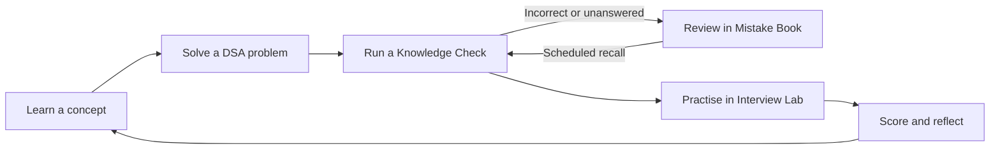
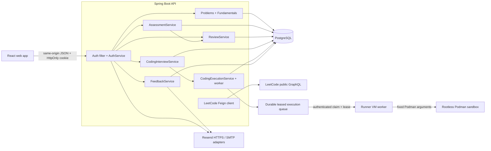
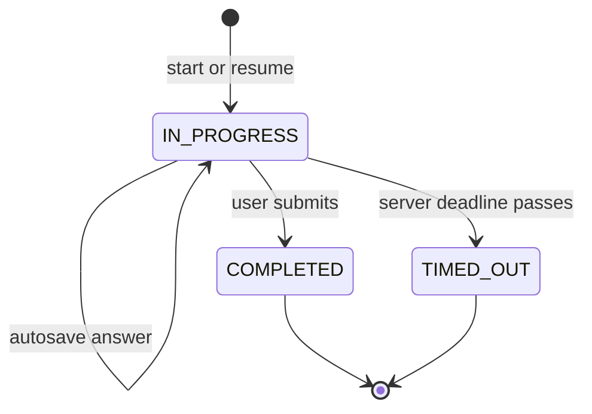
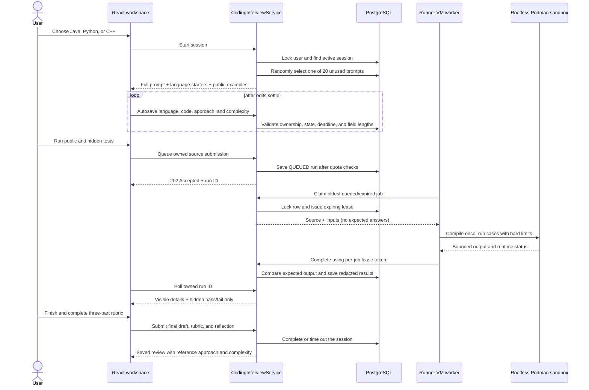
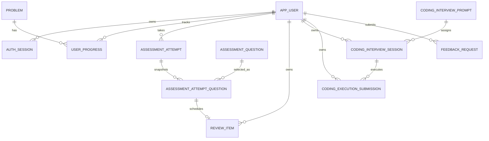

# PrepPilot — Product and System Design

**Status:** Iteration 3 implemented · **Last updated:** August 2026

PrepPilot is a private interview-preparation workspace for fewer than ten early
users. It combines structured learning, deliberate practice, scheduled revision,
and realistic interview rehearsal in one accessible React application.

This document describes the product that is implemented in this repository.
Future ideas are separated into the roadmap rather than presented as current
capabilities.

---

## 1. Product goals

PrepPilot should help an engineer answer four questions:

1. **What should I learn?** — Fundamentals, cheat sheets, and system-design notes.
2. **What should I solve?** — A curated, filterable 145-question DSA catalog.
3. **What do I actually remember?** — Timed Knowledge Checks with explanations.
4. **Can I perform under interview conditions?** — A timed coding Interview Lab.

The core loop is intentionally simple:



### Design principles

- **Focused:** the next useful action should be obvious.
- **Private:** attempts, mistakes, code, rubrics, and feedback belong to one user.
- **Server authoritative:** timers, scores, ownership, and answer visibility are
  decided by the API, not trusted to the browser.
- **Progressive disclosure:** expected answers appear only after an attempt ends.
- **Free-first:** the complete stack runs locally and has a practical free-tier
  deployment path for this small audience.
- **Calm and accessible:** light and dark modes use semantic tokens, restrained
  blue/green accents, responsive layouts, visible focus states, and reduced-motion
  fallbacks.

---

## 2. Implemented experience

### Public learning

- Landing page explaining the complete Learn → Solve → Check → Review loop.
- DSA catalog with search, topic/difficulty filters, pagination, direct LeetCode
  links, and signed-in progress tracking.
- Cheat sheets and Fundamentals chapters rendered from Markdown.
- Fundamentals tracks for Java, Spring Boot, React, Python, SQL/NoSQL,
  Object-Oriented Programming, Computer Networks, and Operating Systems.
- HLD and LLD system-design examples with requirements, APIs, data models,
  workflow diagrams, trade-offs, and FAQs.

### Authenticated practice

- Email OTP login and revocable HttpOnly cookie sessions.
- Nine Knowledge Check topics backed by 900 seeded questions.
- Twenty questions in a topic-aware 10–15 minute window, balanced across easy,
  medium, and hard.
- Autosaved answers, server-side scoring, five non-repeating checks per topic,
  history, and full post-check explanations.
- A Mistake Book that automatically captures incorrect and unanswered questions.
- A coding Interview Lab with 20 curated prompts, problem-specific executable
  starters for Java, C++, and Python, public/hidden cases, a 45-minute server
  timer, autosaved reasoning, verified run history, a focused three-signal rubric,
  and post-round reference guidance.
- Authenticated issue/improvement feedback with an optional validated image and
  an email notification to the configured recipient.

### Explicit non-goals for this iteration

- PrepPilot never compiles submitted code inside the Spring process or API
  container. A separate worker launches bounded, rootless Podman sandboxes.
- It does not copy LeetCode statements or editorials; the DSA catalog stores
  factual metadata and links to the original page.
- AI coaching, automatic LeetCode history sync, browser extensions, behavioral
  interviews, and system-design interviews are roadmap items.

---

## 3. Technology and repository shape

| Layer | Choice | Reason |
|---|---|---|
| Web | React 19, TypeScript, Vite | Fast typed UI with a small deployment artifact |
| API | Java 21, Spring Boot 3.5 | Clear domain services, validation, security, and persistence |
| Database | PostgreSQL + Flyway | Durable relational ownership and repeatable migrations |
| Data access | Spring Data JPA | Small repositories and transactional services |
| External HTTP | Spring Cloud OpenFeign | Typed isolation of the LeetCode API |
| Code runner | Python stdlib + rootless Podman | Tiny worker, no paid provider, ARM64-compatible isolation |
| Tests | Spring Boot + H2 PostgreSQL mode | Fast API-boundary integration tests |
| Local stack | Podman Compose or Docker Compose | One reproducible command for web, API, and database |

```text
PrepPilot/
├── frontend/
│   └── src/
│       ├── components/       Feature and shared UI components
│       ├── lib/api.ts        Credentialed typed API adapter
│       ├── types/api.ts      API contracts
│       ├── theme.css         Semantic palette and light/dark scheme tokens
│       └── styles.css        Feature layout and responsive rules
├── backend/src/main/
│   ├── java/com/preppilot/api/
│   │   ├── auth/             OTP and database sessions
│   │   ├── assessment/       Knowledge Checks
│   │   ├── review/           Mistake Book scheduling
│   │   ├── interview/        Coding Interview Lab and execution adapter
│   │   ├── problem/          DSA catalog
│   │   ├── progress/         Per-user problem state
│   │   ├── feedback/         Suggestions and attachments
│   │   └── integration/      External clients
│   └── resources/
│       ├── db/migration/     PostgreSQL schema history
│       ├── fundamentals/     Markdown learning tracks
│       └── systemdesign/     HLD and LLD chapters
├── README.md
└── DESIGN.md
```

The backend is organized by product domain. Within each domain, controllers own
HTTP contracts, services own business rules and transactions, repositories own
queries, and entities own local state transitions.

---

## 4. Runtime architecture



The production-shaped container stack exposes only the web proxy. The frontend
and `/api` share an origin, which keeps cookie behavior predictable and avoids a
broad CORS policy.

---

## 5. Authentication and ownership

1. A user submits a validated email address.
2. Before generation, PostgreSQL-backed rolling windows enforce a resend
   cooldown plus per-email and hashed-client-IP request limits.
3. The API generates a six-digit OTP with `SecureRandom`, stores only a hash,
   enforces expiry and attempt limits, and sends the code through `OtpSender`.
4. Successful verification creates a random session token. Only its hash is
   stored; the raw token is returned in an `HttpOnly`, `SameSite=Strict` cookie.
5. `SessionAuthenticationFilter` resolves the cookie to `PrepPilotPrincipal`.
6. Every private repository query includes the principal's user ID.

Private resources deliberately return `404` when an ID belongs to another user,
so resource existence is not disclosed. New revision and interview endpoints
reuse this ownership pattern.

Hosted configuration must keep `EXPOSE_DEV_OTP=false`, use a strong
`AUTH_TOKEN_PEPPER`, enable secure cookies on HTTPS, and list exact allowed
origins.

---

## 6. Knowledge Checks

### Attempt lifecycle



- The API selects 20 previously unused questions for the user/topic and enforces
  the configured easy/medium/hard mix.
- The time limit is topic-aware: 10 minutes for OOP, React, Computer Networks,
  and Operating Systems; 12 minutes for Spring Boot, Python, and MySQL; and 15
  minutes for the denser Java and C++ code/output checks.
- The expiry instant is stored with the attempt. Refreshing the browser cannot
  reset the timer.
- While an attempt is active, responses omit `correctOption` and justification.
- On completion, the server scores the saved answers and returns every option,
  the correct answer, the user's selection, difficulty, and explanation.
- Starting an attempt locks the user row and excludes question IDs used in that
  user's earlier attempts. Database constraints separately protect attempt
  numbering, question position, and duplication inside one attempt.

The React runner shows one question at a time, a question navigator, a sticky
countdown, optimistic selection with API reconciliation, save status, and a
confirmation before early submission. Difficulty is intentionally hidden during
the check and shown only in review.

---

## 7. Mistake Book and scheduled revision

Assessment completion calls `ReviewService.addMistakes` inside the completion
transaction. Each incorrect or unanswered attempt question becomes an immediately
due `review_item`. The `(user_id, attempt_question_id)` constraint makes this
operation idempotent.

The user first recalls the answer, then reveals the explanation and rates recall:

| Rating | Effect |
|---|---|
| Forgot | Reset repetitions; review again in 1 day |
| Difficult | Keep a short interval, increasing by 2 days up to 30 |
| Remembered | Progress through 3, 7, 14, 30, then doubling up to 90 days |
| Easy | Advance faster through 7, 21, then 60 days |

A repetition count of four marks an item as mastered. The UI can show only
items due now or the entire private mistake history. Question Markdown, including
code snippets, is rendered consistently with Knowledge Checks.

---

## 8. Interview Lab: coding vertical slice

### Round flow



The primary problem score is the best completed runner result: passed test cases
over total test cases, including hidden tests. Session history obtains those
scores through one owner-scoped aggregate query rather than trusting a client
calculation or issuing one request per session. A missing run is shown as
unverified, not as zero. The clarification, approach, and correctness rubric is
retained only as a clearly labelled self-assessment; it is never presented as
the problem score. Testing, code-quality, and communication self-scores were
removed because verified runs and the saved reasoning give more useful evidence.
The review screen preserves the user's work, execution history, self-assessment,
reflection, and reference direction.

Reference guidance is never included while `status=IN_PROGRESS`. All draft
fields have explicit request limits. The Spring process never runs submitted
code. Runner URLs are environment-owned, HTTPS-only, and host-allowlisted; keys
never enter source control. Jobs disable network access and cap CPU, wall time,
memory, files, processes, polling and returned diagnostics. The API enforces a
rolling per-user daily limit, a minimum interval, one active run per interview,
and owner-scoped reads. Hidden inputs, expected output, and actual output are
redacted before persistence and response. Completion email is optional and
contains only the score and a link—never source or hidden test data.

---

## 9. Operating Systems Fundamentals

The Operating Systems track is a ten-chapter interview curriculum:

1. The big picture: kernel/user mode, system calls, abstractions.
2. Processes and threads.
3. CPU scheduling.
4. Synchronization and race conditions.
5. Deadlocks and liveness.
6. Memory management.
7. Virtual memory and paging.
8. Filesystems and I/O.
9. Inter-process communication.
10. Security and rapid revision.

Chapters use comparison tables, compact examples, interviewer prompts, and
Mermaid flows. Diagram colors are derived from the current semantic theme so
labels and edges remain readable in both light and dark modes.

---

## 10. Data model



Important persistence decisions:

- Attempt questions snapshot prompt, options, answer, and justification so old
  reviews remain stable if the seed bank changes later.
- Review items point to those immutable snapshots rather than the mutable bank.
- Coding prompts are seeded original content; sessions hold the user's draft and
  rubric separately from reference guidance. Each prompt also owns three
  executable starters plus public and hidden test JSON.
- Execution submissions snapshot the submitted source and only redacted case
  outcomes; they are always queried with both resource ID and owner ID.
- Flyway owns schema evolution. Hibernate uses `ddl-auto=validate` so mismatches
  fail startup rather than mutate the database silently.

Current tables are documented in `README.md` and created through migrations
`V1`–`V9`.

---

## 11. API conventions

- All endpoints live under `/api/v1`.
- Controllers validate JSON records and translate them into service commands.
- Services define transaction boundaries and use an injected `Clock`, enabling
  deterministic deadline tests.
- Business conflicts use `409`; invalid input uses `400`; unauthenticated access
  uses `401`; unowned private IDs use `404`.
- The web client always sends credentials and converts structured API errors into
  user-readable messages.
- Answer keys and interview reference material are response-state dependent, not
  merely hidden with CSS.

The route table in `README.md` is the canonical endpoint inventory.

---

## 12. UI system

The UI uses semantic tokens rather than feature-local hex colors:

- surfaces: `--bg`, `--panel`, `--surface-inset`, `--surface-code`;
- content: `--text`, `--text-soft`, `--muted`, `--line`;
- actions: `--action`, `--action-hover`, `--action-ink`;
- accents: restrained `--accent-blue` and `--accent-green`.

The user's light/dark preference is persisted locally and otherwise follows the
operating-system preference. `VITE_UI_THEME` selects the palette at build time.
Content, diagrams, forms, code blocks, feedback states, scrollable sidebars, and
responsive layouts are verified in both schemes. Reduced-motion preferences
disable decorative smooth motion.

---

## 13. Verification strategy

Backend integration tests start a migrated H2 database in PostgreSQL compatibility
mode and exercise the HTTP boundary. The suite covers:

- OTP login and owner-scoped progress;
- five non-repeating Knowledge Checks and hidden pre-submit answers;
- automatic mistake creation and review-interval advancement;
- Interview Lab 20-prompt seeding, problem-specific starters, autosave,
  timeout/submit, verified best-score aggregation, three-signal self-assessment,
  history, owner isolation, and post-submit reference visibility;
- authenticated durable runner claims, expiring leases, output comparison, and
  hidden-test redaction without exposing expected answers to the worker;
- feedback validation and attachments.

Frontend verification includes ESLint, TypeScript through the production build,
and a browser pass for route names, signed-out guards, responsive overflow,
theme switching, and Mermaid rendering without syntax errors.

---

## 14. Deployment

Local deployment is the supported baseline:

```bash
make up
make logs
make down
```

For fewer than ten users, the free-first hosted shape is two OCI Ampere A1 VMs:
one 1-OCPU/6-GB app VM for the same-origin web, API, and PostgreSQL stack, and one
1-OCPU/6-GB runner VM for the worker and rootless Podman. The runner has no
inbound application port and reaches the app over HTTPS. Hosted secrets belong
in protected environment files, never in Git. See `docs/OCI_FREE_DEPLOYMENT.md`.

---

## 15. Next iterations

1. Extend revision to DSA confidence ratings and user-authored notes.
2. Add a system-design Interview Lab with requirements, capacity, API, data model,
   architecture, reliability, and trade-off rubrics.
3. Add behavioral STAR-story and project/resume deep-dive practice.
4. Add runner health/usage dashboards and retention cleanup for old source
   submissions before expanding beyond the small private beta.
5. Add reviewed approach templates and deterministic evaluations before any
   optional AI coaching.

PrepPilot is independent and is not affiliated with LeetCode.
