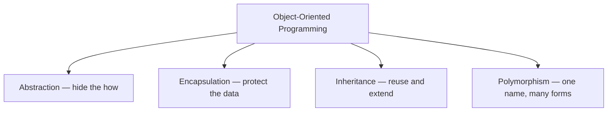
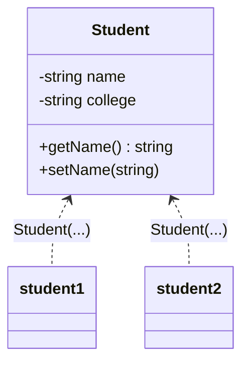
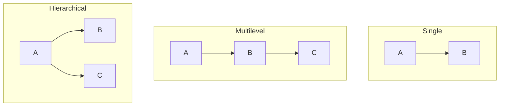
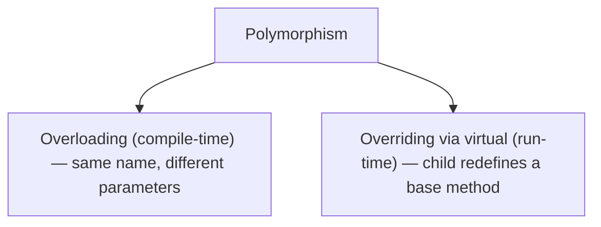

# 🧩 C++ OOP Concepts

> Object-Oriented Programming in plain English — the 4 pillars, with real-world examples and diagrams.

---

## 🧭 The Big Picture

OOP organizes code around **objects** — bundles that keep their **data** (state) and **behavior** (methods) together, like real-world things.

It stands on **four pillars**:



C++ gives you fine control: access specifiers, virtual functions, and even multiple inheritance.

---

## 🧱 Class & Object

A **class** is a **blueprint**. An **object** is a **real thing built from it**.

> A `Car` class describes what every car has and does. Your specific red car is an *object* of that class.



```cpp
class Student {
private:
    string name;
    string college;

public:
    Student(string name, string college) {   // constructor
        this->name = name;
        this->college = college;
    }
    string getName() { return name; }
    void setName(string n) { name = n; }
};

// Create objects
Student s1("Ramesh", "BVB");            // on the stack
Student* s2 = new Student("Prakash", "GEC");  // on the heap (remember delete)
```

---

## 🔒 Encapsulation

**Bundle data + methods in a class, and control access** with `private`, `protected`, `public`.

- `private` → only the class itself
- `protected` → the class and its children
- `public` → everyone

> Like a **medicine capsule** — sealed contents you use as one unit.

```cpp
class Account {
private:
    double balance = 0;          // hidden

public:
    double getBalance() { return balance; }      // controlled read

    void deposit(double amount) {                 // controlled write with a rule
        if (amount > 0) balance += amount;
    }
};
```

---

## 🎭 Abstraction

**Show only what matters, hide the details.** In C++ you abstract with **abstract classes** — a class with at least one **pure virtual** function (`= 0`).

> A **car**: you use the wheel and pedals, not the engine internals.

```cpp
class Employee {
protected:
    int paymentPerHour;
public:
    Employee(int pay) : paymentPerHour(pay) {}
    virtual int calculateSalary() = 0;   // pure virtual -> WHAT, not HOW
    virtual ~Employee() {}               // virtual destructor (important!)
};

class Contractor : public Employee {
    int hours;
public:
    Contractor(int pay, int h) : Employee(pay), hours(h) {}
    int calculateSalary() override { return paymentPerHour * hours; }
};

// Employee e;  // ERROR: cannot instantiate an abstract class
```

---

## 🧬 Inheritance

A child class **reuses** a parent's members and can **add its own** — an **IS-A** relationship. Syntax: `class Child : public Parent`.

```cpp
class Animal {
public:
    virtual void sound() { cout << "Some sound\n"; }
};

class Dog : public Animal {      // Dog IS-A Animal
public:
    void sound() override { cout << "Bark\n"; }   // override
    void fetch() { cout << "Fetching\n"; }        // its own
};
```

### Types of inheritance



- **Single / Multilevel / Hierarchical** — same as the diagram.
- **Multiple** — ✅ **C++ allows it** (unlike Java).

```cpp
class Swimmer { public: void swim() { cout << "swim\n"; } };
class Runner  { public: void run()  { cout << "run\n";  } };

class Triathlete : public Swimmer, public Runner {};  // multiple inheritance
```

> ⚠️ The **Diamond Problem**: if two parents share a common base, you get duplicate copies. Solve it with **virtual inheritance**: `class B : virtual public A`.

---

## 🔀 Polymorphism

**One name, many forms.** The same call behaves differently depending on the object.



**1. Overloading** (compile-time) — same name, different parameters:

```cpp
int add(int a, int b)         { return a + b; }
int add(int a, int b, int c)  { return a + b + c; }
double add(double a, double b){ return a + b; }
```

**2. Overriding with `virtual`** (run-time) — the base method must be `virtual`; a base **pointer/reference** to a derived object calls the derived version:

```cpp
class Shape  { public: virtual void draw() { cout << "shape\n"; } };
class Circle : public Shape { public: void draw() override { cout << "circle\n"; } };
class Square : public Shape { public: void draw() override { cout << "square\n"; } };

Shape* s = new Circle();
s->draw();   // "circle"  <-- decided at runtime (needs `virtual`)
s = new Square();
s->draw();   // "square"
```

> ⚠️ Without `virtual`, `s->draw()` would always call `Shape::draw()`. **Virtual is what enables run-time polymorphism in C++.**

---

## 📌 Quick Recap

| Pillar            | One-line meaning                    | C++ tool                                  |
| ----------------- | ----------------------------------- | ----------------------------------------- |
| **Encapsulation** | Hide data, expose safe methods      | `private` / `protected` / `public`        |
| **Abstraction**   | Hide complexity, show essentials    | pure virtual (`= 0`), abstract class      |
| **Inheritance**   | Reuse & extend a parent (IS-A)      | `: public Parent` (multiple OK)           |
| **Polymorphism**  | One interface, many implementations | overloading + `virtual` overriding        |

> 💡 Always give a base class a **`virtual` destructor** if you delete derived objects through a base pointer.
