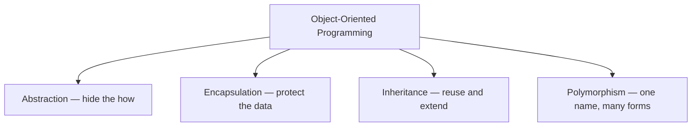
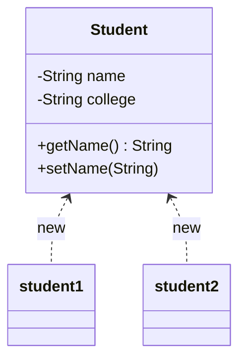
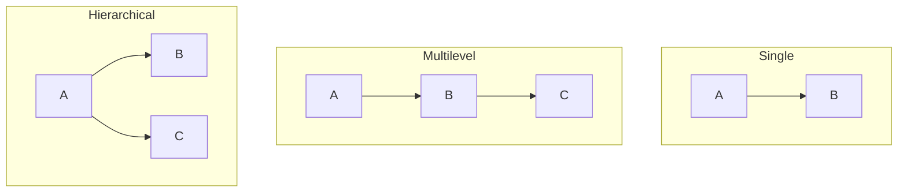
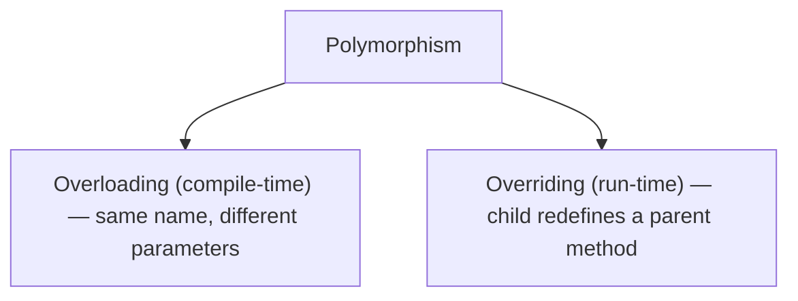

# 🧩 Java OOP Concepts

> Object-Oriented Programming in plain English — the 4 pillars, with real-world examples and diagrams.

---

## 🧭 The Big Picture

OOP is a way of designing programs around **objects** — little bundles that keep their **data** (state) and **behavior** (methods) together, just like real-world things.

It stands on **four pillars**:



Think of it like building with LEGO: each brick (object) is self-contained, and you snap them together to build big things.

---

## 🧱 Class & Object

A **class** is a **blueprint**. An **object** is a **real thing built from that blueprint**.

> A `Car` class describes what every car has (wheels, engine) and can do (drive). Your specific red car is an *object* of that class.



```java
public class Student {
    private String name;
    private String college;

    public Student(String name, String college) {  // constructor
        this.name = name;
        this.college = college;
    }

    public String getName() { return name; }
    public void setName(String name) { this.name = name; }
}

// Create objects with `new`
Student s1 = new Student("Ramesh", "BVB");
Student s2 = new Student("Prakash", "GEC");
```

- **Declaration** → `Student s1;` (a name that can point to a Student)
- **Instantiation** → `new Student(...)` (allocates memory)
- **Initialization** → the constructor fills in the fields

---

## 🔒 Encapsulation

**Wrap the data and the methods that use it inside one unit (the class), and hide the data** behind `private`. The outside world talks to the object only through public methods (getters/setters).

> Like a **medicine capsule** — the contents are sealed inside; you interact with it as one unit.

```java
public class Account {
    private double balance;          // hidden from outside

    public double getBalance() {     // controlled read
        return balance;
    }

    public void deposit(double amount) {   // controlled write with a rule
        if (amount > 0) balance += amount;
    }
}
```

**Why it helps:** you can change or protect the internals without breaking code that uses the class, and you can enforce rules (no negative deposits).

---

## 🎭 Abstraction

**Show only what matters, hide the messy details.** You know *what* something does, not *how*.

> A **car**: you use the steering wheel and pedals. You don't need to know how the engine burns fuel. An **ATM**: you withdraw cash without knowing the internal machinery.

In Java, abstraction is done with **abstract classes** and **interfaces**.

```java
public abstract class Employee {
    private int paymentPerHour;

    public Employee(int paymentPerHour) { this.paymentPerHour = paymentPerHour; }

    public abstract int calculateSalary();   // WHAT, not HOW

    public int getPaymentPerHour() { return paymentPerHour; }
}

public class Contractor extends Employee {
    private int hours;
    public Contractor(int pay, int hours) { super(pay); this.hours = hours; }

    @Override
    public int calculateSalary() { return getPaymentPerHour() * hours; }
}
```

> ⚡ Abstraction is a **design-level** idea (hide complexity); encapsulation is an **implementation-level** idea (hide data).

---

## 🧬 Inheritance

A child class **reuses** the fields and methods of a parent class, and can **add its own** — an **IS-A** relationship (a Dog IS-A Animal). Keyword: `extends`.

```java
class Animal {
    void sound() { System.out.println("Some sound"); }
}

class Dog extends Animal {      // Dog IS-A Animal
    @Override
    void sound() { System.out.println("Bark"); }   // override
    void fetch() { System.out.println("Fetching"); } // its own
}
```

### Types of inheritance



- **Single** — one parent, one child.
- **Multilevel** — a chain: A → B → C.
- **Hierarchical** — one parent, many children.
- **Multiple** — a class with two parents. ❌ **Not allowed with classes in Java** (ambiguity if both parents have the same method). ✅ Achieved with **interfaces**.

```java
interface Swimmer { void swim(); }
interface Runner  { void run(); }

class Triathlete implements Swimmer, Runner {   // "multiple" via interfaces
    public void swim() { System.out.println("swim"); }
    public void run()  { System.out.println("run"); }
}
```

---

## 🔀 Polymorphism

**One name, many forms.** The same method call behaves differently depending on the object.



**1. Overloading** (compile-time) — same method name, different parameter lists:

```java
class Adder {
    static int add(int a, int b)      { return a + b; }
    static int add(int a, int b, int c) { return a + b + c; }   // different params
    static double add(double a, double b) { return a + b; }     // different types
}
```

**2. Overriding** (run-time) — a child provides its own version of a parent method. The actual object decides which runs:

```java
class Shape   { void draw() { System.out.println("shape"); } }
class Circle  extends Shape { void draw() { System.out.println("circle"); } }
class Square  extends Shape { void draw() { System.out.println("square"); } }

Shape s = new Circle();
s.draw();   // "circle"  <-- decided at runtime by the real object
s = new Square();
s.draw();   // "square"
```

> **Upcasting**: `Shape s = new Circle();` — a parent reference pointing to a child object. This is what makes overriding polymorphic.

---

## 📌 Quick Recap

| Pillar            | One-line meaning                          | Java tool                          |
| ----------------- | ----------------------------------------- | ---------------------------------- |
| **Encapsulation** | Hide data, expose safe methods            | `private` fields + getters/setters |
| **Abstraction**   | Hide complexity, show essentials          | `abstract` class, `interface`      |
| **Inheritance**   | Reuse & extend a parent (IS-A)            | `extends`, `implements`            |
| **Polymorphism**  | One interface, many implementations       | overloading + overriding           |

**Overloading vs Overriding**

| Overloading                     | Overriding                          |
| ------------------------------- | ----------------------------------- |
| Same class                      | Two classes (IS-A relationship)     |
| Parameters **must differ**      | Parameters **must be same**         |
| Compile-time (static binding)   | Run-time (dynamic binding)          |
