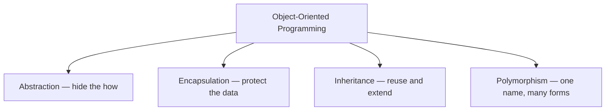
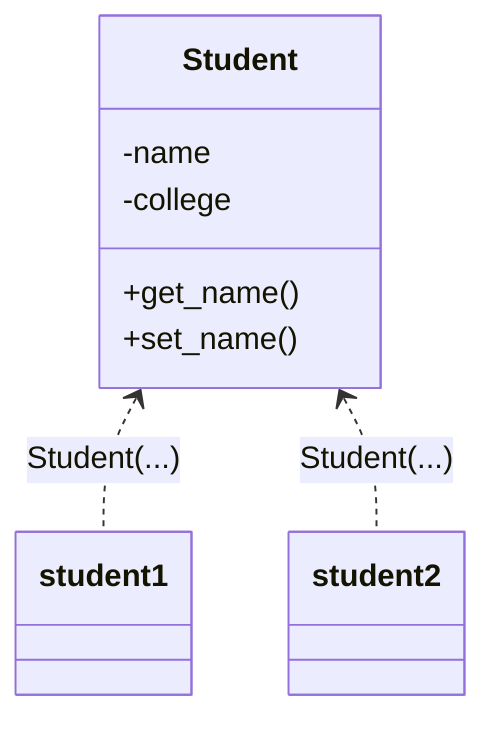
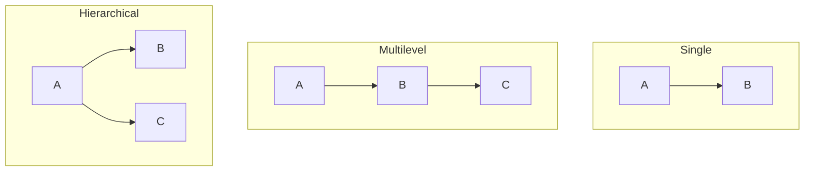
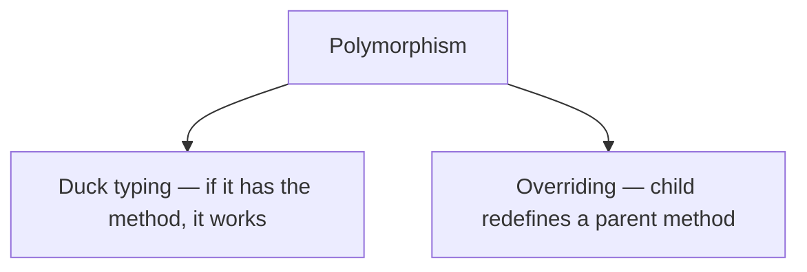

# 🧩 Python OOP Concepts

> Object-Oriented Programming in plain English — the 4 pillars, with real-world examples and diagrams.

---

## 🧭 The Big Picture

OOP organizes code around **objects** — bundles that keep their **data** (state) and **behavior** (methods) together, like real-world things.

It stands on **four pillars**:



Python is object-oriented to the core — even an `int` is an object.

---

## 🧱 Class & Object

A **class** is a **blueprint**. An **object** is a **real thing built from it**.

> A `Car` class describes what every car has and does. Your specific red car is an *object* of that class.



```python
class Student:
    def __init__(self, name, college):   # constructor
        self.name = name
        self.college = college

    def get_name(self):
        return self.name

# Create objects — no `new` keyword in Python
s1 = Student("Ramesh", "BVB")
s2 = Student("Prakash", "GEC")
```

- `__init__` is the constructor; `self` is the current object (like `this`).
- Every method's first parameter is `self`.

---

## 🔒 Encapsulation

**Keep data and the methods that use it in one class, and signal what's internal.**
Python uses **naming conventions** rather than hard access keywords:

- `name` → public
- `_name` → "protected" (convention: internal use)
- `__name` → "private" (name-mangled to `_Class__name`)

> Like a **medicine capsule** — sealed contents you use as one unit.

```python
class Account:
    def __init__(self):
        self.__balance = 0            # "private"

    def get_balance(self):            # controlled read
        return self.__balance

    def deposit(self, amount):        # controlled write with a rule
        if amount > 0:
            self.__balance += amount

# Pythonic getters/setters use @property
class Temperature:
    def __init__(self):
        self._celsius = 0

    @property
    def celsius(self):
        return self._celsius

    @celsius.setter
    def celsius(self, value):
        if value < -273:
            raise ValueError("too cold")
        self._celsius = value
```

---

## 🎭 Abstraction

**Show only what matters, hide the messy details.** Use the `abc` module for abstract base classes.

> A **car**: you use the wheel and pedals, not the engine internals. An **ATM**: you withdraw cash without knowing the machinery.

```python
from abc import ABC, abstractmethod

class Employee(ABC):
    def __init__(self, payment_per_hour):
        self.payment_per_hour = payment_per_hour

    @abstractmethod
    def calculate_salary(self):        # WHAT, not HOW
        ...

class Contractor(Employee):
    def __init__(self, pay, hours):
        super().__init__(pay)
        self.hours = hours

    def calculate_salary(self):
        return self.payment_per_hour * self.hours

# Employee() -> TypeError: can't instantiate an abstract class
```

---

## 🧬 Inheritance

A child class **reuses** a parent's attributes/methods and can **add its own** — an **IS-A** relationship. Syntax: `class Child(Parent):`.

```python
class Animal:
    def sound(self):
        print("Some sound")

class Dog(Animal):            # Dog IS-A Animal
    def sound(self):          # override
        print("Bark")
    def fetch(self):          # its own
        print("Fetching")
```

### Types of inheritance



- **Single / Multilevel / Hierarchical** — same as the diagram.
- **Multiple** — ✅ **Python allows it!** A class can have several parents.

```python
class Swimmer:
    def swim(self): print("swim")

class Runner:
    def run(self): print("run")

class Triathlete(Swimmer, Runner):   # multiple inheritance
    pass
```

> ⚠️ When two parents define the same method, Python resolves it using the **MRO** (Method Resolution Order), left-to-right. Check it with `Triathlete.__mro__`.

---

## 🔀 Polymorphism

**One name, many forms.** The same call behaves differently depending on the object.



**Overriding** — a child provides its own version of a parent method:

```python
class Shape:
    def draw(self): print("shape")

class Circle(Shape):
    def draw(self): print("circle")

class Square(Shape):
    def draw(self): print("square")

for shape in [Circle(), Square()]:
    shape.draw()      # circle, then square
```

**Duck typing** — Python doesn't care about the class, only whether the method exists ("if it walks like a duck and quacks like a duck…"):

```python
def render(obj):
    obj.draw()        # works for ANY object that has draw()
```

> Python has **no method overloading** by signature. Use **default arguments** or `*args` instead:
> ```python
> def add(a, b, c=0):
>     return a + b + c
> ```

---

## 📌 Quick Recap

| Pillar            | One-line meaning                    | Python tool                          |
| ----------------- | ----------------------------------- | ------------------------------------ |
| **Encapsulation** | Hide data, expose safe access       | `_name` / `__name`, `@property`      |
| **Abstraction**   | Hide complexity, show essentials    | `abc.ABC`, `@abstractmethod`         |
| **Inheritance**   | Reuse & extend a parent (IS-A)      | `class Child(Parent)` (multiple OK)  |
| **Polymorphism**  | One interface, many implementations | overriding + duck typing             |
