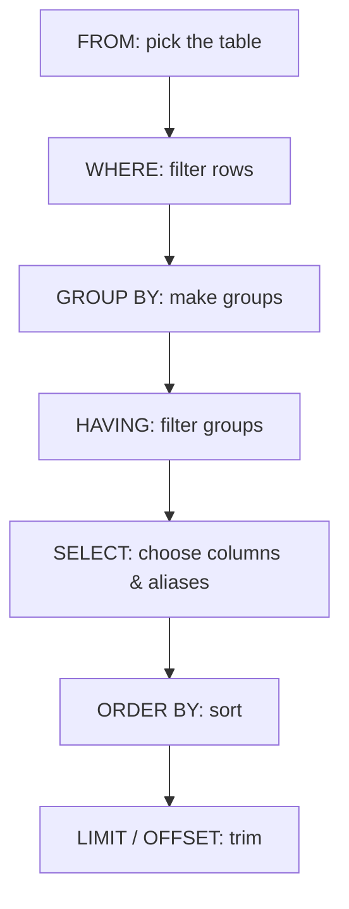

# 🔍 The SELECT Statement

> How to ask a database "show me this data" — the foundation of every SQL query.

## 🧠 What & Why

Almost everything you do in SQL starts with `SELECT`. It's the command that **reads** data out of your tables. If you learn to think in `SELECT`, the rest of SQL clicks into place.

A query is really just a sentence: *"**SELECT** these columns **FROM** this table **WHERE** these rows match, **ORDER BY** this, and give me the **LIMIT** first few."* You describe **what** you want, and MySQL figures out **how** to fetch it.

Throughout this course we use three little tables: `employees(id, name, department_id, salary, hire_date, manager_id)`, `departments(id, name, location)`, and `orders(id, customer_id, amount, order_date)`.

## 🔑 Key Concepts

- **SELECT** — chooses which columns come back.
- **FROM** — names the table (or tables) to read from.
- **`*`** — a wildcard meaning "every column."
- **Alias (AS)** — a temporary nickname for a column or table.
- **DISTINCT** — removes duplicate rows from the result.
- **ORDER BY** — sorts the result (`ASC` = ascending, `DESC` = descending).
- **LIMIT / OFFSET** — return only some rows, optionally skipping a few first.

## 💻 Selecting columns

```sql
-- Grab specific columns (preferred: clear and efficient)
SELECT name, salary
FROM employees;

-- Grab everything with the star wildcard (handy for exploring, avoid in production)
SELECT *
FROM employees;
```

## 💻 Aliases with AS

```sql
-- Rename columns in the output for readability
SELECT name AS employee_name,
       salary AS monthly_pay
FROM employees;

-- Table aliases keep long queries short (AS is optional for tables)
SELECT e.name, e.salary
FROM employees AS e;
```

## 💻 DISTINCT

```sql
-- List each department_id only once, no duplicates
SELECT DISTINCT department_id
FROM employees;
```

## 💻 ORDER BY

```sql
-- Highest paid first
SELECT name, salary
FROM employees
ORDER BY salary DESC;

-- Sort by department, then by salary within each department
SELECT name, department_id, salary
FROM employees
ORDER BY department_id ASC, salary DESC;
```

## 💻 LIMIT and OFFSET

```sql
-- Top 5 earners
SELECT name, salary
FROM employees
ORDER BY salary DESC
LIMIT 5;

-- "Page 2": skip the first 10 rows, then return the next 10
SELECT name, salary
FROM employees
ORDER BY salary DESC
LIMIT 10 OFFSET 10;
```

## 💻 A first taste of WHERE

```sql
-- WHERE filters rows before they come back (full details in the filtering doc)
SELECT name, salary
FROM employees
WHERE salary > 50000;
```

## 💻 Comments

```sql
-- This is a single-line comment
SELECT name        -- you can comment at the end of a line too
FROM employees;

/* This is a
   multi-line comment */
```

## 🧠 How a query reads logically

Even though you **write** `SELECT` first, the database **evaluates** the clauses in a different order. Understanding this explains many "why doesn't my alias work in WHERE?" surprises.



Because `SELECT` runs **after** `WHERE`, a column alias defined in `SELECT` usually can't be used inside `WHERE`.

## ⚠️ Common Pitfalls

- **Using `SELECT *` in real code** — it fetches unneeded columns, breaks when the schema changes, and hides intent. Name your columns.
- **`ORDER BY` without a direction** defaults to `ASC` — be explicit when order matters.
- **`LIMIT` without `ORDER BY`** returns an *arbitrary* set of rows; the "first 5" is only meaningful once sorted.
- **`OFFSET` gets slow on big tables** — skipping a million rows still scans them.
- **Trailing commas** — `SELECT name, salary, FROM employees` is a syntax error.

## ❓ FAQs

### What is the difference between `SELECT *` and naming columns?
`SELECT *` returns every column in the table, which is convenient while exploring but wasteful and fragile in production; naming columns (`SELECT name, salary`) fetches only what you need, documents intent, and won't silently break if someone adds or reorders columns later.

### Does `ORDER BY` come before or after `LIMIT`?
Write `ORDER BY` before `LIMIT`, and logically the database sorts the whole result first and *then* trims it — so `ORDER BY salary DESC LIMIT 5` reliably gives the top 5 earners, whereas `LIMIT` without a sort gives an arbitrary 5.

### How do I paginate results in MySQL?
Use `LIMIT` with `OFFSET`: `LIMIT 10 OFFSET 20` returns rows 21–30, so page *n* (10 per page) is `LIMIT 10 OFFSET (n-1)*10`; for large tables, "keyset" pagination (`WHERE id > last_seen_id`) is faster than large offsets.

### Why can't I use a column alias in my WHERE clause?
Because `WHERE` is evaluated **before** `SELECT` in the logical order, the alias doesn't exist yet when `WHERE` runs; repeat the expression in `WHERE`, or wrap the query in a subquery/derived table where the alias is already available.

### Does DISTINCT apply to one column or the whole row?
`DISTINCT` applies to the **entire selected row**, so `SELECT DISTINCT department_id, salary` de-duplicates unique *combinations* of those two values, not just `department_id` — a common source of "why are there still duplicates?" confusion.
