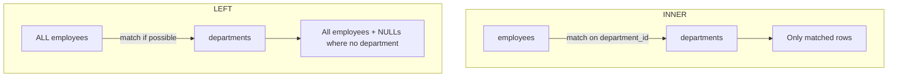

# 🔗 Joins

> Combine rows from multiple tables into one result — the heart of relational databases.

## 🧠 What & Why

Relational databases split data into separate tables to avoid repetition — a design idea called **normalization**. Instead of storing a department's name on every employee row, we store a `department_id` and keep department details once in `departments`. That's clean, but now answering *"which employees work in which departments?"* means stitching tables back together. That stitching is a **join**.

A join matches rows from one table to rows in another using a condition — almost always a **key** relationship, like `employees.department_id = departments.id`. The *type* of join decides what happens to rows that have no match.

Schema recap: `employees(id, name, department_id, salary, hire_date, manager_id)`, `departments(id, name, location)`, `orders(id, customer_id, amount, order_date)`.

## 🔑 Key Concepts

- **INNER JOIN** — keeps only rows that match in **both** tables.
- **LEFT JOIN** — keeps **all** left rows; unmatched right columns become NULL.
- **RIGHT JOIN** — keeps all right rows; the mirror image of LEFT.
- **FULL OUTER JOIN** — keeps all rows from both sides (MySQL lacks it natively).
- **CROSS JOIN** — every combination (Cartesian product).
- **SELF JOIN** — a table joined to itself.
- **ON vs USING** — two ways to express the match condition.

## 💻 INNER JOIN

```sql
-- Only employees who have a matching department
SELECT e.name, d.name AS department
FROM employees AS e
INNER JOIN departments AS d
  ON e.department_id = d.id;
```

## 💻 LEFT (OUTER) JOIN

```sql
-- ALL employees, even those with no department (department shows NULL)
SELECT e.name, d.name AS department
FROM employees AS e
LEFT JOIN departments AS d
  ON e.department_id = d.id;

-- Trick: find employees with NO department using LEFT JOIN + IS NULL
SELECT e.name
FROM employees AS e
LEFT JOIN departments AS d ON e.department_id = d.id
WHERE d.id IS NULL;
```

## 💻 RIGHT JOIN

```sql
-- ALL departments, even empty ones with no employees
SELECT e.name, d.name AS department
FROM employees AS e
RIGHT JOIN departments AS d
  ON e.department_id = d.id;
```

## 💻 FULL OUTER JOIN (the MySQL workaround)

MySQL doesn't support `FULL OUTER JOIN` directly. Emulate it by `UNION`-ing a LEFT and a RIGHT join:

```sql
-- All employees AND all departments, matched where possible
SELECT e.name, d.name AS department
FROM employees AS e
LEFT JOIN departments AS d ON e.department_id = d.id

UNION

SELECT e.name, d.name AS department
FROM employees AS e
RIGHT JOIN departments AS d ON e.department_id = d.id;
```

`UNION` (not `UNION ALL`) removes the duplicate rows that appear in both halves.

## 💻 CROSS JOIN

```sql
-- Every employee paired with every department (rows = emp × dept)
SELECT e.name, d.name
FROM employees AS e
CROSS JOIN departments AS d;
```

## 💻 SELF JOIN

```sql
-- Show each employee alongside their manager (same table, two aliases)
SELECT e.name AS employee, m.name AS manager
FROM employees AS e
LEFT JOIN employees AS m
  ON e.manager_id = m.id;
```

## 💻 ON vs USING

```sql
-- ON: fully explicit, works for any condition
SELECT e.name, d.name
FROM employees e
JOIN departments d ON e.department_id = d.id;

-- USING: shorthand when the join column has the SAME name in both tables
-- (rename departments.id to department_id first for this to apply)
SELECT e.name, d.name
FROM employees e
JOIN departments d USING (department_id);
```

## 💻 Joining 3+ tables

```sql
-- Chain joins to bring together employees, their departments, and orders
SELECT e.name, d.name AS department, o.amount
FROM employees AS e
JOIN departments AS d ON e.department_id = d.id
JOIN orders AS o ON o.customer_id = e.id
ORDER BY o.amount DESC;
```

## 🧠 INNER vs LEFT, visually



## 📊 Join type comparison

| Join | Keeps left rows | Keeps right rows | Unmatched become |
|---|---|---|---|
| INNER | matched only | matched only | dropped |
| LEFT | all | matched only | right = NULL |
| RIGHT | matched only | all | left = NULL |
| FULL OUTER | all | all | either side = NULL |
| CROSS | all × all | all × all | n/a (no condition) |

## ⚠️ Common Pitfalls

- **Forgetting the `ON` clause** turns a join into an accidental `CROSS JOIN` — a huge, wrong result.
- **Filtering an outer join in `WHERE`** can secretly turn a LEFT JOIN into an INNER JOIN; put conditions on the right table in the `ON` clause instead.
- **Ambiguous columns** — when both tables have `name`, always qualify with an alias (`e.name`, `d.name`).
- **Assuming MySQL has FULL OUTER JOIN** — it doesn't; use the `UNION` trick.
- **`UNION ALL` vs `UNION`** in the FULL OUTER workaround — use `UNION` to drop duplicates.

## ❓ FAQs

### What is the difference between INNER JOIN and LEFT JOIN?
`INNER JOIN` returns only rows that have a match in **both** tables, while `LEFT JOIN` returns **every** row from the left table and fills the right side with `NULL` when there's no match — so LEFT JOIN is what you use to find "employees with no department."

### Does MySQL support FULL OUTER JOIN?
No, MySQL has no native `FULL OUTER JOIN`; you emulate it by writing a `LEFT JOIN` and a `RIGHT JOIN` and combining them with `UNION`, which merges both result sets and removes the duplicate matched rows.

### What's the difference between ON and USING?
`ON` lets you write any join condition explicitly (`ON e.department_id = d.id`), whereas `USING (col)` is a shorthand that only works when both tables share an **identically named** column and also collapses that column into one in the output.

### What is a self join and when would I use one?
A self join is a table joined to itself using two different aliases, useful for hierarchical or same-table relationships — for example pairing each employee with their manager via `e.manager_id = m.id`, where both rows live in the `employees` table.

### Why did my LEFT JOIN behave like an INNER JOIN?
Because you put a condition on the right table in `WHERE` (e.g. `WHERE d.location = 'NYC'`), which removes the NULL rows the LEFT JOIN created; to preserve them, move that condition into the `ON` clause (`ON e.department_id = d.id AND d.location = 'NYC'`).
