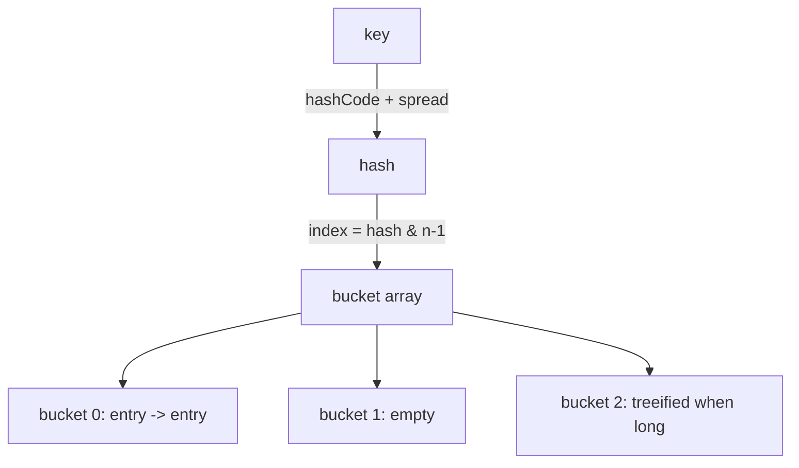

# 🗃️ Java Collections

> The toolbox of ready-made data structures — lists, sets, maps, and queues.

## 🧠 What & Why

The **Collections Framework** is Java's built-in set of data structures for storing and manipulating groups of objects. Instead of hand-rolling a linked list or hash table for every problem, you reach for `ArrayList`, `HashMap`, `HashSet`, and friends. Interviewers expect you to pick the right one and justify it with Big-O reasoning.

Everything hangs off a few core interfaces: **`List`** (ordered, allows duplicates), **`Set`** (no duplicates), **`Map`** (key → value pairs), and **`Queue`/`Deque`** (ordered for processing at the ends). Each interface has multiple implementations with different performance trade-offs — knowing *which to use when* is the whole game.

## 🔑 Key Concepts

- **`List`** — Ordered sequence that allows duplicates. `ArrayList` (array-backed) or `LinkedList` (node-backed).
- **`Set`** — Collection with no duplicates. `HashSet` (unordered), `LinkedHashSet` (insertion order), `TreeSet` (sorted).
- **`Map`** — Key-to-value store. `HashMap` (unordered), `LinkedHashMap` (insertion order), `TreeMap` (sorted by key).
- **`Queue` / `Deque`** — FIFO or double-ended structures. `ArrayDeque` is the go-to for stacks and queues.
- **Big-O** — How an operation scales as the collection grows; the basis for choosing an implementation.
- **Hashing** — Turning a key into an array index so lookups are near-constant time.
- **Load factor** — How full a `HashMap` gets before it resizes (default 0.75).

## 💻 Example

```java
import java.util.*;

public class CollectionsDemo {
    public static void main(String[] args) {
        // List: ordered, allows duplicates
        List<String> names = new ArrayList<>();
        names.add("Ann");
        names.add("Bob");
        names.add("Ann");            // duplicate allowed
        System.out.println(names.get(0)); // O(1) index access -> Ann

        // Set: unique elements only
        Set<String> unique = new HashSet<>(names);
        System.out.println(unique.size()); // -> 2 (Ann, Bob)

        // Map: key -> value
        Map<String, Integer> scores = new HashMap<>();
        scores.put("Ann", 90);
        scores.put("Bob", 75);
        scores.merge("Ann", 5, Integer::sum); // Ann -> 95
        System.out.println(scores.get("Ann"));

        // TreeMap: keeps keys sorted
        Map<String, Integer> sorted = new TreeMap<>(scores);
        System.out.println(sorted.keySet()); // -> [Ann, Bob]

        // Deque as a stack (push/pop from one end)
        Deque<Integer> stack = new ArrayDeque<>();
        stack.push(1);
        stack.push(2);
        System.out.println(stack.pop()); // -> 2 (LIFO)
    }
}
```

## ⏱️ Big-O of common operations

| Structure | Access | Search | Insert | Delete | Notes |
|---|---|---|---|---|---|
| `ArrayList` | O(1) | O(n) | O(1)* amortized | O(n) | Fast random access |
| `LinkedList` | O(n) | O(n) | O(1) at ends | O(1) at ends | Fast insert/remove at ends |
| `HashSet` / `HashMap` | — | O(1) avg | O(1) avg | O(1) avg | O(n) worst case |
| `TreeSet` / `TreeMap` | — | O(log n) | O(log n) | O(log n) | Sorted order |
| `ArrayDeque` | — | O(n) | O(1) at ends | O(1) at ends | Best stack/queue |

\* Amortized: occasionally the backing array resizes (O(n)), but on average adds are O(1).

## 🧭 When to use which

- Need index access and mostly reads → **`ArrayList`**.
- Constant inserts/removes at the ends → **`LinkedList`** or **`ArrayDeque`**.
- Just need uniqueness, order doesn't matter → **`HashSet`**.
- Need sorted keys/elements → **`TreeMap` / `TreeSet`**.
- Need to remember insertion order → **`LinkedHashMap` / `LinkedHashSet`**.
- Stack or queue → **`ArrayDeque`** (faster than `Stack` or `LinkedList`).

## 🔬 How HashMap works internally

A `HashMap` stores entries in an array of **buckets**. When you `put(key, value)`, it calls `key.hashCode()`, spreads the bits, and maps that to a bucket index. Reads do the same to jump straight to the right bucket — that's why lookups are ~O(1).

When two keys land in the same bucket (a **collision**), they're chained together in a linked list. Once a bucket's chain grows past a threshold (8 entries in modern Java) and the table is large enough, that bucket is **treeified** into a balanced tree, improving worst-case lookups from O(n) to O(log n). When the number of entries exceeds `capacity × load factor` (default 0.75), the map **resizes** — doubling capacity and rehashing entries.



## ⚠️ Common Pitfalls

- Using `LinkedList` for random access — `get(i)` is O(n), not O(1).
- Bad `hashCode()`/`equals()` on custom keys makes `HashMap` slow or buggy; always override both together.
- Modifying a collection while iterating over it throws `ConcurrentModificationException` — use an `Iterator.remove()` or `removeIf`.
- Assuming `HashMap` keeps order — it doesn't; use `LinkedHashMap` or `TreeMap` if order matters.
- Using the old `Stack` and `Vector` classes — prefer `ArrayDeque` and `ArrayList`.

## ❓ FAQs

### When would you choose an ArrayList over a LinkedList?
Choose `ArrayList` when you need fast random access by index (O(1)) and mostly append or read, which covers the vast majority of use cases. `LinkedList` only wins when you frequently insert or remove at the ends without indexing, and even then `ArrayDeque` is usually faster due to better cache locality.

### How does a HashMap achieve O(1) lookups?
It converts each key into a hash and uses that to compute an array index, so it can jump directly to the bucket holding the entry instead of scanning. As long as keys are well-distributed, most buckets hold one entry, making get/put average O(1). Poor hashing or many collisions can degrade this toward O(n) — or O(log n) once buckets treeify.

### What is the load factor and why is 0.75 the default?
The load factor is the fullness threshold (`size / capacity`) at which the map resizes. The default of 0.75 balances memory and speed: lower values waste space but reduce collisions, while higher values save memory but slow lookups. 0.75 is a sweet spot that keeps buckets short without resizing too often.

### Why must you override equals() and hashCode() together?
`HashMap` uses `hashCode()` to find the right bucket and `equals()` to match the exact key within it. If two "equal" objects return different hash codes, they'll land in different buckets and the map will treat them as distinct keys. Overriding both consistently ensures lookups behave correctly.

### What's the difference between HashSet, LinkedHashSet, and TreeSet?
`HashSet` stores unique elements with no ordering and O(1) operations. `LinkedHashSet` also gives O(1) but remembers insertion order. `TreeSet` keeps elements sorted (natural or by comparator) at the cost of O(log n) operations. Pick based on whether you need ordering and how much you care about speed.
