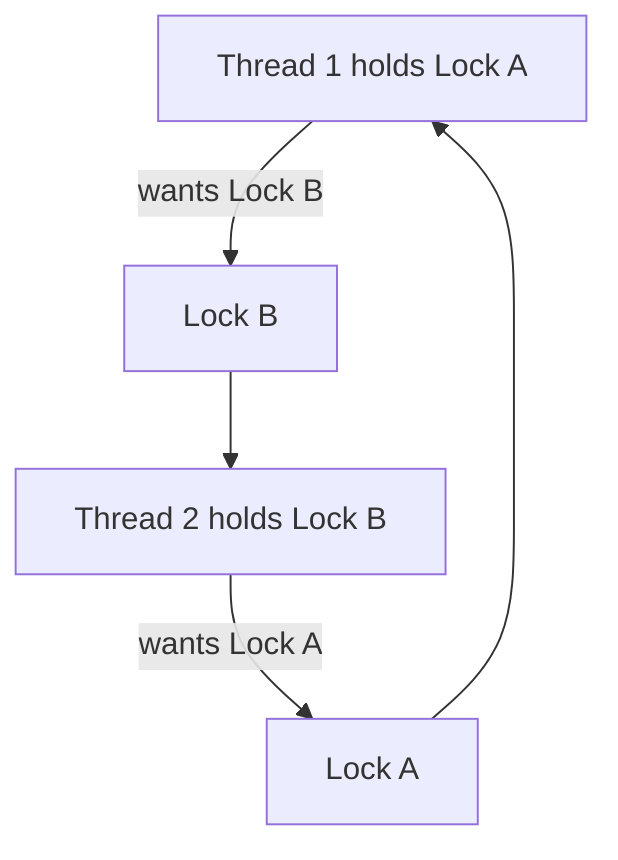

# 🧵 Java Concurrency

> Doing many things at once — safely — is one of the hardest and most-tested topics.

## 🧠 What & Why

**Concurrency** means running multiple pieces of work at the same time, usually on separate **threads**, to make programs faster and more responsive. A web server, for instance, handles many requests concurrently instead of one at a time.

The catch: when threads share data, they can step on each other, producing **race conditions** — bugs that appear randomly and are painful to reproduce. Most of concurrency is about *coordinating* threads so shared state stays consistent. Interviewers probe this to see if you understand `synchronized`, `volatile`, thread pools, and how to avoid deadlocks.

## 🔑 Key Concepts

- **Thread** — An independent path of execution within a program.
- **`Runnable` / `Callable`** — Tasks to run on a thread; `Callable` can return a value and throw checked exceptions.
- **`ExecutorService`** — A managed pool of threads you submit tasks to, instead of creating threads by hand.
- **`synchronized`** — A lock ensuring only one thread runs a block/method on an object at a time.
- **`volatile`** — Guarantees threads always read the latest value of a field (visibility, not atomicity).
- **Race condition** — A bug where the result depends on unpredictable thread timing.
- **Deadlock** — Two threads each waiting forever for a lock the other holds.
- **`CompletableFuture`** — A modern way to run async tasks and chain their results.

## 💻 Example

```java
import java.util.concurrent.*;
import java.util.concurrent.atomic.AtomicInteger;

public class ConcurrencyDemo {
    public static void main(String[] args) throws Exception {
        // A thread-safe counter (atomic ops, no explicit lock needed)
        AtomicInteger counter = new AtomicInteger(0);

        // ExecutorService manages a pool of threads for us
        ExecutorService pool = Executors.newFixedThreadPool(4);

        // Submit 100 increment tasks
        for (int i = 0; i < 100; i++) {
            pool.submit(counter::incrementAndGet);
        }

        pool.shutdown();                          // stop accepting tasks
        pool.awaitTermination(1, TimeUnit.SECONDS);
        System.out.println("Count = " + counter.get()); // reliably 100

        // Callable returns a value via a Future
        ExecutorService single = Executors.newSingleThreadExecutor();
        Future<Integer> future = single.submit(() -> 6 * 7);
        System.out.println("Answer = " + future.get()); // 42
        single.shutdown();

        // CompletableFuture: run async, then transform the result
        CompletableFuture
            .supplyAsync(() -> "hello")
            .thenApply(String::toUpperCase)
            .thenAccept(System.out::println);     // HELLO
    }
}
```

## 🔒 synchronized vs volatile

| Aspect | `synchronized` | `volatile` |
|---|---|---|
| Guarantees | Mutual exclusion + visibility | Visibility only |
| Atomic compound actions? | Yes | No (e.g. `count++` still unsafe) |
| Blocks threads? | Yes (one at a time) | No |
| Use for | Protecting multi-step updates | Simple flags read/written by many threads |

## 💀 How deadlock happens



Each thread holds one lock and waits for the other's — neither can proceed. Prevent it by always acquiring locks in the **same global order**, using timeouts (`tryLock`), or minimizing how much you lock.

## ⚠️ Common Pitfalls

- Assuming `count++` is atomic — it's read-modify-write; use `AtomicInteger` or `synchronized`.
- Using `volatile` for compound updates — it only ensures visibility, not atomicity.
- Creating raw `new Thread()` everywhere — prefer an `ExecutorService` for reuse and control.
- Forgetting to `shutdown()` an executor — the program may hang, keeping non-daemon threads alive.
- Locking on mutable or shared public objects, inviting deadlocks and interference.

## ❓ FAQs

### What's the difference between Runnable and Callable?
`Runnable`'s `run()` returns nothing and can't throw checked exceptions, so it's for fire-and-forget tasks. `Callable`'s `call()` returns a value and may throw checked exceptions, and you submit it to an executor to get a `Future` you can query later. Use `Callable` when you need a result or richer error handling.

### What does volatile do, and what does it not do?
`volatile` guarantees *visibility*: when one thread writes the field, other threads immediately see the new value instead of a stale cached copy. It does *not* provide atomicity for compound operations, so `count++` on a volatile field is still a race condition. Use it for simple flags like `volatile boolean running`, and use locks or atomics for multi-step updates.

### What is a race condition and how do you prevent one?
A race condition occurs when the correctness of a program depends on the unpredictable timing of threads accessing shared mutable state, such as two threads incrementing the same counter and losing an update. You prevent it by coordinating access — using `synchronized` blocks, explicit `Lock`s, atomic classes like `AtomicInteger`, or by avoiding shared mutable state entirely. The goal is to make the critical section effectively run one thread at a time.

### How do you avoid deadlocks?
Deadlocks happen when threads hold locks and wait on each other in a cycle. The most reliable fix is to always acquire multiple locks in a consistent global order so a cycle can't form. Other tactics include using `tryLock` with timeouts, holding locks for as short a time as possible, and reducing the number of locks by using higher-level concurrency utilities.

### Why prefer an ExecutorService over creating threads directly?
Manually creating a thread per task is expensive and hard to control — you can exhaust resources under load. An `ExecutorService` reuses a managed pool of threads, queues tasks, and provides clean shutdown, `Future`s, and scheduling. It decouples *what* you run from *how* threads are managed, which is safer and more scalable.
