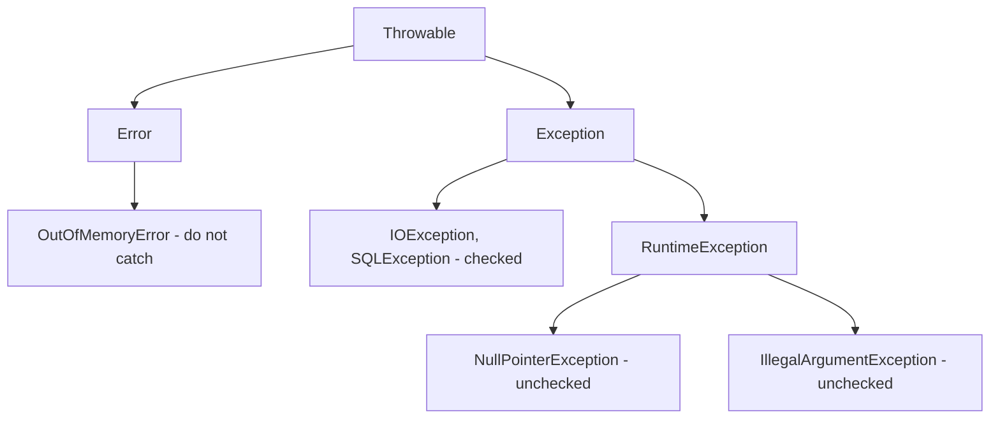

# 🚨 Java Exceptions

> How Java signals that something went wrong — and how you handle it gracefully.

## 🧠 What & Why

An **exception** is Java's way of saying "something unexpected happened." Instead of returning error codes that callers might ignore, Java *throws* an exception object that travels up the call stack until something *catches* it. If nothing does, the program crashes with a stack trace.

Good exception handling separates the "happy path" of your logic from error handling, making code readable and robust. Interviewers love this topic because it reveals whether you understand the difference between **checked** and **unchecked** exceptions, when to catch versus propagate, and how to clean up resources safely.

## 🔑 Key Concepts

- **Checked exception** — Must be declared or handled at compile time (e.g. `IOException`). Represents recoverable, expected problems.
- **Unchecked exception** — A `RuntimeException` you aren't forced to handle (e.g. `NullPointerException`). Usually a programming bug.
- **`try` / `catch` / `finally`** — Try risky code, catch failures, and always run cleanup in `finally`.
- **try-with-resources** — Auto-closes resources (files, connections) that implement `AutoCloseable`.
- **`throw` vs `throws`** — `throw` actually raises an exception; `throws` declares that a method *might* throw one.
- **Custom exception** — Your own exception class extending `Exception` or `RuntimeException`.

## 💻 Example

```java
import java.io.*;

public class ExceptionsDemo {

    // 'throws' declares this method may raise a checked exception
    static String readFirstLine(String path) throws IOException {
        // try-with-resources auto-closes the reader, even on error
        try (BufferedReader reader = new BufferedReader(new FileReader(path))) {
            return reader.readLine();
        }
    }

    // A custom (unchecked) exception
    static class InvalidAgeException extends RuntimeException {
        InvalidAgeException(String message) { super(message); }
    }

    static void setAge(int age) {
        if (age < 0) {
            throw new InvalidAgeException("Age cannot be negative: " + age);
        }
    }

    public static void main(String[] args) {
        try {
            setAge(-5);                       // will throw
        } catch (InvalidAgeException e) {     // catch our custom type
            System.out.println("Caught: " + e.getMessage());
        } finally {
            System.out.println("This always runs.");
        }

        try {
            readFirstLine("missing.txt");
        } catch (IOException e) {
            System.out.println("File error: " + e.getMessage());
        }
    }
}
```

## 🌳 The exception hierarchy



`Throwable` is the root. `Error` covers serious JVM problems you normally can't recover from (like `OutOfMemoryError`). `Exception` covers application problems — its subclass `RuntimeException` (and descendants) are **unchecked**, while everything else under `Exception` is **checked**.

## ✅ Best practices

- Catch the **most specific** exception type, not a broad `catch (Exception e)`.
- Never swallow exceptions silently — at minimum log them with context.
- Use try-with-resources for anything closeable to avoid leaks.
- Throw exceptions for *exceptional* conditions, not ordinary control flow.
- Add meaningful messages so the stack trace tells a story.

## ⚠️ Common Pitfalls

- Empty `catch {}` blocks that hide real failures.
- Catching `Exception` or `Throwable` too broadly and masking bugs.
- Doing cleanup in `try` instead of `finally` (or using try-with-resources) — it won't run if an error occurs first.
- Throwing checked exceptions for programming errors that should be unchecked.
- Relying on exceptions for normal flow, which is slow and confusing.

## ❓ FAQs

### What's the difference between checked and unchecked exceptions?
Checked exceptions (subclasses of `Exception` but not `RuntimeException`) must be either caught or declared with `throws`, and represent recoverable conditions like a missing file. Unchecked exceptions (`RuntimeException` and its subclasses) don't require handling and usually indicate programming bugs like a null dereference. The compiler enforces checked exceptions but leaves unchecked ones to you.

### What is the difference between throw and throws?
`throw` is a statement that actually raises an exception object, e.g. `throw new IllegalArgumentException()`. `throws` is a clause in a method signature declaring that the method *might* throw certain checked exceptions, so callers know to handle them. In short: `throw` does it, `throws` warns about it.

### When does the finally block run, and when doesn't it?
`finally` runs after the `try` (and any matching `catch`) whether the code succeeds, throws, or even returns early — making it ideal for cleanup. The rare exceptions are if the JVM exits via `System.exit()` or the thread is forcibly killed. Modern code often replaces `finally` cleanup with try-with-resources.

### Why should I prefer try-with-resources?
Try-with-resources automatically closes anything implementing `AutoCloseable` when the block exits, even on exception, so you can't forget to release files, sockets, or DB connections. It also handles "suppressed" exceptions cleanly and produces shorter, less error-prone code than manual `finally` blocks. It's the recommended way to manage resources since Java 7.

### Should I catch Error or Throwable?
No — `Error` represents severe JVM-level failures like `OutOfMemoryError` or `StackOverflowError` that your program usually can't sensibly recover from. Catching `Throwable` sweeps these up too and can hide catastrophic problems. Catch specific `Exception` subclasses instead, and let the JVM handle `Error`.
