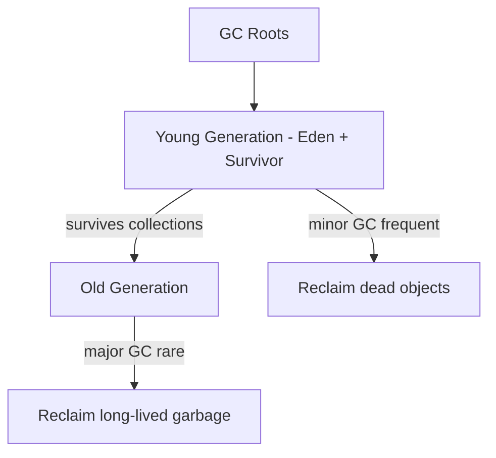

# 🧠 Java JVM & Memory

> What actually happens under the hood — where your objects live and how they're cleaned up.

## 🧠 What & Why

The **JVM (Java Virtual Machine)** is the engine that runs your bytecode. Beyond just executing instructions, it manages *memory* for you: allocating space for objects, and automatically reclaiming it through **garbage collection (GC)**. This is a huge part of Java's appeal — no manual `free()`, far fewer memory bugs.

Understanding the JVM's memory model helps you write efficient code and debug real production issues like `OutOfMemoryError` or slow GC pauses. Interviewers ask about **stack vs heap**, how GC decides what to collect, and what causes memory leaks in a language that "has no leaks."

## 🔑 Key Concepts

- **Stack** — Per-thread memory holding method call frames, local variables, and references. Fast, automatically freed when a method returns.
- **Heap** — Shared memory where all objects live. Managed by the garbage collector.
- **Garbage collection** — The JVM automatically frees heap objects that are no longer reachable.
- **GC roots** — Starting points (active local variables, static fields, threads) from which reachability is traced.
- **Generations** — The heap is split into *young* (new objects) and *old* (long-lived) regions for efficient GC.
- **Class loading** — The process of finding, loading, and linking `.class` files into the JVM.
- **`OutOfMemoryError`** — Thrown when the JVM can't allocate memory and GC can't free enough.

## 💻 Example

```java
public class MemoryDemo {

    static int shared = 0;          // static field -> lives in method area (a GC root)

    public static void main(String[] args) {
        int x = 10;                 // primitive local -> stored on the STACK
        String label = "hi";        // reference on stack -> String object on HEAP

        Person p = new Person("Ann"); // 'p' on stack, Person object on HEAP
        greet(p);

        p = null;                   // object now unreachable -> eligible for GC
        // System.gc();             // a *hint* to run GC (not guaranteed)
    }

    static void greet(Person person) {
        // 'person' is a new stack frame reference to the same heap object
        System.out.println("Hello, " + person.name);
    }

    static class Person {
        String name;                // instance field lives on the HEAP with the object
        Person(String name) { this.name = name; }
    }
}
```

## 🗺️ Stack vs Heap

| Aspect | Stack | Heap |
|---|---|---|
| Stores | Method frames, locals, references | Objects and their instance fields |
| Scope | Per thread | Shared across all threads |
| Lifetime | Freed when method returns | Freed by garbage collector |
| Speed | Very fast | Slower, GC-managed |
| Error when full | `StackOverflowError` | `OutOfMemoryError` |

## ♻️ How garbage collection works

The GC finds objects that are still **reachable** by tracing references starting from **GC roots** (active stack variables, static fields, running threads). Anything it *can't* reach is garbage and can be reclaimed.

To do this efficiently, the heap uses **generations** based on the observation that most objects die young:



New objects go into the **young generation**, collected frequently and cheaply (a *minor GC*). Objects that survive long enough are promoted to the **old generation**, collected less often (a *major/full GC*, which is more expensive).

## 🧯 Memory leaks in Java

Even with GC, you can leak memory by keeping references to objects you no longer need — the GC won't collect anything still reachable. Classic causes: growing a `static` collection forever, unremoved listeners/callbacks, or caches without eviction. The fix is to null out or remove references and use bounded caches.

## ⚠️ Common Pitfalls

- Thinking Java "can't leak" — unbounded reachable references leak just fine.
- Calling `System.gc()` expecting immediate collection — it's only a hint the JVM may ignore.
- Confusing `StackOverflowError` (deep/infinite recursion) with `OutOfMemoryError` (heap exhausted).
- Holding large objects in `static` fields for the app's lifetime unnecessarily.
- Assuming an object is collected right after it goes out of scope — GC timing is non-deterministic.

## ❓ FAQs

### What's the difference between the stack and the heap?
The stack holds each thread's method call frames — local variables, primitives, and object references — and is freed automatically when methods return, making it very fast. The heap is a shared region where all objects live and is managed by the garbage collector. Overflowing the stack (e.g. infinite recursion) throws `StackOverflowError`, while exhausting the heap throws `OutOfMemoryError`.

### How does garbage collection decide what to free?
The collector traces references from GC roots — active local variables, static fields, and live threads — marking every object it can reach. Any object not reachable from a root is considered garbage and eligible for reclamation, regardless of whether other garbage objects still point to it. This "reachability" model is why unreferenced cyclic structures are still collected.

### What are generations and why does the heap use them?
The generational hypothesis is that most objects die young, so the heap splits into a young generation (where new objects are allocated and collected frequently and cheaply) and an old generation (for survivors, collected rarely). This lets the JVM do quick "minor" collections most of the time and expensive "full" collections seldom, improving overall throughput and pause behavior.

### If Java has garbage collection, how can it still leak memory?
GC only reclaims *unreachable* objects, so if your code keeps a reference the object stays alive forever. Common leaks come from ever-growing static collections, caches without eviction, or listeners you never unregister. The remedy is to release references when you're done — remove entries, clear collections, or use weak references and bounded caches.

### What is class loading?
Class loading is how the JVM brings a `.class` file into memory: it *loads* the bytecode, *links* it (verifying, preparing statics, and resolving references), and *initializes* it (running static initializers). Class loaders work in a parent-delegation hierarchy — bootstrap, platform, and application loaders — so core classes load from trusted sources first. It happens lazily, typically the first time a class is used.
