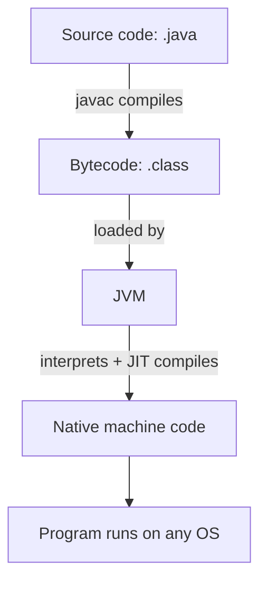

# ☕ Java Overview

> A portable, object-oriented language that runs the same code on almost any machine.

## 🧠 What & Why

Java is a general-purpose programming language created by Sun Microsystems in 1995 (now owned by Oracle). It powers everything from Android apps and huge banking systems to web backends and big-data tools. If you're interviewing for backend or Android roles, Java is often the language you'll be tested in.

The big idea behind Java is **"write once, run anywhere."** You write your code once, compile it into a portable format called *bytecode*, and that same bytecode runs on Windows, macOS, Linux, or a phone — as long as the machine has a Java Virtual Machine (JVM). You don't recompile for each platform; the JVM handles the differences for you.

Java is also **statically typed** (every variable has a declared type checked at compile time) and **object-oriented** (you model your program as objects that hold data and behavior). This combination catches many bugs early and keeps large codebases organized, which is exactly why big companies love it.

## 🔑 Key Concepts

- **JVM (Java Virtual Machine)** — The engine that actually runs your program. It reads bytecode and executes it on the underlying operating system.
- **JRE (Java Runtime Environment)** — The JVM plus the standard libraries needed to *run* Java apps. Use this if you only want to run programs.
- **JDK (Java Development Kit)** — The JRE plus development tools like the compiler (`javac`). Use this if you want to *write and build* Java.
- **Bytecode** — The intermediate `.class` format that `javac` produces from your `.java` source. It's what the JVM understands.
- **Compilation vs interpretation** — Java is a hybrid: source is *compiled* to bytecode ahead of time, then the JVM *interprets* (and later JIT-compiles) that bytecode at runtime.
- **JIT (Just-In-Time compiler)** — Part of the JVM that turns hot bytecode into fast native machine code while the program runs.

## 💻 Example

```java
// File: HelloWorld.java
// A class is the basic unit of a Java program.
public class HelloWorld {

    // main() is the entry point — the JVM starts running here.
    public static void main(String[] args) {
        // Print a line of text to the console.
        System.out.println("Hello, World!");
    }
}
```

To run it from a terminal:

```java
// 1) Compile source -> bytecode (creates HelloWorld.class)
// javac HelloWorld.java
//
// 2) Run the bytecode on the JVM
// java HelloWorld
//
// Output:
// Hello, World!
```

## 🔁 How Java runs your code



Because the JVM sits between your bytecode and the operating system, the *same* `.class` file runs unchanged everywhere a JVM exists.

## 🧩 How a Java program is structured

Every Java program is made of **classes**. Code lives inside methods, methods live inside classes, and related classes are grouped into **packages** (like folders). Execution always begins in a special method with the exact signature `public static void main(String[] args)`. Larger apps are bundled into `.jar` files so they can be shipped and run as a single unit.

## 🌟 Why it's popular

- **Portability** — one build runs across platforms.
- **Strong ecosystem** — huge library support and frameworks like Spring.
- **Reliability** — static typing and automatic memory management (garbage collection) reduce whole classes of bugs.
- **Performance** — the JIT makes long-running server apps fast.
- **Career demand** — enterprises run mountains of Java, so the skill stays valuable.

## ⚠️ Common Pitfalls

- Confusing JDK, JRE, and JVM — remember JDK ⊇ JRE ⊇ JVM.
- Thinking Java is "purely interpreted" — it compiles to bytecode first, then JIT-compiles hot paths.
- Forgetting the `main` method must be `public static void main(String[] args)` exactly, or the JVM won't find it.
- Expecting manual memory management — Java frees memory automatically via garbage collection.

## ❓ FAQs

### What does "write once, run anywhere" actually mean?
It means you compile your Java source into platform-neutral bytecode a single time, and that same bytecode runs on any device that has a JVM. The JVM absorbs the platform differences, so you don't rebuild your app for Windows, Linux, or macOS separately.

### Is Java compiled or interpreted?
Both. Your source is first *compiled* by `javac` into bytecode, and then the JVM *interprets* that bytecode at runtime while its JIT compiler translates frequently-used sections into fast native code. This hybrid model gives you portability plus good performance.

### What's the difference between the JDK, JRE, and JVM?
The JVM is the runtime engine that executes bytecode. The JRE bundles the JVM with the standard libraries so you can *run* Java apps. The JDK bundles the JRE with development tools like the compiler, so you can *build* Java apps. You need the JDK to develop, but only the JRE to run.

### Why is Java so widely used in enterprises?
Its portability, strong static typing, mature tooling, and rich framework ecosystem (like Spring) make it dependable for large, long-lived systems. Automatic memory management and a massive talent pool further reduce risk, which is why banks, e-commerce, and Android all lean on it.

## 🚀 What's next

Now that you know what Java is and how it runs, keep going through the Java track: start with **Java Basics** (variables, control flow, methods), then explore **Collections**, **Strings**, **Exceptions**, **Generics**, **Streams & Lambdas**, **Concurrency**, and finally **JVM & Memory** to understand what happens under the hood.
