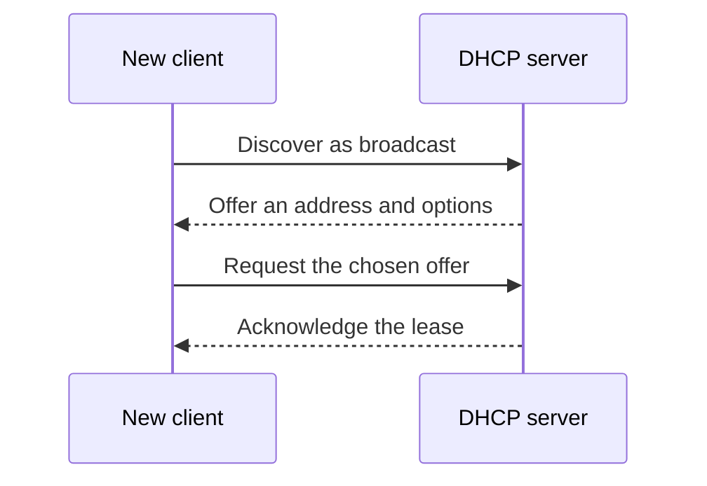
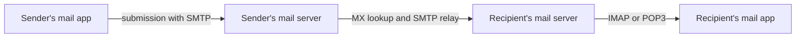

# 📡 Application Protocols & Ports

> Ports are conventions, not magic. Know the common defaults, then explain what each protocol is for and whether it is secure.

## Common interview ports

| Port | Protocol | Purpose | Transport |
|---:|---|---|---|
| 20 / 21 | FTP data / control | Legacy file transfer | TCP |
| 22 | SSH, SFTP | Secure shell and secure file transfer | TCP |
| 23 | Telnet | Unencrypted remote terminal | TCP |
| 25 | SMTP | Server-to-server email relay | TCP |
| 53 | DNS | Name resolution | UDP and TCP |
| 67 / 68 | DHCP server / client | Dynamic IP configuration | UDP |
| 80 | HTTP | Web traffic | TCP |
| 110 | POP3 | Download-oriented email retrieval | TCP |
| 123 | NTP | Time synchronization | UDP |
| 143 | IMAP | Server-synchronized email access | TCP |
| 161 / 162 | SNMP queries / traps | Network monitoring | Usually UDP |
| 443 | HTTPS | HTTP protected by TLS | TCP or QUIC/UDP |

These are default listening ports. A service can be configured on another port, and a client's source port is normally ephemeral.

## DHCP: getting onto a network

DHCP supplies an address, subnet mask/prefix, default gateway, DNS resolvers, and lease time. The classic IPv4 exchange is **DORA**:



The client broadcasts initially because it does not yet have a usable IP or know the server. A DHCP relay can forward requests between subnets.

## Email protocols

- **SMTP** sends and relays outgoing email.
- **IMAP** keeps mail and folder state on the server and synchronizes multiple devices.
- **POP3** traditionally downloads messages to a client and offers a simpler server model.
- **MX records** tell sending mail systems which servers receive mail for a domain.



## Remote access and file transfer

- **SSH** encrypts remote shell sessions and supports tunnelling and secure authentication.
- **SFTP** is a file-transfer subsystem over SSH; it is not “FTP with TLS.”
- **FTPS** is FTP protected with TLS.
- **Telnet** sends terminal traffic without encryption and should not be used for sensitive remote administration.

FTP is awkward around firewalls because it uses separate control and data connections. Active and passive modes differ in which side initiates the data connection.

## Monitoring and time

- **SNMP** lets network-management systems read device metrics and receive traps/notifications. Prefer secure SNMPv3 where possible.
- **NTP** synchronizes clocks. Accurate time is critical for logs, certificate validation, distributed systems, and incident investigation.

## Encapsulation reminder

An HTTP request is not “sent on port 80 by IP.” The application creates the request; TCP uses source/destination ports; IP adds logical addresses; the link layer adds next-hop MAC addresses.

## Rapid recall

```text
FTP 21       SSH 22       Telnet 23      SMTP 25
DNS 53       DHCP 67/68   HTTP 80        POP3 110
NTP 123      IMAP 143     SNMP 161/162   HTTPS 443
```

Learn the service first and the number second. Interviewers often change the wording while testing the same association.

## ❓ FAQs

### Does DNS always use UDP?
No. UDP is common for normal queries because it has low overhead. TCP is used for zone transfers, some large responses, and fallback; encrypted DNS can use still other transports.

### What is the difference between SSH and HTTPS?
Both use cryptography, but they serve different application protocols. SSH provides secure remote login, commands, tunnels, and SFTP; HTTPS is HTTP carried inside TLS.

### Why do applications use ports?
An IP address gets traffic to an interface. The transport port lets the operating system deliver that traffic to the correct listening process or connection.
