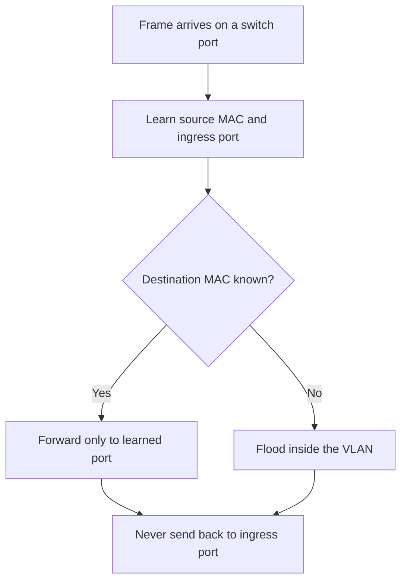
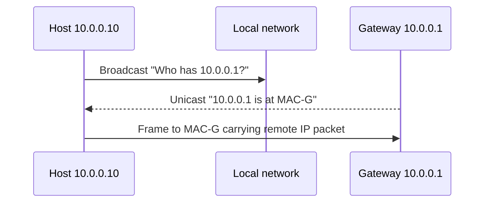
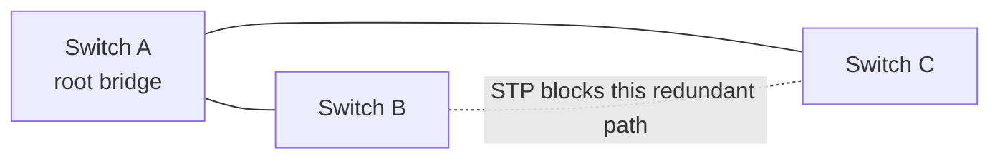

# 🔌 Ethernet, MAC Addresses & Switching

> Layer 2 delivers a frame across one local network. Its key ideas are MAC learning, broadcasts, VLANs, and loop prevention.

## Ethernet frame essentials

An Ethernet frame contains destination and source **48-bit MAC addresses**, a type field identifying the payload (often IPv4 or IPv6), the payload itself, and a frame check sequence for error detection. It does not route across the Internet.

| Destination MAC | Meaning |
|---|---|
| One device's MAC | Unicast |
| `ff:ff:ff:ff:ff:ff` | Broadcast to the entire VLAN |
| A multicast MAC | Selected group of listeners |

## How a switch learns

A switch builds a MAC/CAM table by observing the **source MAC** of frames arriving on each port.

1. Frame arrives on port 3 from MAC A → learn `A → port 3`.
2. Look up the destination MAC.
3. If known, forward only through its learned port.
4. If unknown, flood the frame to every other port in that VLAN.
5. Broadcasts are also flooded within the VLAN.

A **hub** has no MAC table and repeats to every port. A switch gives each port a separate collision domain, so unrelated devices do not see every unicast frame.

## ARP: IPv4 address to MAC address

Before sending an IPv4 packet on Ethernet, a host needs a destination MAC for the **next hop**.

- If the destination IP is local, ARP asks for the destination host's MAC.
- If it is outside the subnet, ARP asks for the **default gateway's** MAC—not the remote server's MAC.
- The ARP request is broadcast; the ARP reply is normally unicast.
- Results are held briefly in the ARP cache.

ARP broadcasts stay inside one broadcast domain and do not cross a router. IPv6 uses Neighbor Discovery rather than ARP.

## VLANs: logical LANs on shared switches

A **VLAN** creates an isolated Layer 2 broadcast domain without requiring a separate physical switch.

- **Access port:** carries one VLAN, usually for an endpoint.
- **Trunk port:** carries several VLANs between network devices, tagging frames with IEEE 802.1Q.
- Communication between VLANs requires a router or Layer 3 switch (**inter-VLAN routing**).

VLANs improve organization and reduce broadcast scope. They are not a complete security boundary by themselves; routing and firewall policy must enforce access.

## Why Layer 2 loops are dangerous

Ethernet frames have no TTL. Redundant switch links can circulate broadcasts forever, creating a **broadcast storm** and causing MAC tables to flap.

**Spanning Tree Protocol (STP)** elects a root bridge and blocks selected redundant paths so the active Layer 2 topology is loop-free. A blocked path can be activated after a failure.

## Collision detection, then and now

Classic shared, half-duplex Ethernet used **CSMA/CD**: Carrier Sense Multiple Access with **Collision Detection**. Devices listened before transmitting, detected a collision, waited for a randomized backoff, then retried.

Modern switched Ethernet is normally full duplex with a dedicated link per port, so collisions do not occur and CSMA/CD is effectively obsolete. Wi-Fi is different: it uses collision avoidance because a wireless station cannot reliably detect a collision while transmitting.

## Interview traps

- A switch learns from the **source**, then forwards based on the **destination**.
- ARP resolves the MAC of the **next hop**, not always the final destination.
- A switch splits collision domains; a router or VLAN boundary splits broadcast domains.
- STP prevents switch loops; IP TTL limits routed packet loops.
- MAC addresses matter only on the current local link.

## ❓ FAQs

### Why does a switch flood an unknown unicast?
It has not yet learned which port reaches the destination. Flooding lets the first exchange succeed; the reply then teaches the switch the missing source-port mapping.

### Can two VLANs communicate through a normal Layer 2 switch?
No. Each VLAN is a separate Layer 2 network. Traffic must be routed by a router or Layer 3 switch and can then be filtered by policy.

### Is ARP secure?
Classic ARP has no authentication, so a malicious host can send forged mappings in an ARP-spoofing attack. Networks mitigate this with segmentation, inspection features, secure access controls, and encrypted end-to-end protocols.
