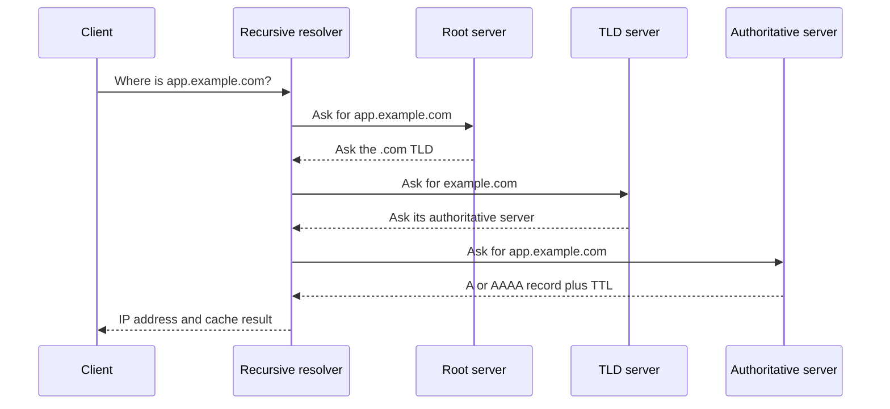
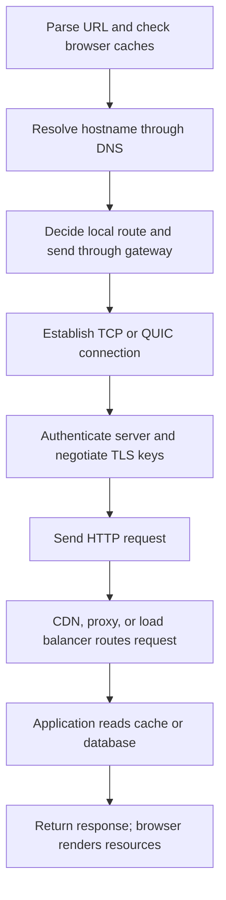

# 🕸️ DNS, HTTP & the Web

> “What happens when you type a URL?” is not one question. It is a chain of cache lookups, name resolution, routing, transport, security, and application work.

## DNS: names to records

DNS is a distributed, hierarchical database. It commonly uses port **53**.

| Record | Purpose | Example idea |
|---|---|---|
| A | Name → IPv4 address | `api.example.com → 203.0.113.8` |
| AAAA | Name → IPv6 address | `api.example.com → 2001:db8::8` |
| CNAME | Alias → canonical name | `www → edge-provider.example` |
| MX | Mail servers for a domain | mail delivery destination |
| NS | Authoritative name servers | who owns the DNS zone |
| TXT | Arbitrary text | email verification and policy |
| PTR | IP → name | reverse lookup |

A browser or OS first checks local caches. A **recursive resolver** then finds or returns the answer, consulting root, top-level-domain, and authoritative name servers when its cache has no usable record.

DNS normally uses UDP for small, low-overhead queries. It can use TCP for large responses, fallback, and zone transfers. Modern encrypted transports such as DNS-over-HTTPS and DNS-over-TLS change privacy, not the record model.

The DNS record **TTL** controls caching duration; it is unrelated to the IP packet TTL. **DNSSEC** signs DNS data so validators can detect spoofed or altered records. It provides authenticity, not confidentiality.

## HTTP essentials

HTTP is an application-layer, request-response protocol and is **stateless by default**. State is added with cookies, authorization tokens, server-side sessions, or application data.

### Methods

| Method | Typical purpose | Safe? | Idempotent? |
|---|---|---:|---:|
| GET | Read a representation | Yes | Yes |
| HEAD | Read headers only | Yes | Yes |
| POST | Submit or create with server-defined semantics | No | Not inherently |
| PUT | Replace a resource at a known URI | No | Yes |
| PATCH | Partially change a resource | No | Not inherently |
| DELETE | Remove a resource | No | Yes |

**Safe** means the intended operation does not change server state. **Idempotent** means repeating the same request has the same intended effect as sending it once. Network retries still require careful API design and idempotency keys for non-idempotent operations.

### Status code families

| Class | Meaning | Common examples |
|---:|---|---|
| 1xx | Informational | `100 Continue` |
| 2xx | Success | `200 OK`, `201 Created`, `204 No Content` |
| 3xx | Redirection / cache decision | `301`, `302`, `304` |
| 4xx | Client-side request problem | `400`, `401`, `403`, `404`, `429` |
| 5xx | Server-side failure | `500`, `502`, `503`, `504` |

`404` means the resource was not found. `500` is a generic internal server error. A good interview answer distinguishes `401` (authentication required or invalid) from `403` (understood identity lacks permission).

## HTTP/1.1, HTTP/2, and HTTP/3

| Version | Transport | Important change |
|---|---|---|
| HTTP/1.1 | TCP | Persistent connections, but limited request concurrency per connection |
| HTTP/2 | TCP | Binary framing, header compression, multiplexed streams |
| HTTP/3 | QUIC over UDP | Multiplexing without TCP transport-level head-of-line blocking |

HTTP/2 multiplexing lets multiple streams share one TCP connection, but TCP packet loss can temporarily hold all streams. QUIC gives streams independent delivery progress.

## What happens when you enter an HTTPS URL?

Strong answers mention caches and alternatives instead of pretending every request starts from zero: DNS may be cached, an existing connection may be reused, the response may come from a CDN, and HTTP/3 may use QUIC rather than TCP.

## Caching and intermediaries

- Browser caches reduce latency and load.
- A **forward proxy** acts for clients; a **reverse proxy** acts in front of servers.
- A **CDN** caches content near users and often terminates TLS.
- A Layer 4 load balancer distributes connections using IP/port information.
- A Layer 7 load balancer can route using host, path, headers, or cookies.

## ❓ FAQs

### Does HTTPS use a different application protocol from HTTP?
The HTTP semantics are the same; HTTPS protects them with TLS. The usual ports are 80 for HTTP and 443 for HTTPS.

### Why can changing a DNS record take time to appear?
Resolvers and clients may retain the previous answer until its DNS TTL expires. Negative answers can also be cached.

### Is POST always used to create and PUT always used to update?
That convention is common but incomplete. POST applies server-defined processing and is not inherently idempotent. PUT replaces the state of a resource at a known URI and is idempotent.
