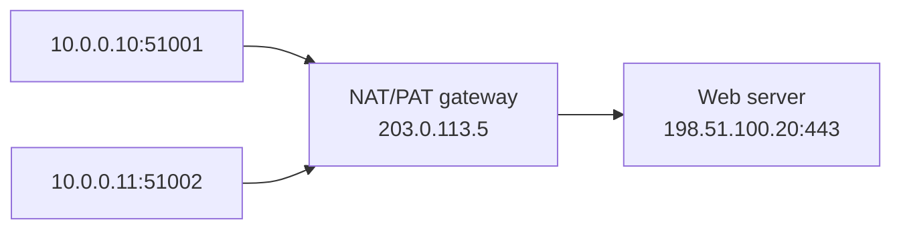

# 🧮 IP Addressing, CIDR & Subnetting

> Subnetting becomes simple when you stop memorizing classes and start counting network bits and host bits.

## IPv4 and IPv6

- **IPv4:** 32 bits, written as four decimal octets, for example `192.168.10.34`.
- **IPv6:** 128 bits, written in hexadecimal groups, for example `2001:db8::10`.
- `127.0.0.1` is IPv4 loopback; `::1` is IPv6 loopback.
- `0.0.0.0` can mean “all local interfaces” when binding, or an unspecified address depending on context.

Private IPv4 ranges are not routed on the public Internet:

| Range | CIDR | Size |
|---|---:|---:|
| `10.0.0.0` – `10.255.255.255` | `/8` | 16,777,216 addresses |
| `172.16.0.0` – `172.31.255.255` | `/12` | 1,048,576 addresses |
| `192.168.0.0` – `192.168.255.255` | `/16` | 65,536 addresses |

The old Class A/B/C system appears in interviews, but real networks use **CIDR**. `192.168.x.x` was historically Class C space; CIDR is the modern way to describe prefixes.

## Reading CIDR

In `192.168.10.0/24`, `/24` means the first 24 bits identify the network and 8 bits identify hosts.

```text
Address:  192.168.10.0     11000000.10101000.00001010.00000000
Mask /24: 255.255.255.0    11111111.11111111.11111111.00000000
                                  network bits | host bits
```

For a conventional IPv4 subnet:

```text
total addresses = 2^(32 - prefix length)
usable hosts    = total addresses - 2
```

The subtraction reserves the all-zero host value as the network address and the all-one host value as the broadcast address. `/31` point-to-point links and `/32` host routes are deliberate exceptions.

## The subnetting method

For `192.168.10.70/26`:

1. Host bits = `32 - 26 = 6`.
2. Block size = `2^6 = 64` addresses.
3. Boundaries in the last octet: 0, 64, 128, 192.
4. 70 falls in the 64–127 block.
5. Network = `192.168.10.64`.
6. Broadcast = `192.168.10.127`.
7. Usable range = `.65` through `.126` → 62 usable hosts.

| Prefix | Mask | Total | Usually usable |
|---:|---|---:|---:|
| `/16` | `255.255.0.0` | 65,536 | 65,534 |
| `/24` | `255.255.255.0` | 256 | 254 |
| `/25` | `255.255.255.128` | 128 | 126 |
| `/26` | `255.255.255.192` | 64 | 62 |
| `/27` | `255.255.255.224` | 32 | 30 |
| `/28` | `255.255.255.240` | 16 | 14 |
| `/30` | `255.255.255.252` | 4 | 2 |

Borrowing two more network bits splits one `/24` into four `/26` subnets, each containing 64 addresses.

## How a host decides local versus remote

The host applies its subnet mask to both its own IP and the destination IP.

- Same network prefix → send directly after resolving the destination MAC.
- Different prefix → send to the **default gateway** after resolving the gateway MAC.

The default gateway routes off-subnet traffic. It is not needed for communication inside the same subnet.

## NAT and PAT

**NAT** translates addresses between networks, commonly private addresses to a public address. **PAT** (Port Address Translation, or NAT overload) lets many private connections share one public IP by assigning different source ports.



NAT conserves IPv4 addresses and hides internal addressing, but it is not a substitute for a firewall. It also weakens the original end-to-end addressing model.

## MTU, fragmentation, MSS, and checksums

- **MTU:** largest IP packet a link can carry without fragmentation; Ethernet commonly uses 1500 bytes.
- **MSS:** largest TCP payload in one segment, negotiated during the handshake. For typical IPv4/TCP without options: `1500 - 20 - 20 = 1460` bytes.
- **Path MTU Discovery:** finds the smallest MTU along a route so the sender avoids fragmentation.
- Fragmentation is discouraged because losing one fragment makes the whole original datagram unusable and reassembly costs resources.
- Checksums detect accidental bit corruption. They do not provide authentication or protection against intentional tampering.

IPv4 routers may fragment in some circumstances. IPv6 routers do not fragment transit packets; endpoints are expected to size packets appropriately.

## Interview-ready subnet answer

> “A CIDR prefix says how many leading bits identify the network. The remaining bits identify addresses inside it. I calculate the block size from `2^(host bits)`, find the boundary containing the address, then identify network, broadcast, and usable range.”

## ❓ FAQs

### Does an IP address identify a whole computer?
More precisely, it identifies a network interface. A computer can have several interfaces and addresses, such as Wi-Fi, Ethernet, loopback, IPv4, and IPv6.

### Why does a /24 have 254 usable hosts rather than 256?
In a conventional subnet, the first address names the network and the last is the broadcast address. The remaining 254 can be assigned to interfaces.

### What is the broadcast address?
It is the address with every host bit set to one. An IPv4 packet sent there targets all hosts in that subnet's broadcast domain.
