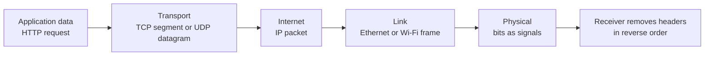
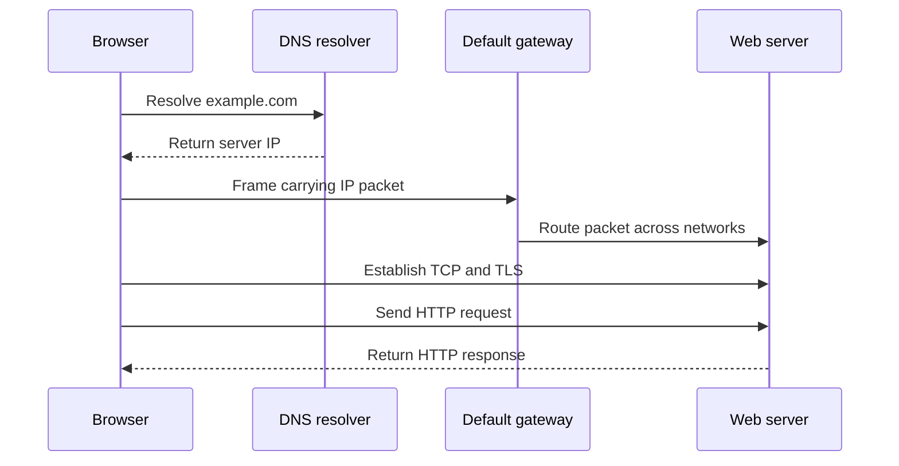

# 🌐 Computer Networks: The Big Picture

> A network moves data between programs. The interview skill is explaining what changes at every hop—and what stays end to end.

When you open a website, your browser creates application data, TCP or QUIC transports it, IP routes it, Ethernet or Wi-Fi carries it across the next local link, and physical signals move the bits. Each layer solves one part of the journey.

## The two models you should know

| OSI layer | Main job | Examples | Data unit |
|---|---|---|---|
| 7. Application | Services used by applications | HTTP, DNS, SMTP, SSH | Data / message |
| 6. Presentation | Encoding, compression, encryption | UTF-8, JSON, TLS concepts | Data |
| 5. Session | Starts and manages conversations | Sessions, checkpoints | Data |
| 4. Transport | Process-to-process delivery | TCP, UDP, QUIC | Segment / datagram |
| 3. Network | Logical addressing and routing | IPv4, IPv6, ICMP | Packet |
| 2. Data Link | Delivery across one local link | Ethernet, Wi-Fi, MAC, VLAN | Frame |
| 1. Physical | Signals over a medium | Copper, fibre, radio | Bits |

The Internet more commonly uses the **TCP/IP model**:

| TCP/IP layer | Rough OSI mapping |
|---|---|
| Application | OSI 5–7 |
| Transport | OSI 4 |
| Internet | OSI 3 |
| Link / Network access | OSI 1–2 |

This wrapping process is **encapsulation**. The receiver performs **decapsulation**. A link-layer frame changes at every router because every hop is a new local link; the source and destination IP addresses usually remain end to end (unless NAT rewrites them).

## Addressing answers four different questions

| Identifier | Question it answers | Scope |
|---|---|---|
| Domain name | What human-friendly service do I want? | Application |
| IP address | Which network interface should receive the packet? | Across networks |
| MAC address | Which interface receives this frame on this local link? | One broadcast domain |
| Port | Which process on the host receives the data? | One host |

An IPv4 address is **32 bits**; IPv6 is **128 bits**. A TCP connection is commonly identified by the five-tuple: protocol, source IP, source port, destination IP, destination port.

## The devices

| Device | Typical layer | Behaviour |
|---|---|---|
| Repeater | L1 | Regenerates a weak signal |
| Hub | L1 | Repeats incoming bits to every port |
| Bridge / switch | L2 | Learns MAC addresses and forwards frames inside a LAN |
| Router | L3 | Chooses a next hop for packets between networks |
| Access point | L2 | Bridges wireless clients to a wired LAN |
| Firewall | L3–L7 | Allows or rejects traffic according to policy |
| Load balancer | L4 or L7 | Distributes connections or requests across servers |

**Switch versus router** is a frequent interview comparison: a switch connects devices in the same Layer 2 network; a router connects different IP networks and normally bounds broadcasts.

## Network shapes and scopes

- **Star topology:** every endpoint connects to a central switch or access point. This is the normal modern LAN shape.
- **Collision domain:** endpoints that could contend for the same medium. Each modern switch port is its own collision domain.
- **Broadcast domain:** endpoints that receive the same Layer 2 broadcast. A VLAN creates one broadcast domain; a router separates broadcast domains.
- **LAN:** local, privately administered network. **WAN:** connects networks over larger distances.

## A browser request in one picture

Each arrow hides several layers, but the order is the useful mental model: **resolve → route → connect → secure → request → respond**.

## Interview-ready summary

> “Applications communicate using protocols such as HTTP. Transport protocols identify processes with ports and provide the required reliability. IP gives hosts logical addresses and routes packets across networks. Ethernet or Wi-Fi delivers a frame over each local hop, and the physical layer transmits bits. Encapsulation keeps these responsibilities separate.”

## ❓ FAQs

### Does a switch ever use IP addresses?
A basic Layer 2 switch forwards user frames using its MAC address table. A managed switch can still have an IP for administration, and a Layer 3 switch can also route, but neither changes the core distinction.

### Are OSI Session and Presentation layers real Internet protocols?
The responsibilities are real, but Internet stacks usually implement them inside applications or libraries. TLS, serialization, authentication sessions, and compression do not need separate network boxes.

### What is the difference between a packet and a frame?
A packet is the Layer 3 IP unit routed across networks. A frame is the Layer 2 wrapper used only for one link. Routers remove the incoming frame and build a new frame for the next hop.
