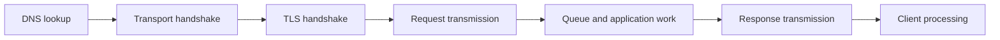

# ⚡ Network Performance & Reliability

> Performance is not one number. Separate latency, bandwidth, throughput, loss, jitter, and application work before diagnosing it.

## The core measurements

| Term | Meaning | Typical unit |
|---|---|---|
| Bandwidth | Theoretical carrying capacity | bit/s |
| Throughput | Useful data delivered per unit time | bit/s or requests/s |
| Latency | Time for data to travel or an operation to complete | ms |
| RTT | Time from sender to peer and back | ms |
| Jitter | Variation in delay | ms |
| Packet loss | Fraction of packets that never arrive | % |

High bandwidth does not guarantee low latency. A truck full of disks has enormous throughput and terrible first-byte latency.

## Where latency comes from

```text
total delay ≈ processing + queueing + transmission + propagation
```

- **Processing:** inspect headers, encrypt, execute application logic.
- **Queueing:** wait behind other packets; often the most variable part.
- **Transmission:** serialize bits onto the link; packet size ÷ link rate.
- **Propagation:** signal travel time over physical distance.

Application latency also includes DNS, connection handshakes, TLS, load balancers, caches, databases, and rendering.



Connection reuse, caching, CDNs, HTTP multiplexing, and placing services closer to users reduce different pieces of this chain.

## Bandwidth-delay product and windows

The **bandwidth-delay product (BDP)** is approximately bandwidth × RTT. It is the amount of data needed in flight to fully utilize the path.

```text
100 Mbit/s × 0.080 s = 8 Mbit ≈ 1 MB in flight
```

If TCP's receive or congestion window is much smaller than the path BDP, the connection cannot fill the link regardless of raw bandwidth.

## Loss and retransmission

TCP treats loss as a signal that data needs retransmission and often that congestion may exist. On long-RTT paths, recovery costs more time. Random wireless loss and congestion loss have different causes, but both affect TCP delivery.

UDP does not retransmit automatically. Real-time applications may prefer to skip stale data, use forward-error correction, or retransmit only data still useful to the user.

## Queueing and bufferbloat

Buffers absorb short bursts, but oversized queues can create seconds of delay while a link is saturated—**bufferbloat**. Active Queue Management and fair scheduling try to control delay while maintaining throughput.

## MTU failures

If packets larger than the path permits are sent with fragmentation prohibited, Path MTU Discovery depends on ICMP feedback. Filtering that feedback can create a **PMTU black hole**: small packets work while large transfers stall.

MSS clamping at tunnel boundaries is sometimes used to keep TCP segments below the effective path MTU.

## Reliability belongs at several layers

- Ethernet checks a frame on one link.
- IP routes best-effort packets.
- TCP can provide reliable ordered bytes end to end.
- HTTP reports application results.
- The business operation may still need idempotency, persistence, and its own acknowledgement.

No single lower-layer ACK proves that a payment, email, or database transaction was processed exactly once.

## A performance diagnosis order

1. Define the affected percentile, users, operation, and time range.
2. Split client time into DNS, connect, TLS, time-to-first-byte, and download.
3. Check loss, RTT, route changes, saturation, retransmissions, and MTU symptoms.
4. Trace server-side proxy, application, cache, database, and downstream timing.
5. Compare a healthy path and change one variable at a time.

## ❓ FAQs

### Why can adding bandwidth fail to improve response time?
If the workload is limited by propagation, handshakes, server processing, loss, or an undersized TCP window, more link capacity does not remove the bottleneck.

### Is zero packet loss always realistic?
No. Networks are designed to tolerate some loss, and queues may intentionally drop or mark traffic during congestion. The goal is controlled behaviour and acceptable application performance.

### Why does HTTP/3 help on lossy networks?
QUIC manages independent streams, so loss on one stream does not hold back delivery on every other stream as it can when HTTP/2 streams share TCP's single ordered byte stream.
