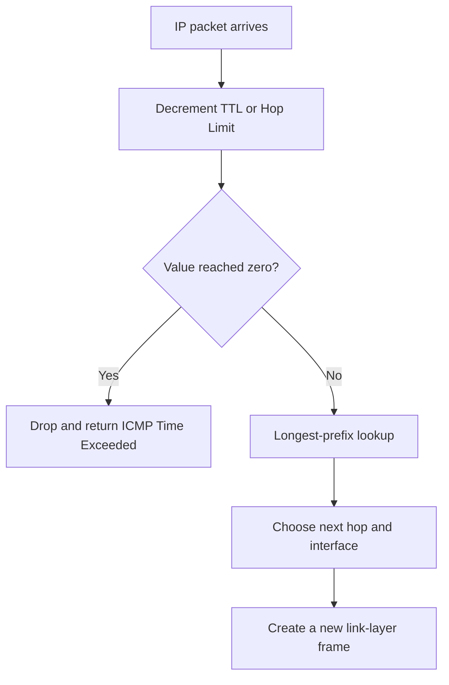
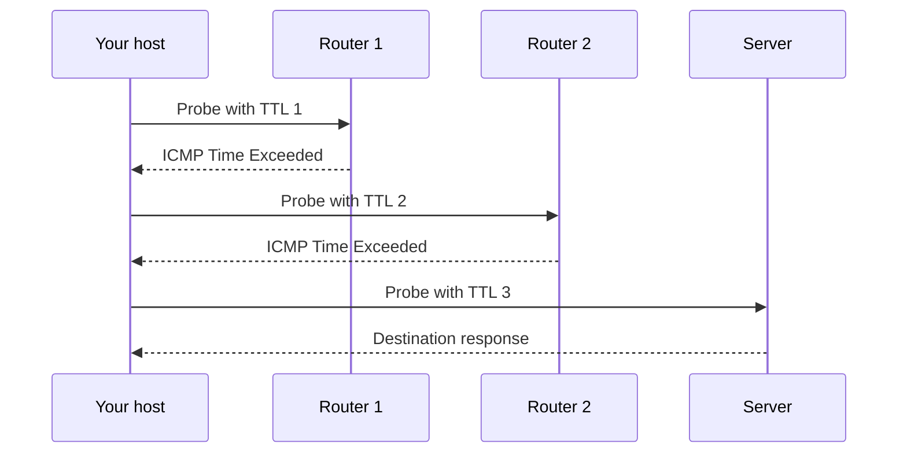

# 🧭 Routing & Internet Paths

> Routing is repeated next-hop selection. No router needs to know the complete physical path before forwarding a packet.

## What a router does

For every packet, a router:

1. Removes the incoming Layer 2 frame.
2. Validates and inspects the destination IP.
3. Decrements IPv4 TTL or IPv6 Hop Limit; if it reaches zero, discard and usually return ICMP Time Exceeded.
4. Finds the most specific matching route.
5. Chooses a next hop and outgoing interface.
6. Builds a new Layer 2 frame for that outgoing link.

## Longest-prefix match

If a table contains `0.0.0.0/0`, `10.0.0.0/8`, and `10.4.0.0/16`, a packet to `10.4.2.7` uses `/16` because it is the most specific matching prefix. The `/0` **default route** is the fallback.

A host's **default gateway** is the router used when the destination is outside the local subnet.

## Static and dynamic routing

- **Static route:** configured by an administrator. Predictable and simple, but does not adapt automatically.
- **Dynamic routing protocol:** routers exchange reachability information and recalculate paths after changes.

### Distance-vector

Routers tell neighbours their distance to destinations. Classic example: **RIP**. It is simple but can converge slowly and suffer the **count-to-infinity** problem after a route fails.

Mitigations include split horizon, route poisoning, poison reverse, and hold-down timers. These reduce loops while the network converges.

### Link-state

Routers advertise link state, build a topology database, and calculate shortest paths. **OSPF** is a link-state Interior Gateway Protocol and uses Dijkstra's shortest-path-first algorithm.

### Path-vector

**BGP** exchanges reachability between Autonomous Systems (ASes). It makes policy-based decisions using attributes such as AS_PATH and local preference. It is not simply choosing the smallest hop count.

| Protocol | Used where | Core model | Interview phrase |
|---|---|---|---|
| RIP | Inside an organization | Distance-vector | Hop count; simple, limited |
| OSPF | Inside an organization | Link-state | Dijkstra; fast convergence |
| BGP | Between Autonomous Systems | Path-vector | Policy and path attributes |

## TTL and traceroute

TTL prevents a routed packet from looping forever. `traceroute` intentionally sends probes with TTL 1, then 2, then 3, and so on. Each router where TTL expires normally sends an ICMP Time Exceeded response, revealing the hop.

Traditional Unix traceroute commonly uses UDP probes; implementations can also use ICMP or TCP. The important mechanism is increasing TTL.

## ICMP: control and diagnostics

ICMP reports network conditions and supports diagnostics:

- Echo Request / Reply: used by `ping`.
- Destination Unreachable: no route, blocked port, or fragmentation-related feedback.
- Time Exceeded: TTL expired, used by traceroute.

ICMP is not a general application data transport. Blocking all ICMP can break diagnostics and Path MTU Discovery.

## Routing loops versus switching loops

| Problem | Layer | Limiting mechanism |
|---|---|---|
| Packet caught in a routing loop | L3 | TTL / Hop Limit eventually discards it |
| Frame caught in a switching loop | L2 | STP prevents the loop; Ethernet has no TTL |
| Distance-vector count-to-infinity | Routing control plane | Split horizon, poisoning, timers |

## ❓ FAQs

### Does a router change the source and destination IP at every hop?
Normally no. It changes the link-layer frame and decrements TTL, while IP endpoints remain the same. NAT is the common case that deliberately rewrites address and often port fields.

### Why can traceroute show stars for some hops?
A router may rate-limit or filter ICMP, or the return path may differ. A missing response does not necessarily mean forwarding stopped.

### Is BGP a shortest-path routing protocol?
Not in the simple metric sense. BGP first follows administrative policy, then evaluates path attributes. A longer AS path may be selected when policy prefers it.
