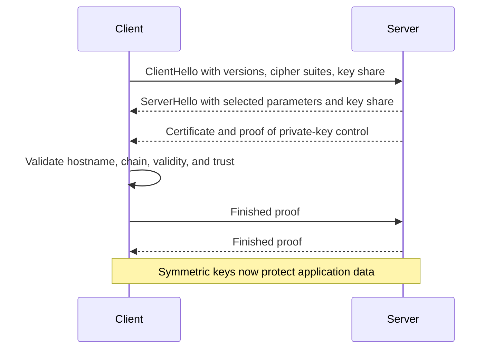

# 🛡️ TLS & Network Security

> Security is a chain: authenticate the peer, protect data in transit, restrict reachability, and make abuse expensive.

## The three properties

- **Confidentiality:** unauthorized parties cannot read the data.
- **Integrity:** unauthorized changes are detected.
- **Authentication:** the peer is who it claims to be.

Encryption alone does not automatically provide all three.

## Symmetric and asymmetric cryptography

| Type | Keys | Strength | Main network use |
|---|---|---|---|
| Symmetric | Same shared secret encrypts/decrypts | Very fast for bulk data | Protecting an established session |
| Asymmetric | Public/private key pair | Authentication and key agreement, but costlier | Handshakes, signatures, identity |
| Hash | One-way digest, no decryption key | Detects change when used correctly | Integrity constructions, fingerprints |

TLS combines them: asymmetric techniques authenticate and establish shared secrets; efficient symmetric keys protect application data.

## A simplified TLS 1.3 handshake

The certificate binds a public key to a hostname through a chain leading to a trusted Certificate Authority. The client must validate the hostname, expiry, signatures, and chain. Skipping certificate validation enables man-in-the-middle attacks.

TLS 1.3 removes obsolete choices and normally completes a new handshake in **1 RTT** after the transport connection. Resumption can be faster. QUIC integrates the TLS 1.3 handshake.

## Firewalls

- **Stateless firewall:** evaluates each packet independently using rules such as source/destination address, protocol, and port.
- **Stateful firewall:** tracks connection state, so it can allow replies to legitimate outbound traffic and reject packets that do not fit a valid flow.
- **Web Application Firewall (WAF):** examines HTTP-layer requests for application attack patterns.

A firewall controls reachability; it does not fix vulnerable application code or make unencrypted traffic confidential.

## Common network attacks

| Attack | What happens | Typical defences |
|---|---|---|
| ARP spoofing | Forged local IP-to-MAC mappings redirect traffic | Segmentation, inspection, secure access, encryption |
| DNS spoofing | Victim receives a false DNS answer | DNSSEC validation, protected resolvers, TLS hostname validation |
| Man in the middle | Attacker observes or changes traffic | Authenticated TLS, correct certificate validation |
| SYN flood | Half-open TCP connections exhaust resources | SYN cookies, rate limits, filtering, scalable front ends |
| DDoS | Many sources overwhelm bandwidth or service capacity | Anycast/CDN, filtering, scrubbing, rate limits, capacity |
| Packet sniffing | Traffic is captured | End-to-end encryption, secure network access |

## SYN cookies in more detail

During a SYN flood, immediately allocating state for every SYN can exhaust the backlog. A SYN cookie encodes connection information in the server's initial sequence number. The server delays normal allocation until the final ACK proves that the client can receive packets at the claimed address.

## DNSSEC is signing, not encryption

DNSSEC adds signatures and a chain of trust to DNS records so a validating resolver can verify authenticity and integrity. Queries and answers remain visible unless an encrypted DNS transport is also used.

## VPNs and IPsec

A VPN creates a protected tunnel across an untrusted network. **IPsec** protects IP traffic using authentication and encryption, commonly in site-to-site or remote-access VPNs. Tunnel mode wraps the entire original IP packet; transport mode protects the payload of the original packet.

## Secure interview reasoning

When asked “Is this secure?”, check each boundary:

1. How is the server authenticated?
2. Is traffic encrypted and integrity-protected end to end?
3. How are keys and credentials stored and rotated?
4. Which hosts and ports are reachable?
5. What prevents replay, spoofing, and resource exhaustion?
6. What logs and alerts reveal abuse?

## ❓ FAQs

### Does NAT protect a private network like a firewall?
Not reliably. NAT changes addressing and incidentally blocks some unsolicited mappings, but a firewall is the component that explicitly enforces allowed traffic and connection state.

### Why not use asymmetric encryption for the whole HTTPS response?
It is computationally expensive and less suitable for bulk data. TLS uses asymmetric operations to authenticate and agree on shared secrets, then symmetric encryption for the session.

### Can HTTPS stop a malicious server?
HTTPS authenticates the server identity represented by the certificate and protects the connection. It cannot make a legitimately authenticated but malicious application trustworthy.
