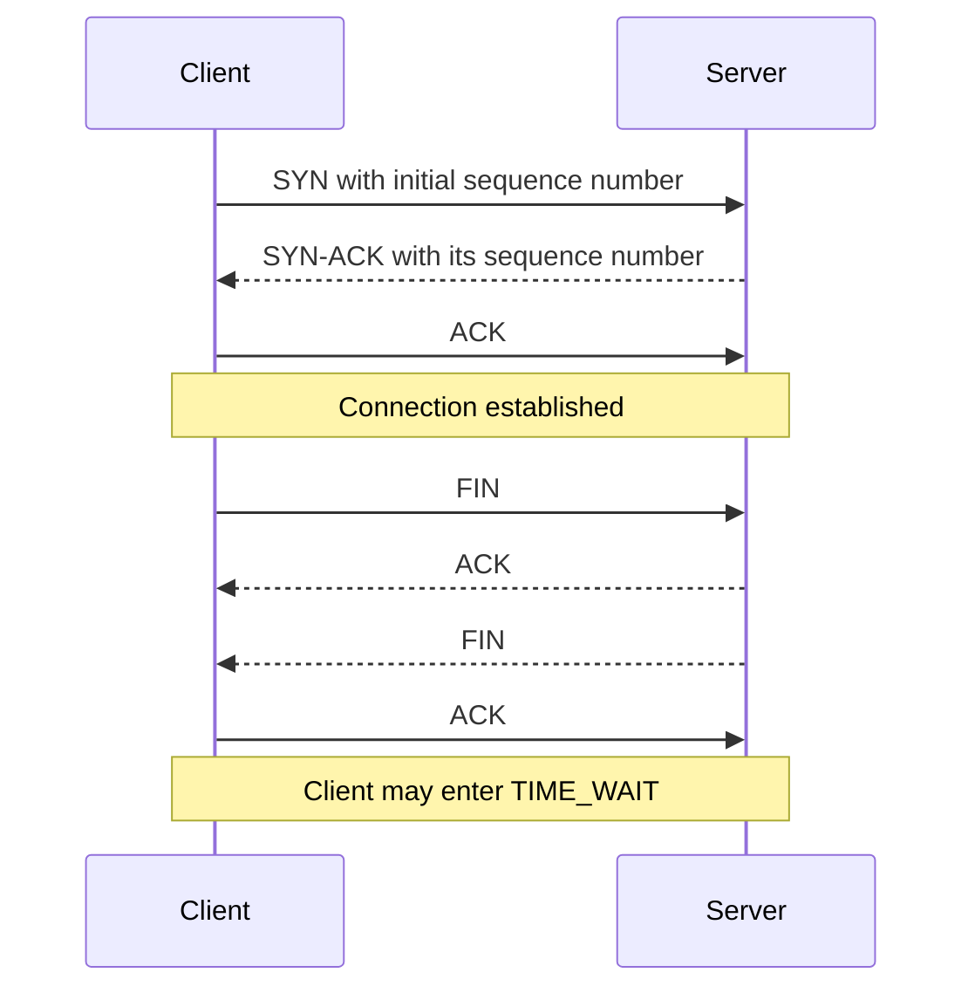
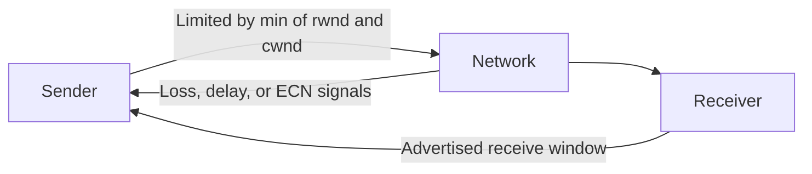

# 🚚 TCP, UDP & QUIC

> Transport protocols connect processes. Choose between reliability, latency, ordering, and application control—not “good” versus “bad.”

## Ports and sockets

A port is a 16-bit number identifying an application endpoint on a host. Servers usually listen on a known port; clients normally use a temporary **ephemeral port**. A socket is an operating-system abstraction around a network endpoint.

## TCP versus UDP

| Property | TCP | UDP |
|---|---|---|
| Connection | Connection-oriented | Connectionless |
| Delivery | Reliable byte stream | Best-effort datagrams |
| Ordering | Preserved | Not guaranteed |
| Duplicate handling | Hidden from application | Application handles it |
| Flow / congestion control | Built in | Application decides |
| Overhead | Higher | Low |
| Typical uses | Web, SSH, email, database connections | DNS, voice/video, gaming, QUIC |

UDP is not automatically faster in every workload; it simply provides fewer mechanisms. Applications can add reliability or ordering selectively.

## TCP connection lifecycle

The **three-way handshake** proves both directions work and synchronizes initial sequence numbers. Closing usually needs FIN, ACK, FIN, ACK because TCP is full duplex and each direction closes independently.

**TIME_WAIT** keeps the active closer around, commonly for twice the Maximum Segment Lifetime, so delayed segments from the old connection expire and the final ACK can be retransmitted if needed.

## How TCP provides reliability

- **Sequence numbers** identify byte positions and restore order.
- **Acknowledgements** report received data.
- **Retransmission timers** and duplicate ACK signals trigger retransmission.
- **Checksum** detects accidental corruption.
- **Sliding window** permits multiple segments in flight instead of waiting after every segment.

TCP exposes an ordered **byte stream**, not message boundaries. One application write may arrive through several reads, or several writes may be combined into one read.

## Flow control versus congestion control

These are deliberately different:

- **Flow control** protects the receiver. The advertised receive window (`rwnd`) says how much buffer space is available.
- **Congestion control** protects the network. The congestion window (`cwnd`) responds to inferred capacity and loss.
- Effective in-flight data is limited by approximately `min(rwnd, cwnd)`.

TCP congestion algorithms use ideas such as **slow start** and **AIMD**: Additive Increase, Multiplicative Decrease. The sender probes for capacity gradually and backs off sharply after congestion signals.

## MSS, Nagle, and low-latency trade-offs

- **MSS** is the maximum TCP payload in a segment and is advertised during the handshake.
- **Nagle's algorithm** coalesces small writes to reduce tiny-packet overhead.
- `TCP_NODELAY` disables Nagle when latency for small messages matters more than packet efficiency.
- Blindly disabling Nagle can increase packet count; measure the actual workload.

## SYN floods and SYN cookies

A **SYN flood** sends many connection requests but does not complete the handshake, consuming the server's half-open connection backlog.

With **SYN cookies**, the server encodes enough state into its SYN-ACK sequence number rather than allocating normal connection state. If a valid final ACK arrives, the server reconstructs the state. Rate limiting, filtering, and scalable front doors are additional protections.

## QUIC and HTTP/3

QUIC runs over UDP but implements secure, reliable, congestion-controlled connections in user space. It integrates TLS 1.3 and supports independent streams.

HTTP/2 multiplexes streams over one TCP connection, removing application-level request serialization. However, loss of one TCP segment can hold back all later bytes, so every HTTP/2 stream on that connection can wait: **transport-layer head-of-line blocking**.

QUIC tracks streams independently, so loss affecting one stream does not block delivery on the others. **HTTP/3 runs over QUIC/UDP**.

## ❓ FAQs

### Does TCP guarantee that the remote application processed my data?
No. TCP confirms delivery to the peer's transport stack. The application needs its own acknowledgement if processing or persistence must be confirmed.

### Why does the TCP handshake require three messages?
Each side must communicate and acknowledge an initial sequence number. Two messages cannot prove that the initiator received the responder's sequence number.

### When should an application choose UDP?
When timeliness is more valuable than retransmitting stale data, or when the application wants custom delivery semantics. Real-time media, games, small DNS queries, and QUIC are common examples.
