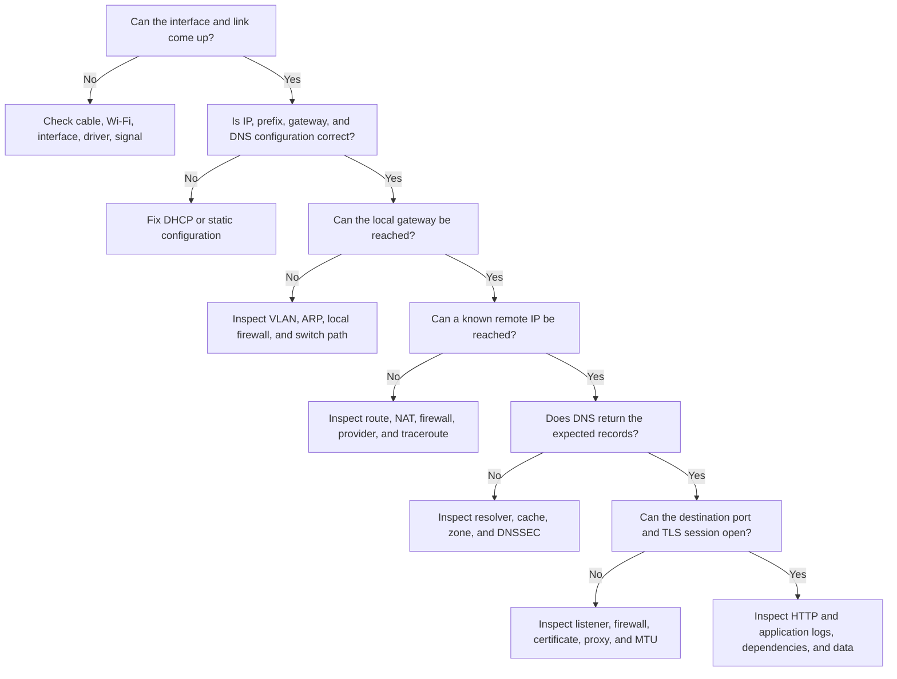

# 🧰 Troubleshooting & Interview Revision

> Diagnose from evidence. Start at the failing layer, compare with a healthy case, and resist changing several things at once.

## A layered troubleshooting flow

## The practical toolkit

| Tool | Answers | Important limitation |
|---|---|---|
| `ip addr` / `ifconfig` | What addresses and interfaces exist? | Syntax varies by OS |
| `ip route` / `route` | Which next hop will be used? | Shows local view only |
| `arp` / `ip neigh` | Which local IP-to-MAC mappings exist? | Only local neighbour cache |
| `ping` | Are ICMP echoes returned and how long do they take? | ICMP may be filtered |
| `traceroute` / `tracert` | At which hops do TTL probes respond? | Missing hops are not proof of failure |
| `dig` / `nslookup` | Which DNS records and TTLs are returned? | Ask the intended resolver/server |
| `ss` / `netstat` | Which ports listen and which connections exist? | Permissions can limit process details |
| `curl -v` | DNS, connection, TLS, HTTP headers and response | Does not reproduce every browser behaviour |
| `openssl s_client` | TLS certificate and handshake details | Requires careful hostname/SNI usage |
| `tcpdump` / Wireshark | What packets actually crossed an interface? | Capture content may be sensitive |

Treat packet captures as sensitive operational data: minimize scope, protect files, and avoid collecting payloads when headers are sufficient.

## Common symptoms and likely layers

| Symptom | First hypotheses |
|---|---|
| Name fails, raw IP works | DNS resolver, record, cache, or DNSSEC |
| Local host works, remote clients fail | Bind address, host firewall, routing, NAT, security group |
| Ping works, HTTPS fails | Listener, port firewall, TLS, proxy, application |
| Small requests work, large ones hang | MTU / PMTU black hole, proxy/body limit |
| First request slow, later requests fast | DNS, connection/TLS setup, cold cache |
| Intermittent delay under load | Queueing, saturation, loss, backend pool exhaustion |
| One VLAN works, another does not | Inter-VLAN route, ACL/firewall, trunk tagging |

## The high-signal comparison sheet

| Compare | Concise answer |
|---|---|
| Hub vs switch | Hub repeats bits to all ports; switch learns MACs and forwards frames selectively. |
| Switch vs router | Switch connects a Layer 2 LAN; router forwards between IP networks. |
| MAC vs IP vs port | Local-link interface vs routed interface vs process endpoint. |
| TCP vs UDP | Reliable ordered byte stream vs best-effort independent datagrams. |
| Flow vs congestion control | Protect receiver capacity vs protect network capacity. |
| VLAN vs subnet | Layer 2 broadcast boundary vs Layer 3 address prefix; commonly aligned, not identical. |
| OSPF vs BGP | Link-state routing inside an AS vs policy/path-vector routing between ASes. |
| HTTP/2 vs HTTP/3 | Multiplexed over TCP vs multiplexed over QUIC, avoiding cross-stream transport HOL blocking. |
| Stateless vs stateful firewall | Per-packet rules vs rules plus connection context. |
| MTU vs MSS | Maximum link IP packet vs maximum TCP payload. |
| Symmetric vs asymmetric crypto | One fast shared key vs public/private keys for identity and key agreement. |

## Facts to recall without hesitation

- OSI has **7 layers**; Network is Layer 3, Transport Layer 4, Application Layer 7.
- PDU order: **data → segment/datagram → packet → frame → bits**.
- IPv4 is **32 bits**; IPv6 is **128 bits**.
- `/24` has 256 total and normally **254 usable**; `/30` has 4 total and **2 usable**.
- TCP open: **SYN → SYN-ACK → ACK**. Normal close uses four messages.
- DNS: A = IPv4, AAAA = IPv6, CNAME = alias, MX = mail.
- OSPF is link-state and uses Dijkstra; BGP routes between Autonomous Systems using policy and attributes.
- HTTP is stateless; GET is safe and idempotent; 3xx redirect, 404 not found, 500 server failure.
- HTTP/3 uses **QUIC over UDP**.
- AIMD = Additive Increase, Multiplicative **Decrease**.
- PAT hides many private hosts behind one public IP using port mappings.
- STP prevents Layer 2 loops; TTL bounds Layer 3 loops.
- DNSSEC signs DNS records; TLS authenticates and encrypts application connections.

## Ten interview prompts to practise aloud

1. Explain what happens after entering an HTTPS URL.
2. Walk through a TCP handshake and reliable delivery.
3. Compare TCP, UDP, and QUIC for a video-call application.
4. Subnet `192.168.10.70/26` and give its usable range.
5. Explain how a switch learns and how ARP reaches a default gateway.
6. Compare OSPF and BGP and describe where each is used.
7. Explain TLS without saying “it just encrypts everything.”
8. Diagnose “the site opens by IP but not by name.”
9. Explain HTTP/2 head-of-line blocking and how HTTP/3 changes it.
10. Explain why retries at several layers still do not guarantee exactly-once business processing.

## A strong answer structure

Use **definition → mechanism → trade-off → example**.

> “TCP is a connection-oriented transport that exposes a reliable ordered byte stream. It uses sequence numbers, ACKs, retransmission, and sliding windows. Those guarantees add state and delay compared with UDP, so I choose it when correctness and ordering matter—such as an SSH session—rather than for stale real-time audio.”

## Ready for the Computer Networks test?

If you can explain the comparison sheet, calculate CIDR ranges, draw the URL-to-response flow, and answer the ten prompts without notes, you have covered the concepts used across the Computer Networks assessment—including its hard questions.

## ❓ FAQs

### Should I troubleshoot from Layer 1 upward every time?
Use the evidence to start near the likely layer, but verify lower-layer assumptions when needed. If a raw IP works, for example, physical and basic IP connectivity already have supporting evidence and DNS becomes the first focus.

### Does a failed ping prove the server is down?
No. ICMP may be blocked or rate-limited while the application port works. Test the actual protocol and port as well.

### How much port memorization is expected?
Know the common defaults and, more importantly, what each protocol does. A strong explanation beats reciting numbers without understanding the traffic flow.
