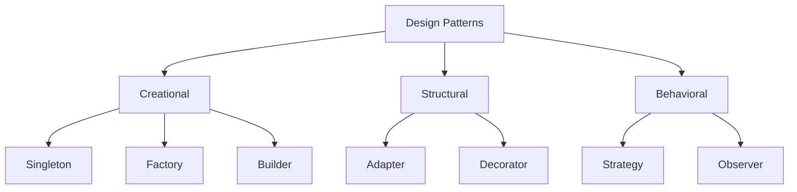

# 🧩 Design Patterns

> Reusable, battle-tested solutions to problems that keep showing up in software design.

## 🧠 What & Why

Design patterns are proven, reusable templates for solving common design problems. They aren't code you copy-paste; they're *ideas* — named blueprints that describe how classes and objects can collaborate to solve a recurring challenge elegantly.

Popularized by the "Gang of Four" (GoF) book, patterns give teams a shared vocabulary. Saying "let's use a Strategy here" instantly communicates a whole design to anyone who knows the pattern, far faster than describing it from scratch. In interviews, recognizing which pattern fits a scenario signals design maturity.

Patterns fall into three families: **Creational** (how objects get made), **Structural** (how objects are composed into bigger structures), and **Behavioral** (how objects communicate and share responsibility). Use them when they genuinely fit — forcing a pattern where it isn't needed just adds complexity.

## 🔑 Key Concepts

- **Creational** — Control and simplify object creation (Singleton, Factory, Builder).
- **Structural** — Compose objects and classes into larger structures (Adapter, Decorator).
- **Behavioral** — Manage algorithms, communication, and responsibility between objects (Strategy, Observer).
- **Gang of Four (GoF)** — The four authors whose book cataloged the classic 23 patterns.
- **Program to an interface** — Most patterns lean on abstractions so parts stay swappable.

## 📋 Patterns Summary

| Pattern | Category | Solves | One-liner |
| --- | --- | --- | --- |
| Singleton | Creational | One shared instance | Guarantee a single global object. |
| Factory | Creational | Deciding which class to create | Create objects without naming the concrete class. |
| Builder | Creational | Complex object construction | Build step-by-step, avoid huge constructors. |
| Adapter | Structural | Incompatible interfaces | Translate one interface into another. |
| Decorator | Structural | Adding behavior dynamically | Wrap an object to add features at runtime. |
| Strategy | Behavioral | Swappable algorithms | Choose an algorithm at runtime. |
| Observer | Behavioral | One-to-many notifications | Notify subscribers when state changes. |

## 💻 Example

```java
// STRATEGY: swap algorithms behind a common interface.
interface PaymentStrategy {
    void pay(int amount);
}
class CreditCardPayment implements PaymentStrategy {
    public void pay(int amount) { System.out.println("Paid " + amount + " by card"); }
}
class PayPalPayment implements PaymentStrategy {
    public void pay(int amount) { System.out.println("Paid " + amount + " via PayPal"); }
}
class Checkout {
    private PaymentStrategy strategy;               // depends on abstraction
    Checkout(PaymentStrategy strategy) { this.strategy = strategy; }
    void complete(int amount) { strategy.pay(amount); }
}

// FACTORY: hide which concrete class is created.
class PaymentFactory {
    static PaymentStrategy create(String type) {
        return switch (type) {
            case "card" -> new CreditCardPayment();
            case "paypal" -> new PayPalPayment();
            default -> throw new IllegalArgumentException("Unknown: " + type);
        };
    }
}

public class Main {
    public static void main(String[] args) {
        // Factory decides the class; Strategy lets us swap behavior.
        PaymentStrategy s = PaymentFactory.create("paypal");
        new Checkout(s).complete(100); // Paid 100 via PayPal
    }
}
```

## 🏗️ A Few More in Brief

```java
// SINGLETON: exactly one instance, lazily created.
class Config {
    private static Config instance;
    private Config() {}                          // private = no external 'new'
    static Config getInstance() {                // shared access point
        if (instance == null) instance = new Config();
        return instance;
    }
}

// BUILDER: readable step-by-step construction instead of a giant constructor.
class Burger {
    private final boolean cheese, bacon;
    private Burger(Builder b) { this.cheese = b.cheese; this.bacon = b.bacon; }
    static class Builder {
        private boolean cheese, bacon;
        Builder cheese() { this.cheese = true; return this; }
        Builder bacon()  { this.bacon = true; return this; }
        Burger build()   { return new Burger(this); }
    }
}
// Usage: new Burger.Builder().cheese().bacon().build();

// DECORATOR: wrap to add behavior without changing the original class.
interface Coffee { double cost(); }
class Espresso implements Coffee { public double cost() { return 2.0; } }
class MilkDecorator implements Coffee {
    private final Coffee inner;
    MilkDecorator(Coffee inner) { this.inner = inner; }
    public double cost() { return inner.cost() + 0.5; } // adds to wrapped cost
}
// Usage: Coffee c = new MilkDecorator(new Espresso()); // 2.5

// ADAPTER: make an incompatible class fit an expected interface.
class LegacyPrinter { void printText(String s) { System.out.println(s); } }
interface Printer { void print(String s); }
class PrinterAdapter implements Printer {
    private final LegacyPrinter legacy = new LegacyPrinter();
    public void print(String s) { legacy.printText(s); } // translate the call
}
```



## ⚠️ Common Pitfalls

- **Pattern overuse.** Reaching for a pattern when a plain method would do adds needless complexity. Patterns are tools, not goals.
- **Singleton as a hidden global.** Singletons can create tight coupling and make testing hard because they carry shared, hard-to-mock state. Use sparingly.
- **Confusing Factory with Builder.** Factory chooses *which* object to create; Builder assembles *one complex* object step by step. They solve different problems.
- **Adapter vs Decorator mix-up.** Adapter changes an interface to match expectations; Decorator keeps the interface but adds behavior.

## ❓ FAQs

### What are design patterns and why are they useful?
Design patterns are reusable, proven solutions to recurring design problems, giving developers a shared vocabulary and reliable structure for organizing classes and objects. They're useful because they capture hard-won experience, so you can apply a well-understood approach instead of reinventing a fragile solution.

### What are the three categories of design patterns?
The three categories are Creational (patterns about object creation, like Singleton and Factory), Structural (patterns about composing objects into larger structures, like Adapter and Decorator), and Behavioral (patterns about communication and responsibility between objects, like Strategy and Observer). Grouping patterns this way helps you quickly find the right family for a given problem.

### What is the difference between the Factory and Strategy patterns?
Factory is a creational pattern focused on deciding *which* concrete object to instantiate, hiding the construction details from the caller. Strategy is a behavioral pattern focused on selecting *which algorithm or behavior* to run at runtime; the two are often combined, where a factory creates the strategy object the client then uses.

### When should I avoid the Singleton pattern?
Avoid Singleton when the shared global state it introduces would make code hard to test or reason about, since singletons are difficult to mock and can hide dependencies. In many cases, passing a single shared instance explicitly through dependency injection is cleaner and keeps the design flexible.

### How is the Decorator pattern different from inheritance?
Inheritance adds behavior at compile time by creating a subclass, producing a fixed combination for the life of the program. The Decorator pattern adds behavior at run time by wrapping an object in another object with the same interface, so you can stack and combine features dynamically without a subclass explosion.
