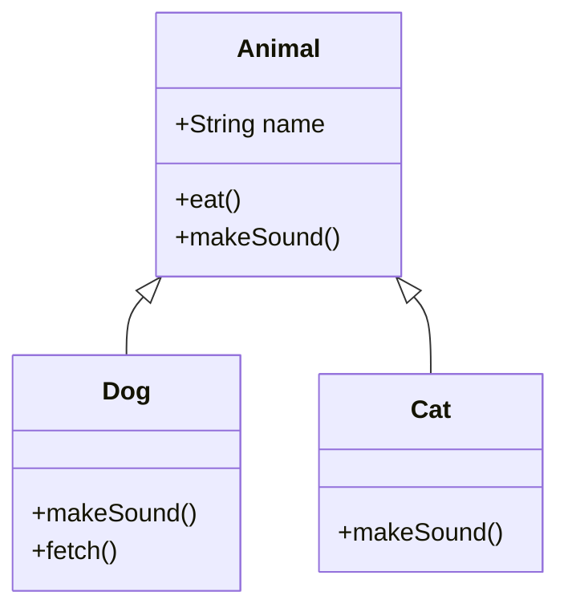

# 🧬 Inheritance

> Build new classes on top of existing ones to reuse behavior — an "is-a" relationship.

## 🧠 What & Why

Inheritance lets a new class (the **subclass** or child) acquire the fields and methods of an existing class (the **superclass** or parent). The child gets everything the parent has for free, then adds or changes behavior as needed. In Java you write this with the `extends` keyword.

The relationship inheritance models is **IS-A**: a `Dog` *is an* `Animal`, a `Car` *is a* `Vehicle`. If you can't say "X is a Y" truthfully, inheritance is probably the wrong tool.

Inheritance promotes **code reuse** and lets you treat many types uniformly through their common parent. But it's a strong, permanent coupling: the child depends deeply on the parent's design. That's why experienced developers often say **"prefer composition over inheritance"** — combining objects (HAS-A) is usually more flexible than deep inheritance trees (IS-A).

## 🔑 Key Concepts

- **`extends`** — The keyword that makes one class inherit from another.
- **`super`** — A reference to the parent; used to call the parent's constructor (`super(...)`) or an overridden method (`super.method()`).
- **Method overriding** — A subclass replaces a parent method with its own version using the same signature (`@Override`).
- **Code reuse** — Shared behavior lives once in the parent instead of being copied.
- **Composition** — Building capability by holding other objects as fields (HAS-A) instead of inheriting.

## 💻 Example

```java
// Parent class: shared state and behavior.
class Animal {
    protected String name;

    Animal(String name) {
        this.name = name;
    }

    void eat() {
        System.out.println(name + " is eating.");
    }

    void makeSound() {
        System.out.println(name + " makes a sound.");
    }
}

// Child class: inherits eat(), overrides makeSound(), adds fetch().
class Dog extends Animal {
    Dog(String name) {
        super(name); // call the parent constructor to set 'name'
    }

    @Override
    void makeSound() { // overriding: same signature, new behavior
        System.out.println(name + " barks: Woof!");
    }

    void fetch() { // new behavior specific to Dog
        System.out.println(name + " fetches the ball.");
    }
}

public class Main {
    public static void main(String[] args) {
        Dog rex = new Dog("Rex");
        rex.eat();       // inherited from Animal: "Rex is eating."
        rex.makeSound(); // overridden: "Rex barks: Woof!"
        rex.fetch();     // Dog-specific
    }
}
```

## 🎯 Composition vs Inheritance

| Aspect | Inheritance (IS-A) | Composition (HAS-A) |
| --- | --- | --- |
| Relationship | Child is a kind of parent | Object holds other objects |
| Coupling | Tight — child bound to parent | Loose — swap parts freely |
| Flexibility | Fixed at compile time | Can change at run time |
| Keyword | `extends` | Fields referencing other objects |
| Rule of thumb | Use for true "is-a" | Prefer this by default |



## ⚠️ Common Pitfalls

- **The fragile base class problem.** Changing a parent class can silently break subclasses that relied on its exact behavior, even if the change looks harmless.
- **The diamond problem.** With multiple inheritance of classes, a class inheriting from two parents that share a common ancestor creates ambiguity. Java avoids this by forbidding multiple class inheritance (you can implement many interfaces instead).
- **Deep inheritance hierarchies.** Long chains (`A → B → C → D`) are hard to follow and change. Favor shallow trees or composition.
- **Inheriting just to reuse a method.** If there's no real IS-A relationship, use composition instead of forcing inheritance.

## ❓ FAQs

### What is the difference between inheritance and composition?
Inheritance models an IS-A relationship where a subclass extends a parent and reuses its behavior, while composition models a HAS-A relationship where an object holds other objects as fields to reuse their behavior. Composition is generally more flexible because you can swap the contained objects at runtime and avoid the tight coupling of inheritance.

### Why do people say "prefer composition over inheritance"?
Inheritance permanently couples a subclass to its parent's implementation, so parent changes can break children (the fragile base class problem) and deep hierarchies become rigid. Composition keeps components independent and swappable, letting you assemble behavior flexibly, which usually leads to more maintainable designs.

### What is method overriding and how is it different from overloading?
Overriding is when a subclass provides a new implementation for a method it inherited, using the exact same signature, and the correct version is chosen at run time based on the object's actual type. Overloading is defining multiple methods with the same name but different parameter lists in the same class, resolved at compile time — they are unrelated mechanisms despite the similar names.

### What is the diamond problem and how does Java handle it?
The diamond problem occurs when a class inherits from two classes that share a common ancestor, creating ambiguity about which inherited version to use. Java sidesteps this for classes by allowing only single class inheritance; when you implement multiple interfaces that have conflicting `default` methods, the compiler forces you to override and resolve the conflict explicitly.

### What does the `super` keyword do?
`super` refers to the immediate parent class and lets a subclass call the parent's constructor with `super(...)` or invoke an overridden parent method with `super.methodName()`. It's how a child can build on the parent's behavior instead of completely replacing it.
