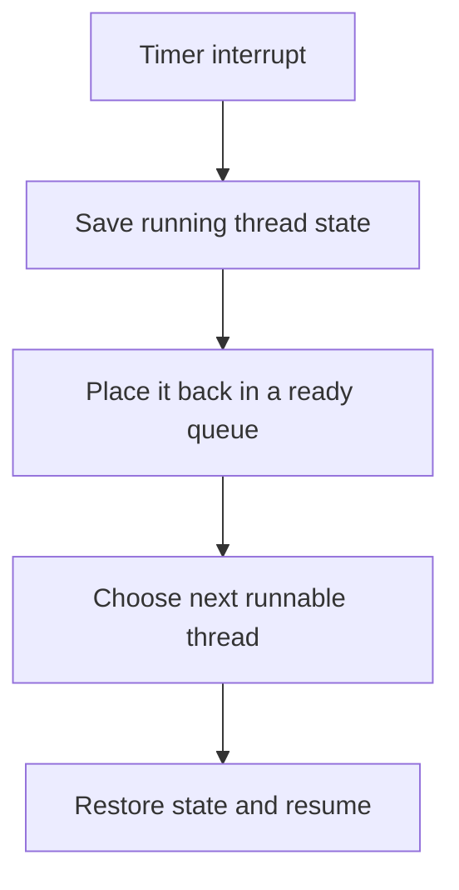

# CPU Scheduling

> The scheduler decides which ready thread runs next, balancing responsiveness, throughput and fairness.

## Important measurements

- **Arrival time:** when a job becomes ready.
- **Burst time:** CPU time the job needs.
- **Completion time:** when it finishes.
- **Turnaround time:** completion − arrival.
- **Waiting time:** turnaround − CPU burst.
- **Response time:** first run − arrival.

Interactive systems prioritize response time; batch systems often prioritize throughput and turnaround.

## Scheduling algorithms

| Algorithm | Decision | Strength | Weakness |
| --- | --- | --- | --- |
| FCFS | Oldest ready job | Simple, no starvation | Convoy effect |
| SJF | Shortest next burst | Best average wait when bursts are known | Long jobs can starve |
| SRTF | Preemptive SJF | Good response for short jobs | More switches; estimates needed |
| Round Robin | Fixed time quantum | Fair and responsive | Quantum choice matters |
| Priority | Highest priority first | Supports urgency | Low priorities may starve |
| MLFQ | Adaptive priority queues | Favors interactive tasks | Complex tuning |

## Preemption

A preemptive scheduler can interrupt a running thread, usually after a timer interrupt or when a more important thread becomes ready. Non-preemptive scheduling waits until the task blocks or exits.

## Round-robin quantum

A very large quantum approaches FCFS and hurts interactivity. A very small quantum improves apparent responsiveness but spends too much time context switching. The useful value depends on workload and switch cost.

## Starvation and aging

**Starvation** occurs when a runnable task waits indefinitely because others keep winning. **Aging** gradually raises the priority of waiting tasks so they eventually run.

## Multicore considerations

Schedulers also balance work across cores. Moving a thread may improve load balance but lose warm-cache affinity. CPU affinity keeps a thread on selected cores when locality or hardware constraints matter.

## Worked calculation

Jobs A, B and C arrive together with bursts 5, 2 and 1. Under non-preemptive SJF the order is C, B, A. Waiting times are 0, 1 and 3, so the average is 4/3. Under FCFS order A, B, C, waiting times are 0, 5 and 7, averaging 4.

## Interview takeaway

There is no universally best scheduler. Always state the workload and the metric you are optimizing.

