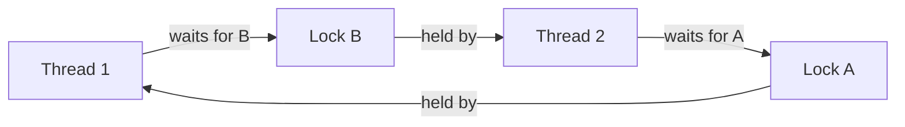

# Deadlocks and Liveness

> A deadlock is a cycle of participants that can make no progress because each waits for a resource held by another.

## Coffman conditions

All four must hold for a deadlock:

1. **Mutual exclusion:** a resource has limited ownership.
2. **Hold and wait:** a participant holds one resource while requesting another.
3. **No preemption:** resources cannot be forcibly reclaimed.
4. **Circular wait:** a cycle of waiting exists.

## Handling strategies

### Prevention

Break a necessary condition. A global lock ordering breaks circular wait: every thread acquires account locks by increasing account ID.

### Avoidance

Grant a request only if the system remains in a safe state. Banker's algorithm is the classic example, but it requires knowing maximum future claims and is uncommon in general application code.

### Detection and recovery

Allow waits, build a wait-for graph and detect cycles. Recovery may cancel work, roll back a transaction or terminate a process.

### Timeout

Timeouts bound waiting but do not prove the absence of deadlock. They also require cleanup and retry logic.

## Deadlock versus starvation versus livelock

- **Deadlock:** participants are blocked in a dependency cycle.
- **Starvation:** one participant repeatedly loses access to a resource.
- **Livelock:** participants keep changing state in response to each other but accomplish no useful work.

Two polite workers that repeatedly step aside in the same direction illustrate livelock. Randomized backoff can break the symmetry.

## Database deadlocks

Transactions can deadlock on row or index locks. Databases detect the cycle and abort a victim. Applications must keep transactions short, lock rows consistently and safely retry the aborted transaction when the operation is idempotent.

## Interview answer pattern

Draw the resource cycle, identify which Coffman condition you will break, and discuss the trade-off. “Use a timeout” is incomplete without rollback and retry behavior.

