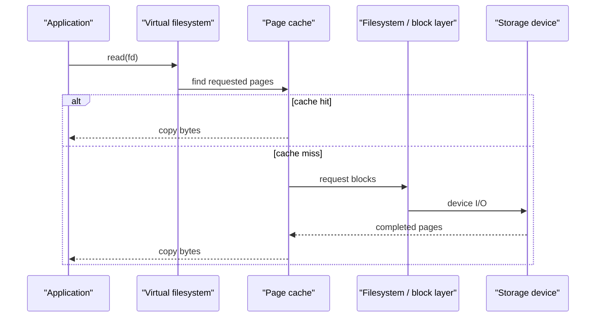

# Filesystems and I/O

> A filesystem maps durable byte storage into named files while preserving metadata, permissions and crash consistency.

## Core objects

- A **file descriptor** is a process-local integer referring to an open kernel object.
- An **inode**-like structure stores metadata and block locations; a directory maps names to file identities.
- A **hard link** is another directory entry for the same file identity.
- A **symbolic link** stores a path to be resolved later.

Deleting a name does not necessarily remove the data immediately. The object can remain while another hard link or open descriptor references it.

## Read path

The page cache makes repeated reads fast and allows writes to be buffered. A successful ordinary `write` may mean data reached kernel memory, not stable storage. Durability-sensitive code uses `fsync`-like operations and must understand filesystem guarantees.

## Buffered, direct and asynchronous I/O

- **Buffered I/O** uses the page cache and is the normal choice.
- **Direct I/O** bypasses much of that cache and requires alignment; databases may use it to control caching themselves.
- **Asynchronous I/O** lets a thread submit operations and handle completion later rather than blocking one thread per operation.

## Journaling and crash consistency

A crash between related writes can leave metadata inconsistent. Journaling records intended metadata changes so recovery can replay or roll back complete transactions. Journaling does not automatically make an application's multi-file update atomic.

## Disk scheduling and storage realities

Traditional disks benefit from ordering requests to reduce head movement. SSDs remove mechanical seek but still have erase blocks, write amplification and finite endurance. Sequential access remains friendlier to caches and prefetching.

## Common interview comparisons

- Hard link versus symbolic link.
- Buffered write versus durable write.
- Sequential versus random I/O.
- Memory-mapped file versus explicit read/write.
- File descriptor versus filename.

