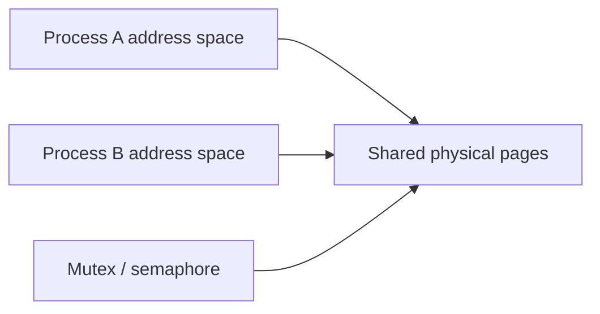

# Inter-Process Communication

> IPC trades isolation for controlled data exchange and synchronization between processes.

## Choosing an IPC mechanism

| Mechanism | Best fit | Trade-off |
| --- | --- | --- |
| Anonymous pipe | Related local processes, byte stream | Usually one direction; no message boundaries |
| Named pipe | Unrelated local processes | Filesystem-visible rendezvous |
| Message queue | Discrete asynchronous messages | Copying and capacity limits |
| Shared memory | High-throughput local data | Fast but requires synchronization |
| Unix-domain socket | Local client/server | Socket semantics with low network overhead |
| TCP socket | Local or remote services | Portable, routable, more protocol work |
| Signal | Small event notification | Very limited payload and tricky handlers |

## Shared memory flow

Shared memory avoids repeatedly copying large payloads through the kernel after setup, but processes must agree on layout, ownership and synchronization. A crash while holding a process-shared lock requires a recovery design.

## Pipes and sockets

A pipe is a kernel buffer exposed as file descriptors. Reads block when empty and writes may block when full, creating natural backpressure. A byte-stream transport does not preserve application message boundaries; protocols need framing such as a length prefix.

Sockets provide bidirectional communication. Unix-domain sockets identify local endpoints and can pass operating-system credentials or descriptors. Network sockets use addresses and ports and require serialization plus security across trust boundaries.

## Blocking and non-blocking models

- Blocking I/O keeps code simple but can tie up a thread per waiting operation.
- Non-blocking descriptors return when they cannot progress.
- Event notification mechanisms let one thread wait for readiness across many descriptors.

Readiness is not completion: a ready descriptor means an operation can likely make progress now, not that an entire application message has arrived.

## Interview design questions

When comparing IPC choices, discuss locality, payload size, message boundaries, backpressure, failure detection, synchronization and security—not speed alone.

