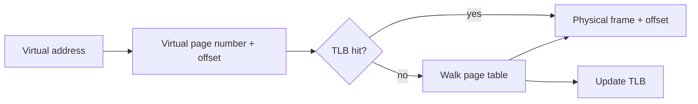

# Memory Management

> Virtual memory gives each process a private address space while the OS and hardware map it onto physical RAM.

## Address translation

A program generates a virtual address. The memory-management unit separates it into a virtual page number and offset, looks up the physical frame, and preserves the offset.

The **TLB** is a small cache of recent translations. A TLB miss is not necessarily a page fault: the page-table entry may be valid in RAM.

## Paging

Virtual and physical memory are divided into fixed-size pages and frames. Paging avoids external fragmentation because any free frame can hold a page, although the last page of an allocation can waste space internally.

Page-table entries commonly contain:

- Physical-frame number.
- Present/valid bit.
- Read/write/execute permissions.
- User/kernel accessibility.
- Accessed and dirty bits.

Multi-level page tables allocate lower levels only for used address ranges. Huge pages reduce translation overhead for large contiguous regions but increase allocation granularity.

## Segmentation and allocation

Logical regions include code, data, heap, mapped libraries and thread stacks. The heap usually grows through an allocator that manages blocks inside pages obtained from the OS. Allocation bugs include leaks, use-after-free and fragmentation.

## Protection and sharing

Per-page permissions isolate processes and implement non-executable data. Shared mappings deliberately map the same physical frames into multiple processes. Copy-on-write initially shares read-only frames and copies one only when a process writes.

## Internal versus external fragmentation

- **Internal fragmentation:** wasted space inside an allocated fixed-size block.
- **External fragmentation:** enough free memory exists in total but not as one suitable contiguous region.

Paging largely removes external fragmentation from physical allocation; allocators can still experience fragmentation inside their managed heaps.

## Interview prompts

### Why does every process use the same-looking addresses?

Virtual addresses are interpreted through that process's page tables, so the same number can map to different physical frames.

### TLB miss versus page fault?

A TLB miss requires another translation lookup. A page fault means the page-table state cannot satisfy the access directly and the kernel must handle it.

