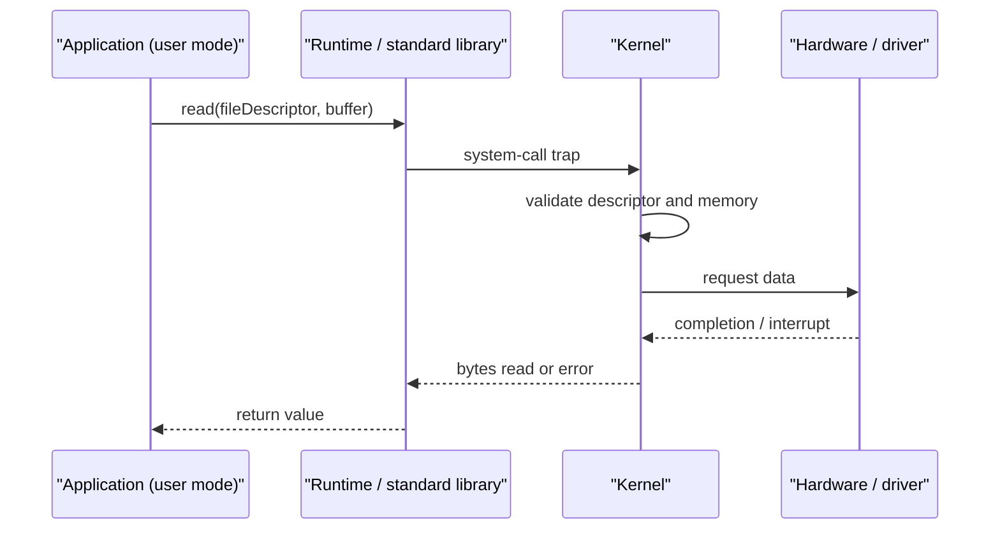

# Operating Systems — The Big Picture

> The operating system turns hardware into safe, shareable abstractions: processes, virtual memory, files and devices.

## What an operating system owns

An application cannot safely schedule the CPU, map physical memory or talk directly to every disk. The OS kernel mediates those resources and provides stable interfaces.

| Resource | OS abstraction | Main responsibility |
| --- | --- | --- |
| CPU | Process and thread | Scheduling and isolation |
| Memory | Virtual address space | Allocation, protection and paging |
| Storage | File and directory | Naming, permissions and durability |
| Devices | File descriptor and driver | Uniform I/O interface |
| Network | Socket | Communication between endpoints |

## User mode and kernel mode

Applications normally execute in **user mode**, where privileged instructions are forbidden. A **system call** deliberately crosses into kernel mode. The kernel validates the request, performs the privileged operation and returns control.

The mode switch protects the system; it is not the same as a process context switch. A system call may return to the same thread without scheduling another one.

## Interrupts, traps and exceptions

- **Interrupt:** asynchronous hardware signal, such as a network packet or timer tick.
- **Trap:** intentional synchronous transfer, commonly a system call.
- **Exception:** synchronous fault caused by the current instruction, such as division by zero or a page fault.

## Kernel architectures

- **Monolithic kernels** keep most services and drivers in kernel space. Calls are efficient, but a faulty kernel component has wide impact.
- **Microkernels** keep only essential mechanisms in the kernel and move services to user space. Isolation improves, while message-passing overhead increases.
- Production systems often use hybrid designs rather than fitting one label perfectly.

## Boot flow

Firmware initializes hardware, a bootloader loads the kernel, the kernel discovers devices and mounts the root filesystem, and the first user-space process starts services.

## Interview checklist

Be ready to explain:

1. Why applications need system calls.
2. User mode versus kernel mode.
3. Interrupt versus exception.
4. Process isolation.
5. Why a context switch costs more than an ordinary function call.

## Common trap

The kernel is not a background application. It is the privileged part of the OS that executes on behalf of processes and responds to hardware events.

