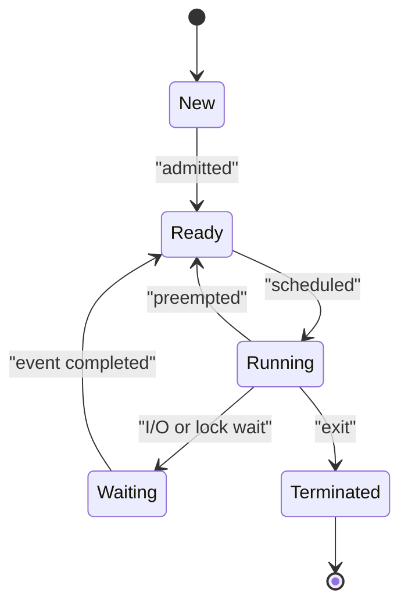

# Processes, Threads and Context Switching

> A process owns an isolated execution environment; threads are execution paths that share that environment.

## Process state

A process contains a virtual address space, open files, security identity and at least one thread. The kernel tracks it through a process control block containing identifiers, scheduling state and resource references.

Only a ready thread can be selected for CPU execution. A waiting thread does not consume CPU while the event it needs is incomplete.

## Process versus thread

| Property | Process | Thread |
| --- | --- | --- |
| Address space | Separate | Shared within process |
| Heap and globals | Private to process | Shared |
| Stack and registers | At least one set | Private per thread |
| Isolation | Stronger | A bad thread can corrupt its process |
| Communication | IPC required | Shared-memory access |
| Creation/switch cost | Usually higher | Usually lower |

Threads share code, heap and open files, but each thread needs its own stack, program counter, registers and scheduling state.

## Context switching

When the scheduler changes the running thread, the kernel saves registers and execution state for the old thread and restores them for the new one. Switching processes may also change address-space mappings.

Costs include:

- Kernel scheduling work.
- Cold CPU caches and translation lookaside buffer effects.
- Pipeline disruption.
- Lock contention when many runnable threads compete.

More threads do not automatically mean more throughput. CPU-bound work benefits roughly up to the available cores; I/O-bound work can tolerate more concurrency because many tasks wait.

## Creation and termination

On Unix-like systems, `fork` creates a child process using copy-on-write pages; `exec` replaces its program image. A terminated child may remain a **zombie** until its parent collects the exit status. An **orphan** is re-parented to a system process.

## Concurrency versus parallelism

- **Concurrency:** multiple tasks make progress during overlapping time.
- **Parallelism:** multiple tasks literally execute at the same instant on different cores.

A single-core machine can run concurrent tasks by interleaving them without executing them in parallel.

## Interview prompts

### Why is a thread switch cheaper than a process switch?

Threads in one process share the address space and most resources, so the kernel usually changes less state. It still saves registers and can still lose cache locality, so it is not free.

### What belongs to a thread?

Its stack, registers, program counter, thread-local storage and scheduling state. Heap objects and global variables normally belong to the process and are shared.

