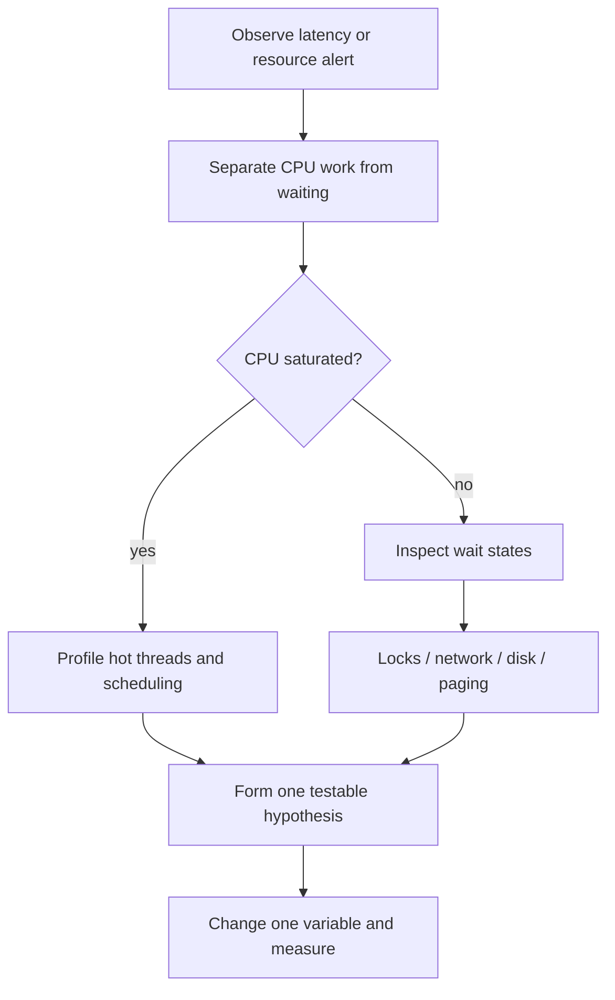

# OS Security, Troubleshooting and Revision

> Interview-ready OS knowledge connects isolation mechanisms to real symptoms: high CPU, blocked threads, memory pressure and slow I/O.

## Protection model

The kernel associates operations with identities and permissions. Key mechanisms include:

- User and group IDs.
- File permission bits and access-control lists.
- Process isolation through page tables.
- Privileged versus unprivileged execution.
- Capability-based privilege splitting.
- Sandboxing, namespaces and resource limits.
- Non-executable memory and address-space randomization.

The **principle of least privilege** means a process receives only the files, network access and kernel capabilities required for its job.

## Symptom-to-layer checklist

| Symptom | First questions |
| --- | --- |
| High CPU | Which threads are runnable? Busy loop, contention or legitimate work? |
| Low CPU but slow | Waiting on disk, network, locks or an overloaded downstream service? |
| Growing memory | Heap growth, page cache, mapped files or unreleased native memory? |
| Heavy swapping | Does the active working set exceed RAM? |
| Many context switches | Too many threads, short blocking operations or lock contention? |
| Disk latency | Random I/O, queue depth, cache misses, flushes or device saturation? |
| Process will not exit | Non-daemon threads, blocked I/O, deadlock or unhandled child process? |

## End-to-end diagnostic flow

## Rapid revision sheet

| Pair | Essential distinction |
| --- | --- |
| Process / thread | Isolated resource container / shared execution path |
| Concurrency / parallelism | Overlapping progress / simultaneous execution |
| Mutex / semaphore | Ownership lock / permit counter |
| Deadlock / starvation | Dependency cycle / indefinite unfair waiting |
| TLB miss / page fault | Translation-cache miss / kernel fault handling |
| Virtual / resident memory | Address range / pages currently in RAM |
| File name / descriptor | Directory mapping / open kernel reference |
| User / kernel mode | Restricted execution / privileged execution |

## Ten interview questions

1. Walk through a context switch.
2. Why can threads race even on one CPU core?
3. What conditions create a deadlock?
4. How does a virtual address become a physical address?
5. What happens during a major page fault?
6. Why can a process use more virtual memory than installed RAM?
7. When would shared memory beat a socket?
8. Why does `write` not always mean durable?
9. How would you investigate high context switching?
10. How do containers use OS isolation rather than becoming virtual machines?

If you can draw the process lifecycle, page-fault flow and deadlock cycle—and explain the trade-offs in the revision table—you have the operating-system foundation expected in a general software-engineering interview.

