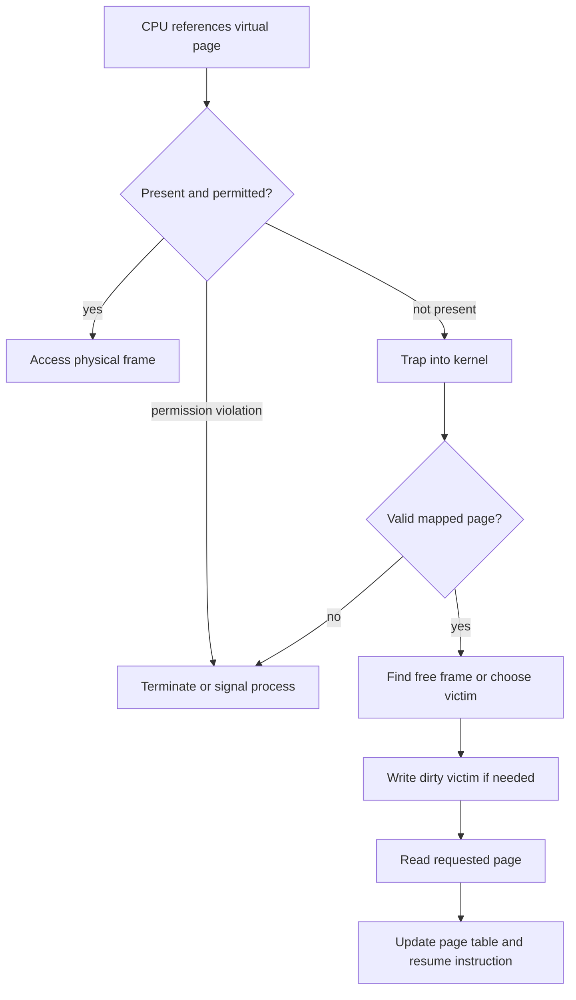

# Virtual Memory, Page Faults and Replacement

> Demand paging loads a page when it is first needed, allowing active working sets to share limited RAM.

## Page-fault flow

A minor fault can be resolved without disk I/O, for example by mapping an already cached file page. A major fault requires storage access and is far slower.

## Replacement algorithms

| Algorithm | Idea | Note |
| --- | --- | --- |
| Optimal | Evict the page used farthest in the future | Benchmark only; future is unknown |
| FIFO | Evict the oldest loaded page | Can show Belady's anomaly |
| LRU | Evict least recently used | Good locality model; exact tracking costs |
| Clock | Approximate LRU with a reference bit | Practical and efficient |

**Belady's anomaly** means FIFO can produce more faults after receiving more frames. Stack algorithms such as true LRU do not have this behavior.

## Locality and working set

Programs tend to reuse nearby instructions and data:

- **Temporal locality:** recently used data is likely to be reused.
- **Spatial locality:** neighboring data is likely to be used.

The working set is the pages actively needed during a time window. When combined working sets exceed RAM, the system may **thrash**, spending most of its time paging rather than executing useful work.

## Swap and memory-mapped files

Anonymous pages may be moved to swap. File-backed pages can often be discarded and read again from their file; dirty mapped pages must be written back. Memory mapping lets file contents participate in the virtual-memory system and can reduce copying.

## Diagnosing memory pressure

Watch resident-set size, swap activity, major faults, page-in latency and reclaim pressure. High virtual size alone is not proof that all of that memory occupies RAM.

## Interview takeaway

Explain both the mechanism and the performance hierarchy: TLB lookup, page-table walk, minor fault and major disk-backed fault have radically different costs.

