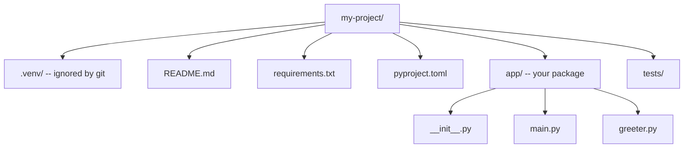

# 📦 Python App Structure

> Going from a single script to a real, organized project — with virtual environments, dependencies, and clean layout.

## 🧠 What & Why

A one-file script is fine for a quick experiment, but real apps need structure: isolated dependencies, a clear folder layout, and reusable modules. Getting this right early saves you from the classic "it works on my machine" nightmare.

The single most important habit is the **virtual environment**. It's an isolated Python setup per project, so Project A can use one version of a library and Project B another, without conflict. Paired with a `requirements.txt` (a list of your dependencies), anyone can recreate your exact environment in seconds.

Beyond that, Python organizes code into **modules** (single `.py` files) and **packages** (folders of modules). Understanding how imports and the `__main__` guard work turns a pile of scripts into a coherent, runnable application.

## 🔑 Key Concepts

- **Virtual environment (venv)** — An isolated Python + packages sandbox per project.
- **pip** — Python's package installer; pulls libraries from PyPI.
- **requirements.txt** — A pinned list of dependencies for reproducible installs.
- **Module** — A single `.py` file you can import.
- **Package** — A folder of modules (historically with `__init__.py`).
- **`__main__`** — The entry point guard for "run this file directly."
- **pyproject.toml** — The modern config file used by tools like Poetry and pip.

## 💻 Example

```bash
# Create and activate a virtual environment
python -m venv .venv
source .venv/bin/activate      # macOS/Linux
# .venv\Scripts\activate       # Windows

# Install a dependency and freeze the list
pip install requests
pip freeze > requirements.txt  # records exact versions

# Later, on another machine:
pip install -r requirements.txt
```

```python
# app/main.py — a minimal runnable app
from app.greeter import greet   # import from another module in the package

def main():
    print(greet("World"))

# Only runs when executed directly (not when imported)
if __name__ == "__main__":
    main()
```

```python
# app/greeter.py — a reusable module
def greet(name):
    return f"Hello, {name}!"
```

## 🗂️ A Sensible Project Layout



Run it from the project root with `python -m app.main`, which treats `app` as a package and makes imports resolve cleanly.

## 🔧 Dependencies: pip vs Poetry

| Tool | Config file | Notes |
|---|---|---|
| **pip + venv** | `requirements.txt` | Built-in, simple, widely understood |
| **Poetry** | `pyproject.toml` | Manages deps + virtualenv + packaging together |
| **pip + pyproject** | `pyproject.toml` | Modern standard config, growing adoption |

For learning and small projects, `pip` + `venv` + `requirements.txt` is perfectly fine. Larger teams often prefer Poetry for lockfiles and cleaner dependency resolution.

## ⚠️ Common Pitfalls

- **Skipping the virtual environment.** Installing globally leads to version conflicts across projects.
- **Committing `.venv/` to git.** Add it to `.gitignore`; ship `requirements.txt` instead.
- **`ModuleNotFoundError` from wrong run location.** Run packages with `python -m app.main` from the project root.
- **Forgetting the `__main__` guard.** Without it, code runs on import, causing surprises.
- **Not pinning versions.** Unpinned deps can break your app when a library updates.

## ❓ FAQs

### What is a virtual environment and why do I need one?

A virtual environment is an isolated Python installation for a single project, keeping its dependencies separate from other projects and the system Python. It prevents version conflicts (Project A needs library v1, Project B needs v2) and makes your setup reproducible for teammates.

### What does the `if __name__ == "__main__":` guard do?

When Python runs a file directly, it sets that file's `__name__` to `"__main__"`; when the file is imported, `__name__` is the module's name instead. The guard ensures the enclosed code (usually your `main()` call) runs only on direct execution, not when another module imports it.

### What's the difference between a module and a package?

A module is a single `.py` file you can import. A package is a directory containing multiple modules (traditionally marked with an `__init__.py` file), letting you organize related code and import it with dotted paths like `app.greeter`.

### How do `requirements.txt` and `pip freeze` work together?

`pip freeze` outputs the exact versions of every installed package, which you redirect into `requirements.txt`. Anyone can then run `pip install -r requirements.txt` to recreate the identical environment, ensuring the app behaves the same everywhere.

### Should I use pip or Poetry?

For learning and small projects, `pip` with `venv` and a `requirements.txt` is simple and universal. Poetry adds dependency locking, environment management, and packaging in one tool via `pyproject.toml`, which many teams prefer for larger or shared codebases. Both are valid — pick based on project complexity.
