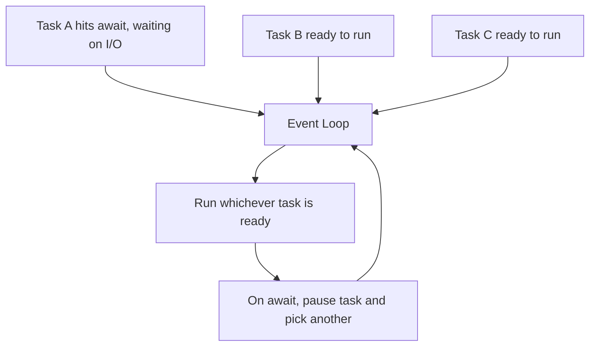

# 🔀 Python Async

> Doing many things at once by not waiting around — the event loop, async/await, and when it actually helps.

## 🧠 What & Why

Normally Python runs code **synchronously**: one line finishes before the next starts. That's simple, but wasteful when your program spends most of its time *waiting* — for a network response, a database query, or a file read. During that wait, the CPU sits idle.

**Asynchronous** programming lets a single thread juggle many such waits. While one task is blocked waiting for I/O, the **event loop** switches to another ready task. Nothing runs truly in parallel here, but by never sitting idle, an async program can handle thousands of concurrent connections efficiently.

You express this with `async def` (to define a **coroutine**) and `await` (to pause at a waiting point and let other tasks run). The key insight: async is a huge win for **I/O-bound** work, but does *not* speed up **CPU-bound** work — that's where the GIL comes in.

## 🔑 Key Concepts

- **Synchronous** — Tasks run one after another; each blocks until done.
- **Asynchronous** — Tasks yield during waits so others can progress.
- **Event loop** — The scheduler that runs and switches between coroutines.
- **Coroutine** — A function defined with `async def`; runs when awaited.
- **`await`** — Pause here, let the loop do other work, resume when ready.
- **`asyncio`** — Python's standard library for async programming.
- **GIL** — The Global Interpreter Lock; only one thread runs Python bytecode at a time.

## 💻 Example

```python
import asyncio

# A coroutine — note "async def"
async def fetch(name, delay):
    print(f"{name}: start")
    await asyncio.sleep(delay)      # simulates waiting on I/O (non-blocking)
    print(f"{name}: done after {delay}s")
    return name

async def main():
    # Run three coroutines concurrently
    results = await asyncio.gather(
        fetch("A", 2),
        fetch("B", 1),
        fetch("C", 3),
    )
    print("all done:", results)

# Total time ≈ 3s (the longest), NOT 2+1+3=6s
asyncio.run(main())
```

## 🔄 How the Event Loop Works



The loop keeps a set of tasks. When one hits an `await` on I/O, it steps aside so another can run. When its data arrives, it's resumed. One thread, no idle waiting.

## 📊 Sync vs Async

| Aspect | Synchronous | Asynchronous |
|---|---|---|
| Execution | One task at a time, blocking | Interleaves tasks during waits |
| Best for | Simple scripts, CPU work | Many I/O-bound operations |
| Complexity | Low | Higher (async/await, event loop) |
| Speeds up CPU work? | — | ❌ No (GIL) |
| Speeds up I/O waiting? | — | ✅ Yes |

## 🔒 The GIL, Simply

The **Global Interpreter Lock** ensures only one thread executes Python bytecode at any moment. This keeps memory management safe but means threads can't run Python code truly in parallel. So:

- **I/O-bound work** (network, disk): async or threads help, because waiting releases the GIL.
- **CPU-bound work** (heavy math): use `multiprocessing` (separate processes) to sidestep the GIL and use multiple cores.

## ⚠️ Common Pitfalls

- **Expecting async to speed up CPU work.** It won't — async is about *waiting* efficiently, not computing faster.
- **Calling a coroutine without `await`.** `fetch("A", 2)` alone returns a coroutine object and does nothing; you must `await` it or schedule it.
- **Blocking the event loop.** A synchronous `time.sleep()` or heavy loop freezes *all* tasks; use `await asyncio.sleep()` and async libraries.
- **Mixing sync and async carelessly.** Blocking calls inside async code stall everything — offload them to a thread/process pool.

## ❓ FAQs

### What's the difference between synchronous and asynchronous code?

Synchronous code runs one step at a time, blocking until each finishes. Asynchronous code can pause a task while it waits (e.g., for a network reply) and let other tasks run in the meantime. Async doesn't make individual operations faster — it avoids wasting time sitting idle during waits.

### When should I use async, and when is it pointless?

Use async for **I/O-bound** workloads — lots of network calls, database queries, or file operations where you spend time waiting. It's pointless (or even counterproductive) for **CPU-bound** work like heavy computation, because the GIL prevents true parallel execution; use `multiprocessing` for that instead.

### What is the event loop?

The event loop is the scheduler at the heart of asyncio. It keeps track of all your coroutines, runs the ones that are ready, and when a coroutine hits an `await` on something slow, it parks that coroutine and switches to another. When the awaited result is available, the loop resumes the parked coroutine.

### What does `await` actually do?

`await` marks a point where the current coroutine can pause and hand control back to the event loop, allowing other tasks to run while it waits for a result. Once the awaited operation completes, execution resumes right after the `await`. You can only use it inside an `async def` function.

### What is the GIL and how does it affect async?

The Global Interpreter Lock (GIL) allows only one thread to execute Python bytecode at a time, which keeps the interpreter's memory management safe but blocks true multi-core parallelism for Python code. Async sidesteps this for I/O because waiting releases the GIL, but for CPU-heavy work you need multiple processes to actually use multiple cores.
