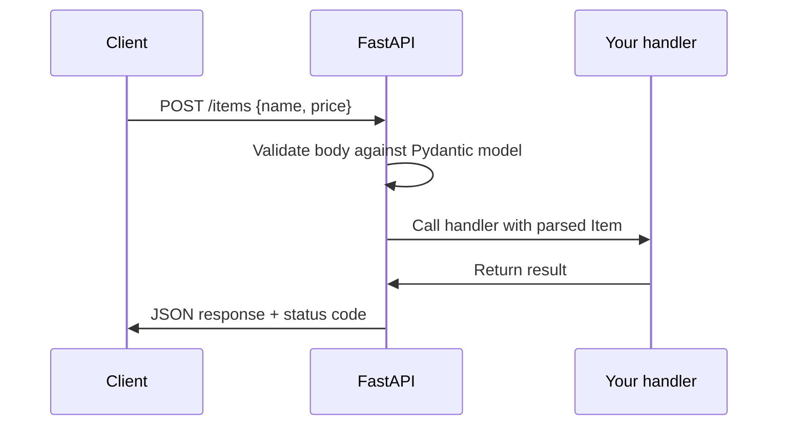

# ⚡ Python FastAPI

> A modern Python framework for building fast APIs — with type hints, async support, and free interactive docs.

## 🧠 What & Why

FastAPI is a web framework for building **APIs** (the backend services your frontend or other apps talk to). It has become wildly popular because it combines three things developers love: **high performance** (built on async), **type hints** for safety and editor autocomplete, and **automatic interactive documentation** generated straight from your code.

The magic is that FastAPI reads Python's standard **type hints** to do real work. Declare that a parameter is an `int` and FastAPI validates it, converts it, and documents it for you. Pair that with **Pydantic models** for request bodies, and you get robust input validation with almost no boilerplate.

Because it's built on async foundations (ASGI), FastAPI handles many concurrent connections efficiently — ideal for I/O-heavy services that call databases or other APIs. You get speed, safety, and self-documenting endpoints in one package.

## 🔑 Key Concepts

- **Path parameter** — Part of the URL path: `/users/{id}`.
- **Query parameter** — After the `?`: `/search?q=python`.
- **Request body** — JSON data sent with POST/PUT, validated by a Pydantic model.
- **Pydantic model** — A typed class that validates and parses incoming data.
- **Dependency injection** — Reusable logic (auth, DB sessions) provided via `Depends`.
- **uvicorn** — The ASGI server that runs your FastAPI app.
- **OpenAPI docs** — Auto-generated interactive docs at `/docs`.

## 💻 Example

```python
# main.py
from fastapi import FastAPI, Depends
from pydantic import BaseModel

app = FastAPI()

# --- Pydantic model: validates the request body ---
class Item(BaseModel):
    name: str
    price: float
    in_stock: bool = True      # default value

# --- Path + query parameters ---
@app.get("/items/{item_id}")
def read_item(item_id: int, verbose: bool = False):
    # item_id comes from the URL path; verbose from ?verbose=true
    data = {"item_id": item_id}
    if verbose:
        data["detail"] = "full info"
    return data

# --- Request body (POST) ---
@app.post("/items")
def create_item(item: Item):
    # FastAPI parses + validates the JSON into an Item automatically
    return {"created": item.name, "price": item.price}

# --- Dependency injection ---
def get_current_user(token: str = "guest"):
    return {"user": token}

@app.get("/me")
def whoami(user: dict = Depends(get_current_user)):
    return user
```

```bash
# Run the app (reload restarts on code changes)
uvicorn main:app --reload
# Then open http://127.0.0.1:8000/docs for interactive docs
```

## 🔄 How a Request Flows



## 📊 FastAPI vs Flask (Quick Compare)

| Feature | FastAPI | Flask |
|---|---|---|
| Async support | Built-in (ASGI) | Add-on (WSGI by default) |
| Data validation | Automatic (Pydantic) | Manual / extensions |
| Auto API docs | Yes (`/docs`) | Extension needed |
| Type-hint driven | Yes | No |

## ⚠️ Common Pitfalls

- **Blocking calls in async routes.** Using a slow synchronous library inside an `async def` route blocks the event loop; use async libraries or run blocking work in a threadpool.
- **Forgetting Pydantic for bodies.** Raw dict handling loses validation; define a model.
- **Wrong uvicorn target.** It's `uvicorn module:app_variable`, e.g. `main:app`.
- **Confusing path vs query params.** Path params are in the URL template `{}`; query params come after `?`.

## ❓ FAQs

### Why is FastAPI considered "fast"?

Two reasons. First, it's built on ASGI and async, so it handles many concurrent I/O-bound requests without blocking. Second, it's fast to *develop* with — type hints and Pydantic eliminate boilerplate validation and give you autocomplete and auto-generated docs out of the box.

### What are Pydantic models used for?

Pydantic models are typed classes that define the shape of your data. FastAPI uses them to automatically parse incoming JSON, validate types and constraints, produce clear error messages, and generate documentation — all from a simple class declaration.

### How does dependency injection work in FastAPI?

You write a function that produces something (a DB session, the current user, config) and declare it in your route with `Depends(...)`. FastAPI calls it, injects the result into your handler, and reuses/caches it as needed. This keeps cross-cutting concerns like auth reusable and testable.

### Where do the automatic docs come from?

FastAPI generates an OpenAPI schema from your routes, type hints, and Pydantic models, then serves interactive documentation at `/docs` (Swagger UI) and `/redoc`. You get a live, testable API reference without writing any docs yourself.

### What's the difference between a path parameter and a query parameter?

A path parameter is embedded in the URL structure, like `id` in `/items/{item_id}`, and typically identifies a specific resource. A query parameter comes after the `?`, like `verbose` in `/items/5?verbose=true`, and usually filters, sorts, or tweaks the response. FastAPI infers which is which from your function signature.
