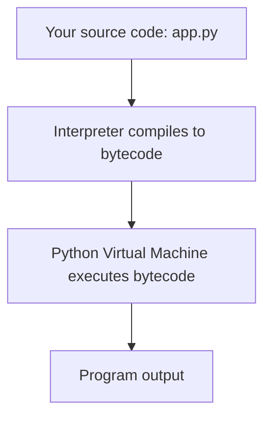

# 🐍 Python Overview

> A friendly, readable language that lets you turn ideas into working code fast — from tiny scripts to production web services.

## 🧠 What & Why

Python is a **general-purpose programming language** designed around one big idea: code should be easy to read and quick to write. Its syntax looks almost like plain English, which is why it's a favorite first language and, at the same time, a workhorse in serious production systems.

Python is **interpreted**, meaning you don't compile it into a separate executable before running. You hand your `.py` file to the Python interpreter, and it runs your code line by line. This makes the write-run-fix loop very fast — great for experimenting and learning.

Python is also **dynamically typed**. You don't declare that a variable is an integer or a string; the interpreter figures out the type at runtime based on the value you assign. That flexibility speeds up development, though it means some mistakes only show up when the code actually runs.

Because it's so approachable and has a massive ecosystem of libraries, Python shines almost everywhere: **web backends** (Django, Flask, FastAPI), **automation & scripting**, and especially **data science and machine learning** (NumPy, pandas, PyTorch).

## 🔑 Key Concepts

- **Interpreted** — Code runs directly through the interpreter, no separate compile step required.
- **Dynamically typed** — Variable types are determined at runtime, not declared up front.
- **Readability first** — Indentation defines structure, keeping code visually clean.
- **Batteries included** — A large standard library plus a huge third-party ecosystem (PyPI).
- **Cross-platform** — The same code runs on Windows, macOS, and Linux.
- **High-level** — Memory management and low-level details are handled for you.

## 💻 Example

```python
# The classic first program in Python
print("Hello, World!")

# No type declarations needed — Python infers them
name = "Ada"        # a string
year = 1815         # an integer
print(f"{name} was born in {year}")
```

## ⚙️ How a Python Program Runs

When you run `python app.py`, Python doesn't just read raw text and execute it directly. It first compiles your source into **bytecode** (a lower-level, portable instruction set), then the **Python Virtual Machine (PVM)** executes that bytecode.



You never manage this manually — it happens automatically every time you run a script. The takeaway: "interpreted" doesn't mean "no compilation"; it means the compilation is invisible and happens on the fly.

## ⚠️ Common Pitfalls

- **Assuming Python is slow for everything.** It's slower than C for raw number-crunching, but libraries like NumPy push heavy work into fast C code under the hood.
- **Confusing "dynamically typed" with "untyped."** Python values always have a definite type; you just don't declare it.
- **Ignoring version differences.** Python 2 is dead; always write Python 3.
- **Forgetting indentation matters.** Whitespace is syntax, not decoration.

## ❓ FAQs

### Is Python compiled or interpreted?

Both, in a sense. Python compiles your source code into intermediate bytecode automatically, then interprets that bytecode on the Python Virtual Machine. From your point of view it feels interpreted because there's no explicit build step.

### What does "dynamically typed" actually mean?

It means a variable's type is checked and bound at runtime rather than declared in advance. You can write `x = 5` and later `x = "hello"`, and Python won't complain — the name `x` simply points to whatever value it currently holds.

### Why is Python so popular for data science and machine learning?

Its readable syntax lets researchers focus on ideas rather than boilerplate, and its ecosystem (NumPy, pandas, scikit-learn, PyTorch, TensorFlow) offers battle-tested tools that wrap fast, low-level code. That combination of ease and power is hard to beat.

### What's the difference between Python 2 and Python 3?

Python 3 is the modern, actively maintained version with better Unicode support, cleaner syntax (like `print()` as a function), and ongoing improvements. Python 2 reached end-of-life in 2020, so all new code should target Python 3.

## 🚀 What's Next

Now that you know what Python is and how it runs, dive into the fundamentals: start with **Python Basics** (variables, control flow, f-strings), then move through **Data Structures**, **Functions**, and **OOP**. After that, explore how to structure a real app, build APIs with **FastAPI**, and understand **async** programming. Each topic builds on the last — read them in order for the smoothest ride.
