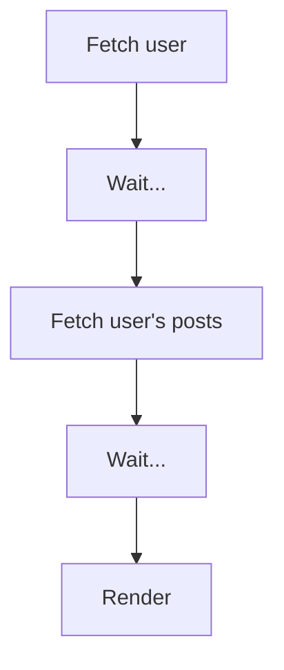

# 🌐 Data Fetching & API Calls

> Loading data from a server into your components — with loading, error, and cleanup handled properly.

## 🧠 What & Why

React components often need data from a server: a list of questions, a user profile, search results. React itself has no built-in data layer, so you use the browser's `fetch` (or a library like axios) inside an effect, store the result in state, and render it.

The tricky part isn't fetching — it's handling everything *around* it: showing a **loading** indicator, catching **errors**, and cleaning up if the component unmounts or the inputs change before the response arrives. Getting these right prevents flickering, stuck spinners, and "set state on unmounted component" bugs.

For anything beyond the basics, dedicated libraries like **React Query (TanStack Query)** handle caching, retries, and background refetching so you don't reinvent them.

## 🔑 Key Concepts

- **`fetch` in `useEffect`** — Trigger the request after render, then store the result in state.
- **Loading state** — A boolean/flag so the UI can show a spinner while waiting.
- **Error state** — Captured so the UI can show a friendly message instead of crashing.
- **AbortController** — Cancels an in-flight request during cleanup to avoid race conditions.
- **Request waterfall** — Sequential dependent requests that slow the page; fetch in parallel when possible.
- **React Query** — A library that adds caching, deduping, and refetching on top of fetching.

## 💻 Example

A reusable `useFetch` hook with loading, error, and abort handling:

```tsx
import { useEffect, useState } from 'react'

type State<T> = { data: T | null; loading: boolean; error: string | null }

function useFetch<T>(url: string): State<T> {
  const [state, setState] = useState<State<T>>({
    data: null, loading: true, error: null,
  })

  useEffect(() => {
    const controller = new AbortController() // lets us cancel the request
    setState({ data: null, loading: true, error: null })

    fetch(url, { signal: controller.signal })
      .then((res) => {
        if (!res.ok) throw new Error(`HTTP ${res.status}`)
        return res.json() as Promise<T>
      })
      .then((data) => setState({ data, loading: false, error: null }))
      .catch((err) => {
        if (err.name === 'AbortError') return // ignore cancellations
        setState({ data: null, loading: false, error: err.message })
      })

    return () => controller.abort() // cleanup: cancel on unmount / url change
  }, [url])

  return state
}

function Questions() {
  const { data, loading, error } = useFetch<string[]>('/api/questions')

  if (loading) return <p>Loading…</p>
  if (error) return <p>❌ {error}</p>
  return <ul>{data?.map((q) => <li key={q}>{q}</li>)}</ul>
}
```

## 🌊 The Request-Waterfall Pitfall



Each request waits for the previous one. If the requests don't depend on each other, fire them in parallel with `Promise.all` to cut total wait time.

## ⚠️ Common Pitfalls

- **No cleanup** — A late response sets state after unmount; abort or guard with a mounted flag.
- **Ignoring `res.ok`** — `fetch` only rejects on network errors, not on HTTP 404/500; check the status yourself.
- **Missing loading/error states** — leads to blank screens or stuck spinners.
- **Refetching every render** — forgetting the dependency array or passing unstable deps.
- **Waterfalls** — chaining independent requests instead of running them in parallel.

## ❓ FAQs

### Where should I put a data-fetching call in React?
Put it inside a `useEffect` (or a custom hook that uses one), keyed on the inputs it depends on (like an id or query). The effect runs after render, fetches, and stores the result in state. For richer needs, a data library like React Query manages the fetching and caching for you, but the effect-based approach is the fundamental pattern.

### Why does fetch not throw on a 404 or 500?
`fetch` only rejects its promise on network-level failures (no connection, DNS error, aborted request). HTTP error statuses like 404 or 500 still resolve successfully with `res.ok === false`. You must check `res.ok` (or `res.status`) yourself and throw, otherwise you'll treat an error response as valid data.

### How do I cancel a request when the component unmounts?
Create an `AbortController`, pass its `signal` to `fetch`, and call `controller.abort()` in the effect's cleanup function. When the component unmounts or the dependencies change, the request is cancelled and the resulting `AbortError` can be ignored. This prevents race conditions and state updates on unmounted components.

### What is a request waterfall and how do I avoid it?
A waterfall happens when requests run sequentially because each waits for the previous — even when they don't actually depend on each other — inflating total load time. Avoid it by starting independent requests in parallel (e.g. `Promise.all([fetchA(), fetchB()])`), and only chain requests that genuinely need a prior result.

### When should I use React Query instead of plain fetch?
Reach for React Query (or SWR) once you need caching, automatic refetching, deduplication of identical requests, pagination, retries, or shared server state across components. It removes a lot of boilerplate loading/error/caching logic. For a single simple request, plain `fetch` in an effect is perfectly fine.
