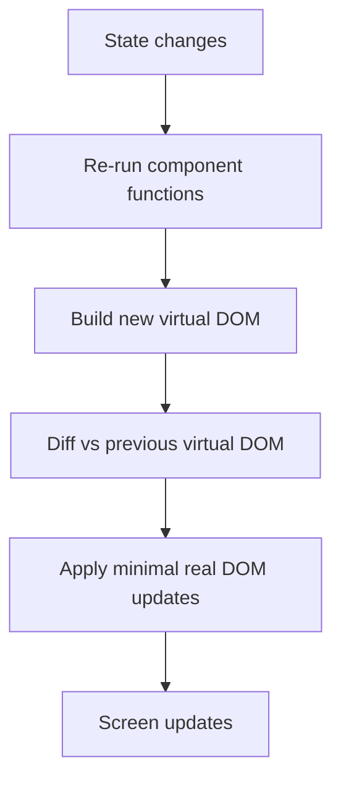

# ⚛️ React Overview

> A JavaScript library for building user interfaces out of small, reusable pieces called components.

## 🧠 What & Why

**React** is a library (not a full framework) for building user interfaces. Instead of manually finding elements on a page and updating them by hand, you *describe what the UI should look like* for a given state, and React figures out how to update the screen. This style is called **declarative** — you say *what* you want, not the step-by-step *how*.

The core idea is the **component**: a small, self-contained function that returns a piece of UI. You build a big app by composing many small components, the same way you build a big function out of small helper functions. Components can be reused, tested, and reasoned about in isolation.

React stays fast using a **virtual DOM** — a lightweight in-memory copy of the real page. When your data changes, React re-renders your components to a new virtual DOM, compares it to the previous one ("diffing"), and applies only the minimal real-DOM updates needed. You never touch the DOM directly.

Data in React flows **one way**: from parent components down to children via props. This predictable, top-down flow makes apps easier to debug — when something looks wrong, you know the data came from above.

## 🔑 Key Concepts

- **Declarative UI** — You describe the UI for the current state; React updates the DOM to match.
- **Component** — A function returning UI (JSX). The fundamental building block of every React app.
- **Virtual DOM** — An in-memory tree React diffs against the previous render to apply minimal changes.
- **Props** — Read-only inputs passed from parent to child.
- **State** — Data owned by a component that can change over time and triggers re-renders.
- **One-way data flow** — Data moves down from parent to child; events flow back up via callbacks.
- **Vite** — A modern build tool that serves and bundles your React app quickly during development.

## 💻 Example

```tsx
// A tiny React component written in TypeScript.
// It takes a `name` prop and returns some UI (JSX).
type GreetingProps = { name: string }

function Greeting({ name }: GreetingProps) {
  // Whatever we return here is what shows on screen.
  return <h1>Hello, {name}! 👋</h1>
}

// Components compose: App uses Greeting like an HTML tag.
export default function App() {
  return (
    <main>
      <Greeting name="Ada" />
      <Greeting name="Grace" />
    </main>
  )
}
```

## 🏗️ How a React App Is Structured (Vite)

A typical Vite + React + TypeScript project looks like this:

```
my-app/
  index.html          // single HTML page; has <div id="root"></div>
  vite.config.ts      // build/dev-server config
  src/
    main.tsx          // entry point: mounts <App /> into #root
    App.tsx           // root component
    components/       // reusable UI pieces
    hooks/            // custom hooks
    lib/              // API clients, helpers
```

The `main.tsx` file is where React attaches to the page:

```tsx
import { createRoot } from 'react-dom/client'
import App from './App'

// Find the root div in index.html and render the app into it.
createRoot(document.getElementById('root')!).render(<App />)
```

## 🔁 How Rendering Works



## ⚠️ Common Pitfalls

- Thinking React is a full framework — it's a UI library; routing, data fetching, etc. are add-ons.
- Trying to update the DOM directly (`document.querySelector(...)`) instead of letting state drive the UI.
- Forgetting that a component re-renders when its state or props change — not "whenever you want".
- Confusing **props** (passed in, read-only) with **state** (owned by the component, changeable).

## ❓ FAQs

### Is React a framework or a library?
React is a **library** focused on the view layer — building and updating UI components. It deliberately leaves choices like routing, global state, and data fetching to you or to companion libraries (react-router, React Query, etc.). People often *call* it a framework loosely, but in interviews it's safest to say "a UI library."

### What is the virtual DOM and why does it matter?
The virtual DOM is a lightweight JavaScript representation of the real DOM. When state changes, React builds a new virtual tree, compares it to the old one, and computes the smallest set of real DOM operations needed. This avoids slow, manual DOM manipulation and makes updates efficient and predictable.

### What does "declarative UI" mean?
Declarative means you describe *what* the UI should look like for a given state, and the framework handles the *how*. Instead of writing imperative steps ("find this node, change its text, add a class"), you write a function of state, and React reconciles the screen to match it.

### What is one-way data flow?
Data flows downward: parent components pass data to children through props, and children never modify their parents' data directly. To communicate upward, children call callback functions passed down as props. This single direction makes it easy to trace where any piece of data came from.

### Why use Vite instead of Create React App?
Vite offers near-instant dev server startup and fast hot-module replacement by leveraging native ES modules during development, and it bundles efficiently for production. Create React App is older and slower, and is no longer the recommended default. Vite is the modern standard for new React projects.

## What's Next

Ready to go deeper? Continue with **react-components-jsx** to learn how to write components and JSX properly, then move on to **react-usestate** and **react-useeffect** to make your components interactive and data-aware.
