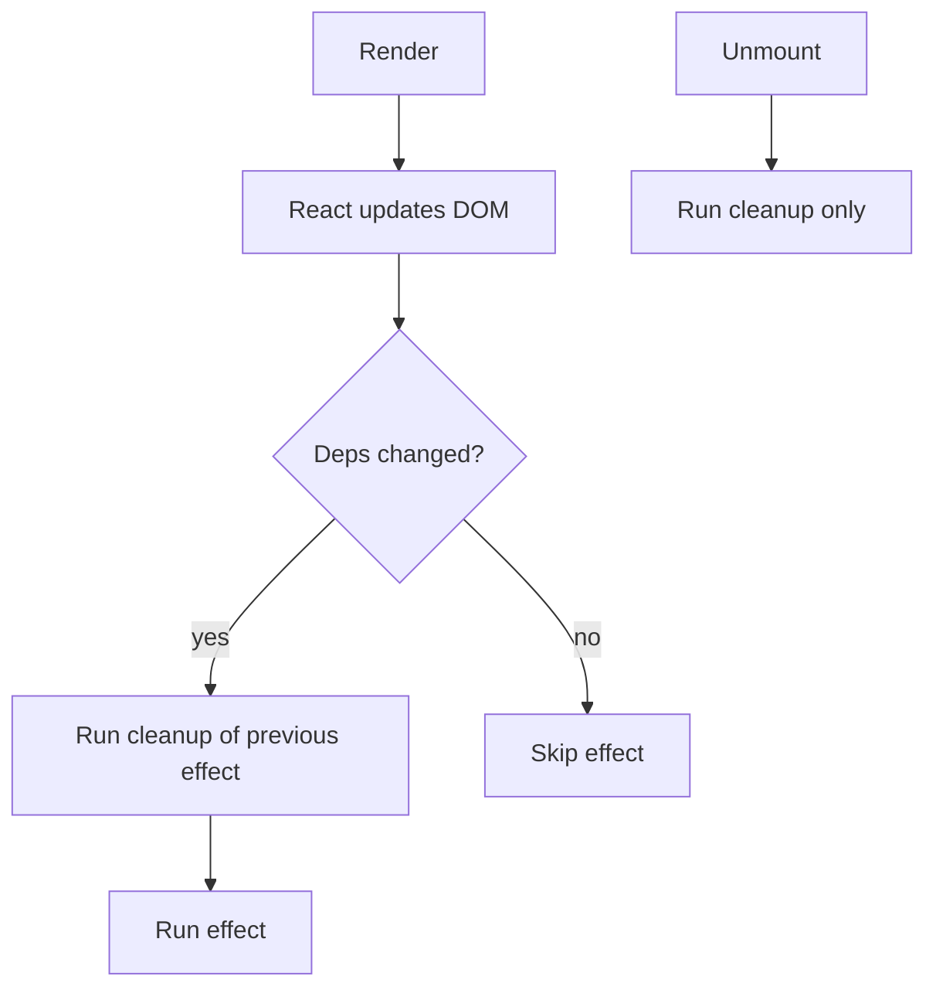

# 🔄 useEffect & Side Effects

> Running code that reaches outside React — timers, subscriptions, and data fetching.

## 🧠 What & Why

Rendering in React should be pure: given the same props and state, a component returns the same UI. But real apps need **side effects** — fetching data, setting timers, subscribing to events, updating the document title. `useEffect` is the hook that lets you run this kind of code *after* React updates the DOM.

You give `useEffect` a function (the effect) and a **dependency array**. React runs the effect after render, and re-runs it only when one of the dependencies changes. This is how you keep external things in sync with your component's data.

Many effects need **cleanup** — clearing a timer, unsubscribing, aborting a request. You return a cleanup function from the effect, and React runs it before the next effect and when the component unmounts.

## 🔑 Key Concepts

- **`useEffect(fn, deps)`** — Runs `fn` after render, re-running when `deps` change.
- **Dependency array** — The list of values the effect depends on. Controls *when* it runs.
- **Mount** — First render; effect runs once if `deps` is `[]`.
- **Update** — A dependency changed; cleanup runs, then the effect runs again.
- **Unmount** — Component removed; only the cleanup function runs.
- **Cleanup function** — Returned from the effect to undo subscriptions/timers.

## 💻 Example

```tsx
import { useEffect, useState } from 'react'

function Clock() {
  const [now, setNow] = useState(() => new Date())

  useEffect(() => {
    // Side effect: start a timer after the component mounts.
    const id = setInterval(() => setNow(new Date()), 1000)

    // Cleanup: stop the timer on unmount to avoid leaks.
    return () => clearInterval(id)
  }, []) // empty deps → run once on mount, clean up on unmount

  return <p>🕒 {now.toLocaleTimeString()}</p>
}
```

Re-running when a value changes:

```tsx
useEffect(() => {
  document.title = `You clicked ${count} times`
}, [count]) // runs on mount AND whenever `count` changes
```

## 📊 How the Dependency Array Behaves

| Deps argument | When the effect runs |
| --- | --- |
| `[]` (empty) | Once, after the first render (on mount) |
| `[a, b]` | On mount, then whenever `a` or `b` changes |
| *omitted* | After **every** render (rarely what you want) |

## 🔁 Effect Lifecycle



## ⚠️ Common Pitfalls

- **Missing dependencies** — Leaving out a value the effect uses leads to stale data. Trust the ESLint `exhaustive-deps` rule.
- **Infinite loops** — Setting state in an effect whose deps include that state re-triggers it forever.
- **Forgetting cleanup** — Timers, listeners, and subscriptions leak if not cleaned up.
- **Fetching without abort** — A slow response can set state after unmount; abort the request in cleanup.
- **Overusing effects** — Don't use an effect to compute values you can derive during render.

## 🚫 When NOT to Use useEffect

- To transform data for rendering — compute it inline instead of syncing to state.
- To respond to a user event — put that logic in the event handler, not an effect.
- To reset state when a prop changes — often a `key` or derived value is cleaner.

## ❓ FAQs

### What does the dependency array actually control?
It tells React *when* to re-run the effect. React compares each dependency to its value from the previous render; if any changed, it runs the cleanup then the effect again. An empty array means "no dependencies, run once on mount." Omitting the array means "run after every render," which is almost never desirable.

### Why does my effect cause an infinite loop?
Usually because the effect updates a state value that is also in its dependency array (or you pass a new object/array/function literal as a dep each render). The update triggers a re-render, which re-runs the effect, which updates state again. Fix it by narrowing dependencies, using functional updates, or memoizing the object/function with useMemo/useCallback.

### What is a cleanup function and when does it run?
The function you return from an effect is the cleanup. React runs it before re-running the effect (when deps change) and once when the component unmounts. Use it to clear timers, remove event listeners, close sockets, or abort fetches, so you don't leak resources or update unmounted components.

### How do I safely fetch data in useEffect?
Start the request inside the effect, track whether the component is still mounted (or use an `AbortController`), and update state only if it is. Handle loading and error states, and abort/ignore the response in the cleanup function. This prevents "set state on unmounted component" warnings and race conditions.

### When should I avoid useEffect entirely?
Avoid it for things that aren't true side effects: computing derived data (do it during render), handling user events (use the event handler), or synchronizing state that could just be a prop or memoized value. Effects are for syncing with *external* systems — the DOM, network, timers, subscriptions — not for ordinary in-app logic.
