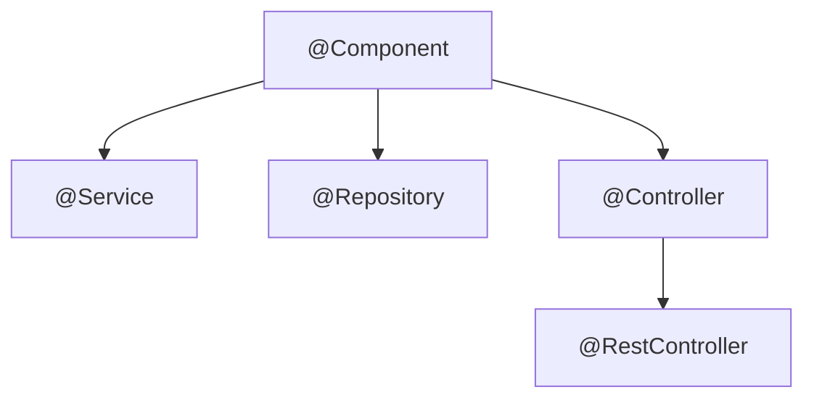

# 🏷️ Essential Spring Annotations

> A quick-reference cheat sheet for the annotations you'll use every day.

## 🧠 What & Why

Spring is annotation-driven. Instead of verbose XML configuration, you sprinkle small annotations on classes, methods, and fields, and Spring reads them to build and wire your application. Knowing the core set is essential — they come up constantly in real work and in interviews.

Annotations fall into a few families: **stereotypes** that mark a class as a certain kind of bean, **configuration** annotations that define beans, **injection** annotations that wire dependencies, and **behavior** annotations that add cross-cutting features like transactions or profiles.

This page is a reference. You don't need to memorize every attribute — just understand what each annotation *means* and when to reach for it. The examples show the most common usage.

## 🔑 Key Concepts

- **Stereotype annotations** — `@Component` and its specializations that register beans.
- **Configuration annotations** — Define beans and configuration classes.
- **Injection annotations** — Control how dependencies are wired.
- **Behavioral annotations** — Add features like transactions or profile activation.

## 📋 Annotations Reference

| Annotation | Category | What it does |
|------------|----------|--------------|
| `@Component` | Stereotype | Generic bean; picked up by component scan |
| `@Service` | Stereotype | A `@Component` for business-logic classes |
| `@Repository` | Stereotype | A `@Component` for data access; adds exception translation |
| `@Controller` | Stereotype | Web controller returning views |
| `@RestController` | Stereotype | `@Controller` + `@ResponseBody`; returns data (JSON) |
| `@Configuration` | Config | Marks a class that defines `@Bean` methods |
| `@Bean` | Config | Registers the returned object as a bean |
| `@Autowired` | Injection | Injects a matching bean |
| `@Qualifier` | Injection | Picks a specific bean when several match |
| `@Primary` | Injection | Marks the default bean when several match |
| `@Value` | Injection | Injects a config/property value |
| `@ComponentScan` | Config | Tells Spring which packages to scan for beans |
| `@Profile` | Behavior | Activates a bean only for certain profiles |
| `@Transactional` | Behavior | Wraps a method in a database transaction |

## 💻 Example

```java
// Stereotype: a business-logic bean.
@Service
public class PaymentService {

    private final PaymentGateway gateway;

    // @Qualifier picks the "stripe" bean when multiple PaymentGateways exist.
    public PaymentService(@Qualifier("stripe") PaymentGateway gateway) {
        this.gateway = gateway;
    }

    // Runs inside a transaction: commits on success, rolls back on exception.
    @Transactional
    public void charge(long amount) {
        gateway.debit(amount);
    }
}

// Configuration class defining beans explicitly.
@Configuration
public class GatewayConfig {

    @Bean
    @Primary // Default choice if no @Qualifier is given.
    public PaymentGateway stripe() {
        return new StripeGateway();
    }

    @Bean
    @Profile("dev") // Only created when the 'dev' profile is active.
    public PaymentGateway mockGateway() {
        return new MockGateway();
    }
}

// Injecting a property value.
@Component
public class Greeter {
    @Value("${app.greeting:Hello}") // Default to "Hello" if property missing.
    private String greeting;
}
```

## 🧭 Stereotype Hierarchy



## ⚠️ Common Pitfalls

- Using `@Controller` when you meant `@RestController` and wondering why Spring tries to resolve a view template instead of returning JSON.
- Two beans of the same type with no `@Primary` or `@Qualifier`, causing a `NoUniqueBeanDefinitionException`.
- Putting `@Transactional` on a `private` method or calling it from within the same class — the proxy won't intercept it, so no transaction is applied.
- Forgetting that `@Value` with no default throws if the property is absent; use `${key:default}` syntax to be safe.

## ❓ FAQs

### What is the difference between @Component, @Service, and @Repository?

They are technically all `@Component` (they register a bean via scanning), but they express intent. `@Service` marks business logic, `@Repository` marks data-access classes and adds automatic exception translation for persistence errors, and `@Component` is the generic fallback. Using the specific one improves readability and can enable extra behavior.

### What is the difference between @Controller and @RestController?

`@Controller` is for traditional web apps that return view names (like an HTML template). `@RestController` is `@Controller` combined with `@ResponseBody`, so every method's return value is serialized directly into the response body (typically JSON), which is what you want for REST APIs.

### When do you use @Qualifier vs @Primary?

Both resolve ambiguity when multiple beans match a type. `@Primary` marks one bean as the default choice used everywhere unless overridden. `@Qualifier` is applied at the injection point to explicitly name which bean you want, overriding `@Primary`. Use `@Primary` for a sensible global default and `@Qualifier` for specific exceptions.

### What does @Transactional do?

It wraps the annotated method in a database transaction. If the method completes normally the transaction commits; if it throws a runtime exception the transaction rolls back. Spring implements this with a proxy, which is why it only works on public methods called from outside the class.

### How does @Value work?

`@Value` injects values from configuration (properties/YAML, environment variables, or SpEL expressions) into fields or parameters. You reference a property with `${property.name}` and can supply a fallback using `${property.name:defaultValue}` so the app still starts if the property is missing.
