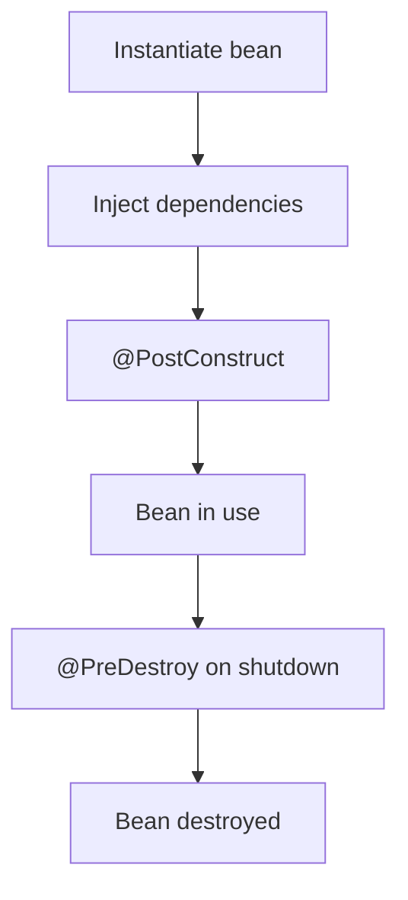

# 🫘 Spring Beans & Lifecycle

> The objects Spring creates, wires, and manages for you from birth to death.

## 🧠 What & Why

A **bean** is simply an object that the Spring container creates and manages. When Spring starts, it reads your configuration and annotations, instantiates the beans, injects their dependencies, and keeps them ready for use. You rarely call `new` yourself — you ask the container for what you need.

Why does Spring manage beans instead of you? Because centralizing object creation lets Spring handle wiring, scoping, lifecycle callbacks, proxying (for things like transactions), and cleanup. It's the foundation that makes dependency injection, AOP, and much of Spring's magic possible.

Beans have a **lifecycle**: created → dependencies injected → initialization callbacks → in use → destruction callbacks. Understanding this lifecycle helps you run setup logic (open a connection) and teardown logic (close it) at the right time.

Beans also have a **scope** that controls how many instances exist and how long they live — most are singletons, but you can have per-request or per-session beans in web apps.

## 🔑 Key Concepts

- **Bean** — An object managed by the Spring IoC container.
- **Bean lifecycle** — Instantiate → populate dependencies → init callbacks → use → destroy callbacks.
- **Scope** — How many instances and how long they live (singleton, prototype, request, session).
- **`@Component` vs `@Bean`** — `@Component` marks a class for scanning; `@Bean` defines a bean via a factory method in config.
- **`@PostConstruct` / `@PreDestroy`** — Methods run after creation and before destruction.
- **Lazy init** — Delay bean creation until first use with `@Lazy`.

## 💻 Example

```java
@Component
public class CacheWarmer {

    // Runs once after the bean is constructed and dependencies are injected.
    @PostConstruct
    public void warmUp() {
        System.out.println("Preloading cache...");
    }

    // Runs when the container shuts down — good for cleanup.
    @PreDestroy
    public void cleanUp() {
        System.out.println("Flushing cache...");
    }
}

// @Bean defines a bean via a method — useful for third-party classes you can't annotate.
@Configuration
public class AppConfig {

    @Bean
    public RestTemplate restTemplate() {
        return new RestTemplate(); // Spring manages the returned object as a bean.
    }
}
```

## 📊 Bean Scopes

| Scope | Instances | Lifetime | Typical use |
|-------|-----------|----------|-------------|
| `singleton` (default) | One per container | Whole app | Stateless services, repositories |
| `prototype` | New every time requested | Not managed after creation | Stateful, short-lived objects |
| `request` | One per HTTP request | The request | Per-request web data |
| `session` | One per HTTP session | The session | Per-user session data |

```java
@Component
@Scope("prototype") // A fresh instance is created every time it's injected/requested.
public class ReportBuilder { }
```

## 🔁 Lifecycle Flow



## ⚠️ Common Pitfalls

- Assuming `@PreDestroy` runs for `prototype` beans — Spring does **not** manage their destruction, so cleanup callbacks won't fire.
- Storing mutable state in a singleton bean shared across threads, causing race conditions.
- Injecting a `prototype` bean into a `singleton` and expecting a new instance each call — you get the same one; use a provider/lookup instead.
- Overusing `@Lazy` and hiding startup errors that would otherwise surface immediately.

## ❓ FAQs

### What is a Spring bean?

A Spring bean is any object that is instantiated, assembled, and managed by the Spring IoC container. You declare beans with stereotype annotations like `@Component` or with `@Bean` factory methods, and the container handles their creation, dependency injection, and lifecycle.

### What is the default bean scope and why?

The default scope is `singleton`, meaning the container creates exactly one instance and shares it everywhere it's injected. This is efficient and works well for stateless components like services and repositories, which is the vast majority of beans in a typical app.

### When would you use @Bean instead of @Component?

Use `@Component` (and its stereotypes) when you own the class and can annotate it directly. Use `@Bean` inside a `@Configuration` class when you need to register a bean you don't control — such as a third-party library class — or when construction requires custom logic that annotations can't express.

### What is the difference between @PostConstruct and a constructor?

The constructor runs before dependencies are injected, so injected fields may still be null. `@PostConstruct` runs *after* the bean is fully constructed and all dependencies are wired, making it the safe place for initialization logic that relies on those dependencies.

### What is the difference between singleton and prototype scope?

A singleton bean has one shared instance for the entire container lifetime, and the container manages its full lifecycle including destruction. A prototype bean produces a brand-new instance every time it is requested, and the container stops managing it after creation — so destruction callbacks like `@PreDestroy` do not run.
