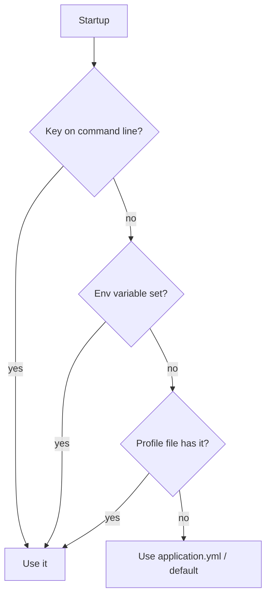

# ⚙️ Configuration & Profiles

> Keep settings out of your code so the same build runs anywhere.

## 🧠 What & Why

Applications need settings: database URLs, ports, feature flags, credentials. Hard-coding them is bad — you'd need to recompile to change environments. Spring Boot solves this with **externalized configuration**: settings live in `application.properties` or `application.yml`, and Boot loads them at startup.

You read individual values with **`@Value`**, or group related settings into a typed object with **`@ConfigurationProperties`**. The latter is cleaner for anything beyond a single value.

**Profiles** let you have different configurations per environment (dev, test, prod). You put profile-specific settings in files like `application-dev.yml` and activate a profile with `spring.profiles.active`. Beans can also be profile-scoped with `@Profile`.

Crucially, Spring layers configuration sources with a **precedence order** — command-line arguments beat environment variables, which beat property files. This lets you override any setting at deploy time without touching the code or the packaged config.

## 🔑 Key Concepts

- **`application.yml` / `.properties`** — The main config files.
- **`@Value`** — Injects a single property into a field.
- **`@ConfigurationProperties`** — Binds a group of properties to a typed bean.
- **Profile** — A named set of config activated per environment.
- **`spring.profiles.active`** — Selects which profile(s) to use.
- **Externalized config** — Settings supplied from outside the JAR.
- **Precedence order** — Which source wins when a key is defined in several places.

## 💻 Example

```yaml
# application.yml — shared defaults
app:
  name: PrepPilot
  page-size: 20

---
# Profile-specific block for 'dev'
spring:
  config:
    activate:
      on-profile: dev
app:
  page-size: 5   # smaller pages while developing
```

```java
// Bind the whole "app" group to a typed, reusable bean.
@ConfigurationProperties(prefix = "app")
@Component
public class AppProperties {
    private String name;
    private int pageSize;
    // getters/setters — Spring binds YAML keys to these.
}

// Or inject a single value directly.
@Service
public class BannerService {
    @Value("${app.name}")
    private String appName;
}
```

## 📊 Configuration Precedence (highest wins)

| Priority | Source |
|----------|--------|
| 1 (highest) | Command-line arguments (`--server.port=9000`) |
| 2 | OS environment variables (`SERVER_PORT`) |
| 3 | Profile-specific files (`application-prod.yml`) |
| 4 | `application.yml` / `application.properties` |
| 5 (lowest) | Defaults in code (`@Value(":default")`) |

## 🧭 How a Property Is Resolved



## ⚠️ Common Pitfalls

- Committing secrets (passwords, API keys) into `application.yml` in source control — use environment variables or a secrets manager instead.
- Forgetting to activate a profile, so production accidentally runs with dev defaults.
- Using `@Value` for many related keys instead of a single `@ConfigurationProperties` class, which is easier to test and validate.
- YAML indentation errors — YAML is whitespace-sensitive, and a stray space changes the structure silently.

## ❓ FAQs

### What is the difference between @Value and @ConfigurationProperties?

`@Value` injects a single property into a field and is fine for one-off values. `@ConfigurationProperties` binds a whole group of related keys (by prefix) into a typed bean, giving you strong typing, easy testing, IDE auto-completion, and optional validation. Prefer `@ConfigurationProperties` when you have more than a couple of related settings.

### How do Spring profiles work?

A profile is a named group of configuration. You place profile-specific settings in files like `application-dev.yml` or profile blocks in YAML, and mark beans with `@Profile("dev")`. You activate profiles via `spring.profiles.active` (in config, an env variable, or a command-line flag), and Spring then loads that profile's settings and beans in addition to the defaults.

### What is externalized configuration?

Externalized configuration means keeping settings outside the compiled code so the same build artifact can run in any environment. Spring Boot reads from property/YAML files, environment variables, and command-line arguments, letting operators change behavior at deploy time without rebuilding the application.

### What is the configuration precedence order?

Spring Boot merges many sources and, when a key appears in several, higher-priority sources win. From highest to lowest: command-line arguments, OS environment variables, profile-specific files, then the general `application.yml`/`.properties`, then in-code defaults. This ordering lets you override any packaged default externally at runtime.

### How should you handle secrets in Spring Boot?

Never commit secrets to config files in version control. Instead supply them through environment variables, a secrets manager (like Azure Key Vault or HashiCorp Vault), or an external config server. Spring resolves `${DB_PASSWORD}` from the environment, keeping the sensitive value out of the codebase entirely.
