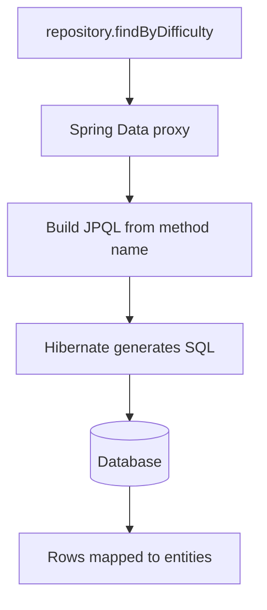

# 🗄️ Spring Data JPA

> Talk to your database with Java objects and method names instead of SQL.

## 🧠 What & Why

**JPA (Jakarta Persistence API)** is a standard for mapping Java objects to database tables — this is called ORM (Object-Relational Mapping). **Hibernate** is the most common JPA implementation. **Spring Data JPA** sits on top and removes almost all the boilerplate: you declare a repository *interface* and Spring generates the implementation for you.

The core idea: annotate a class as an **`@Entity`**, and each instance maps to a row in a table. Then define a repository interface extending `JpaRepository`, and you instantly get `save`, `findById`, `findAll`, `delete`, and more — no implementation code needed.

Beyond the built-ins, Spring Data can *derive queries from method names*. Write `findByDifficulty(String difficulty)` and Spring parses the name and generates the SQL. For anything more complex, drop into `@Query` with JPQL or native SQL.

This dramatically speeds up data access, but it hides real database behavior — so you must understand transactions, lazy loading, and the infamous N+1 problem to avoid performance traps.

## 🔑 Key Concepts

- **`@Entity`** — Marks a class as mapped to a database table.
- **`@Id` / `@GeneratedValue`** — The primary key and how it's generated.
- **`JpaRepository`** — Extend it to get CRUD methods for free.
- **Derived query** — A method whose name (`findByEmail`) becomes a query.
- **`@Query`** — Write custom JPQL or native SQL.
- **Relationships** — `@OneToMany`, `@ManyToOne`, etc., map table associations.
- **Lazy vs eager** — Whether related data loads on demand or immediately.
- **N+1 problem** — Accidentally firing one query per row when loading associations.

## 💻 Example

```java
@Entity
public class Question {

    @Id
    @GeneratedValue(strategy = GenerationType.IDENTITY) // DB auto-increments the id.
    private Long id;

    private String title;
    private String difficulty;

    // Many questions belong to one topic.
    @ManyToOne(fetch = FetchType.LAZY) // Load the topic only when accessed.
    private Topic topic;

    // getters/setters omitted for brevity
}

// No implementation needed — Spring generates it at runtime.
public interface QuestionRepository extends JpaRepository<Question, Long> {

    // Derived query: name is parsed into "WHERE difficulty = ?".
    List<Question> findByDifficulty(String difficulty);

    // Custom JPQL when the method name would get unwieldy.
    @Query("SELECT q FROM Question q WHERE q.topic.name = :topic")
    List<Question> findByTopicName(@Param("topic") String topic);
}
```

## 🔗 Relationship Annotations

| Annotation | Meaning | Example |
|------------|---------|---------|
| `@OneToMany` | One parent, many children | A `Topic` has many `Question`s |
| `@ManyToOne` | Many children, one parent | Many `Question`s share a `Topic` |
| `@OneToOne` | One-to-one link | A `User` has one `Profile` |
| `@ManyToMany` | Many-to-many via join table | `Student` ↔ `Course` |

## 🧭 How a Repository Call Flows



## ⚠️ Common Pitfalls

- **N+1 queries:** looping over a list and touching a lazy association fires one extra query per item. Fix with a `JOIN FETCH` query or an entity graph.
- Accessing a `LAZY` field after the transaction closes throws `LazyInitializationException`.
- Marking associations `EAGER` everywhere, loading huge object graphs and killing performance.
- Forgetting `@Transactional` on multi-step write operations, so partial failures don't roll back.

## ❓ FAQs

### What does Spring Data JPA give you over plain JPA/Hibernate?

Plain JPA still requires you to write repository implementations and manage the `EntityManager`. Spring Data JPA generates repository implementations from interfaces, provides ready-made CRUD methods via `JpaRepository`, derives queries from method names, and integrates transaction management — eliminating most boilerplate data-access code.

### How do derived query methods work?

Spring Data parses the repository method name against a set of keywords. A method like `findByDifficultyAndTitle` is split into property conditions (`difficulty` AND `title`) and translated into a JPQL query automatically. As long as the property names match your entity fields, no SQL or implementation is needed.

### What is the N+1 select problem?

It happens when you load a list of N entities (one query) and then access a lazy association on each, triggering an additional query per entity — N+1 total. It quietly destroys performance. The fix is to fetch the associations in one query using `JOIN FETCH`, an `@EntityGraph`, or batch fetching.

### What is the difference between lazy and eager fetching?

Lazy fetching loads an associated entity only when you actually access it, keeping the initial query lightweight. Eager fetching loads the association immediately along with the parent. Lazy is usually the better default for performance, but you must access lazy data within an open transaction to avoid `LazyInitializationException`.

### Why do repository writes need transactions?

A transaction groups multiple database operations so they either all succeed or all roll back, preserving data consistency. Spring Data's built-in methods are transactional individually, but when you combine several writes in one business operation you should annotate the service method with `@Transactional` so a failure midway doesn't leave the database half-updated.
