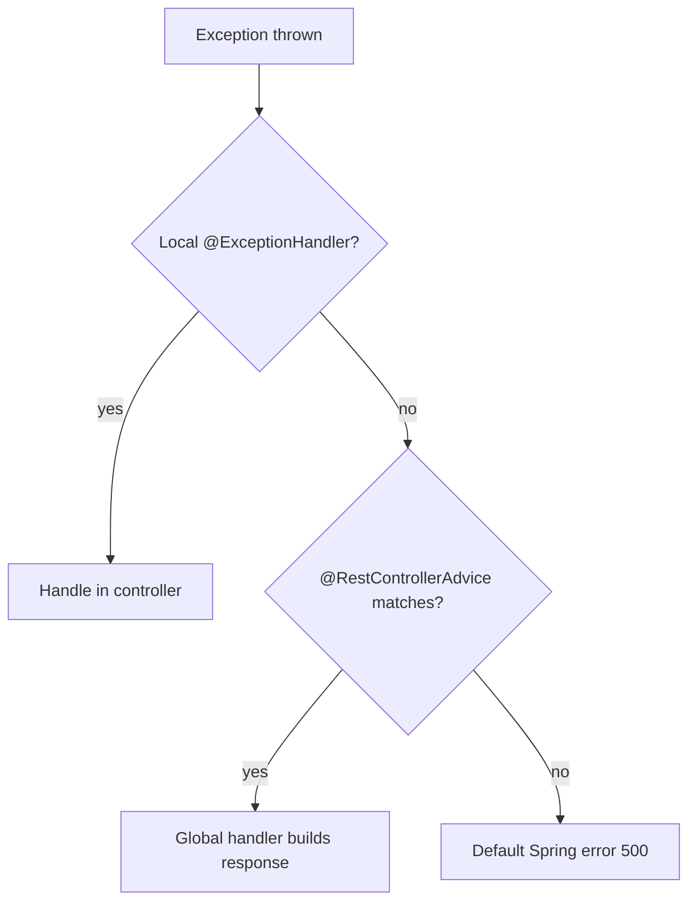

# 🚑 Exception Handling in Spring

> Turn messy stack traces into clean, meaningful HTTP responses.

## 🧠 What & Why

When something goes wrong in your API — a missing resource, invalid input, a downstream failure — you shouldn't leak a raw Java stack trace to the client. Good exception handling maps each error to a sensible **HTTP status code** and a clear, consistent error body.

Spring gives you layered tools. **`@ExceptionHandler`** handles exceptions for a single controller. **`@RestControllerAdvice`** (or `@ControllerAdvice`) centralizes handling across *all* controllers, so you write the mapping once. For quick cases you can throw a **`ResponseStatusException`** with a status code inline.

Modern Spring also supports **`ProblemDetail`** (RFC 7807), a standardized JSON error format with fields like `type`, `title`, `status`, and `detail`. Using it makes your errors machine-readable and consistent.

A common and important case is **validation errors**: when `@Valid` fails, Spring throws `MethodArgumentNotValidException`, and you typically translate its field errors into a tidy list the client can display.

## 🔑 Key Concepts

- **`@ExceptionHandler`** — Handles specific exceptions within a controller.
- **`@RestControllerAdvice`** — Global handler across all controllers, returns response bodies.
- **`ResponseStatusException`** — Throw an exception with an attached HTTP status.
- **`ProblemDetail`** — Standard RFC 7807 error response format.
- **Validation errors** — Field-level failures from `@Valid` you map to readable messages.

## 💻 Example

```java
// A domain exception for "not found" cases.
public class QuestionNotFoundException extends RuntimeException {
    public QuestionNotFoundException(Long id) {
        super("Question " + id + " not found");
    }
}

// Global handler applied to every controller.
@RestControllerAdvice
public class GlobalExceptionHandler {

    // Map our custom exception to 404 with a standard ProblemDetail body.
    @ExceptionHandler(QuestionNotFoundException.class)
    public ProblemDetail handleNotFound(QuestionNotFoundException ex) {
        ProblemDetail pd = ProblemDetail.forStatusAndDetail(
                HttpStatus.NOT_FOUND, ex.getMessage());
        pd.setTitle("Resource Not Found");
        return pd; // Serialized as application/problem+json.
    }

    // Turn @Valid failures into a clean field -> message map (400).
    @ExceptionHandler(MethodArgumentNotValidException.class)
    public ProblemDetail handleValidation(MethodArgumentNotValidException ex) {
        Map<String, String> errors = new HashMap<>();
        ex.getBindingResult().getFieldErrors()
          .forEach(fe -> errors.put(fe.getField(), fe.getDefaultMessage()));

        ProblemDetail pd = ProblemDetail.forStatus(HttpStatus.BAD_REQUEST);
        pd.setTitle("Validation Failed");
        pd.setProperty("errors", errors); // Extra field with details.
        return pd;
    }
}
```

## 📊 Mapping Exceptions to Status Codes

| Exception scenario | HTTP status |
|--------------------|-------------|
| Resource not found | 404 Not Found |
| Invalid input / failed `@Valid` | 400 Bad Request |
| Unauthorized (no/invalid credentials) | 401 Unauthorized |
| Authenticated but not allowed | 403 Forbidden |
| Duplicate / conflicting state | 409 Conflict |
| Unhandled server bug | 500 Internal Server Error |

## 🧭 Handler Resolution



## ⚠️ Common Pitfalls

- Catching `Exception` broadly and returning 500 for everything, hiding the real cause (e.g. a 400-level client error).
- Leaking internal details (stack traces, SQL) in the error body — a security and UX problem.
- Defining conflicting handlers for the same exception in both a controller and advice without understanding that the local one wins.
- Forgetting that only `@RestControllerAdvice` (not plain `@ControllerAdvice`) writes the return value as a body without `@ResponseBody`.

## ❓ FAQs

### What is the difference between @ExceptionHandler and @ControllerAdvice?

`@ExceptionHandler` on a method handles exceptions only for the controller it lives in. `@ControllerAdvice` (and its REST variant `@RestControllerAdvice`) is a global component whose `@ExceptionHandler` methods apply across all controllers, letting you centralize error handling in one place instead of repeating it.

### When would you use ResponseStatusException?

Use `ResponseStatusException` for simple, inline cases where you want to throw an exception with a specific status without defining a custom exception class or handler — for example `throw new ResponseStatusException(HttpStatus.NOT_FOUND, "No such user")`. For consistent, reusable error handling across the app, a `@RestControllerAdvice` is cleaner.

### What is ProblemDetail?

`ProblemDetail` is Spring's implementation of RFC 7807, a standardized JSON structure for API errors with fields like `type`, `title`, `status`, `detail`, and `instance`. Using it gives clients a predictable, machine-readable error format instead of ad-hoc JSON shapes that differ per endpoint.

### How do you handle validation errors cleanly?

When `@Valid` fails, Spring throws `MethodArgumentNotValidException`, which carries a `BindingResult` of field errors. In a global handler you iterate those field errors, build a map of field name to message, and return it (often inside a `ProblemDetail`) with a 400 status, giving the client a clear list of what to fix.

### Why shouldn't you expose stack traces to clients?

Stack traces reveal internal class names, framework versions, and sometimes query details, which helps attackers probe your system and confuses legitimate users. Instead, log the full trace server-side for debugging and return only a safe, generic message plus a status code to the client.
