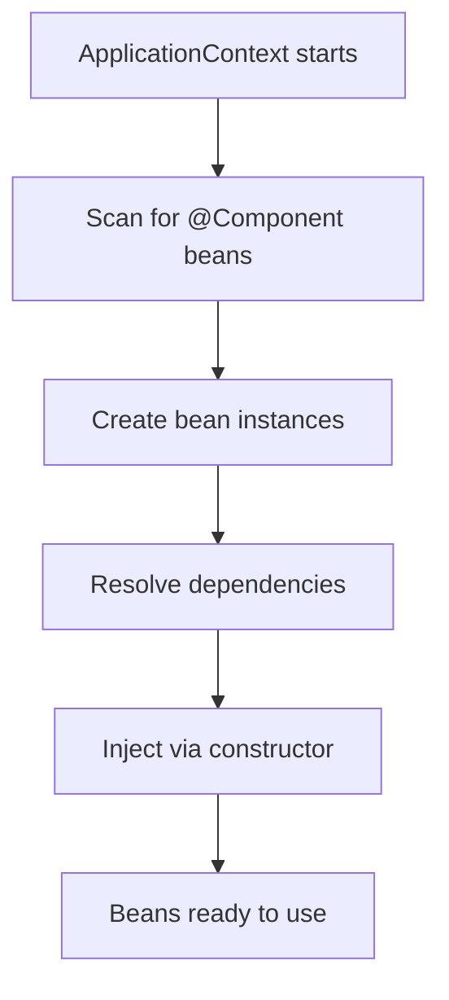

# 🔄 Inversion of Control & Dependency Injection

> Let the framework hand you what you need instead of building it yourself.

## 🧠 What & Why

**Inversion of Control (IoC)** is a design principle: instead of your objects creating and managing their own dependencies, a container does it for you. You "invert" the control of object creation — you no longer call `new`, the framework does.

**Dependency Injection (DI)** is the most common way to achieve IoC. A *dependency* is any object your class needs to do its job (e.g. a service needs a repository). With DI, those dependencies are *injected* from outside rather than created inside.

Why care? Because it decouples your classes. A class that receives its dependencies doesn't know or care how they were built. That makes your code flexible (swap implementations easily) and, crucially, **testable** — you can inject fake/mock dependencies in tests.

In Spring, the **ApplicationContext** (the IoC container) reads your configuration, creates all the beans, figures out who depends on whom, and wires them together automatically at startup.

## 🔑 Key Concepts

- **IoC** — The framework controls object creation and lifecycle, not your code.
- **Dependency Injection** — Dependencies are supplied from outside rather than created internally.
- **ApplicationContext** — Spring's IoC container that holds and wires all beans.
- **`@Autowired`** — Tells Spring to inject a matching bean at this point.
- **Constructor injection** — Dependencies passed via the constructor (recommended).
- **Loose coupling** — Classes depend on interfaces/abstractions, not concrete construction.

## 💻 Example

```java
// A dependency (interface + implementation).
public interface QuestionRepository {
    List<String> findAll();
}

@Repository
public class JpaQuestionRepository implements QuestionRepository {
    public List<String> findAll() { return List.of("Two Sum", "LRU Cache"); }
}

// Constructor injection — the RECOMMENDED approach.
@Service
public class QuestionService {

    private final QuestionRepository repository; // final = immutable & required

    // Spring sees this constructor and injects a QuestionRepository bean.
    // @Autowired is optional when there's exactly one constructor.
    public QuestionService(QuestionRepository repository) {
        this.repository = repository;
    }

    public List<String> listQuestions() {
        return repository.findAll();
    }
}
```

## 🪛 Three Ways to Inject

| Type | How | Pros | Cons |
|------|-----|------|------|
| Constructor | Dependencies as constructor args | Immutable, required deps enforced, easy to test | Slightly more code |
| Setter | `@Autowired` on a setter method | Good for optional deps | Object can exist half-built |
| Field | `@Autowired` on a field directly | Least code | Hard to test, hides dependencies, no `final` |

```java
// Field injection — concise but discouraged (can't set in unit tests without reflection).
@Service
public class BadExample {
    @Autowired
    private QuestionRepository repository;
}
```

## 🧭 How It Works



## ⚠️ Common Pitfalls

- Preferring field injection for brevity — it makes classes hard to unit test and hides required dependencies.
- Circular dependencies (A needs B, B needs A) — constructor injection will fail fast, which is actually a signal to redesign.
- Forgetting `@Component`/`@Service` on a class, so Spring never creates the bean and injection fails with `NoSuchBeanDefinitionException`.
- Injecting concrete classes instead of interfaces, defeating the loose-coupling benefit.

## ❓ FAQs

### What is the difference between IoC and Dependency Injection?

IoC is the broad principle that control of object creation is handed to a framework rather than your own code. Dependency Injection is a specific technique for implementing IoC, where a class's dependencies are provided from the outside (via constructor, setter, or field) instead of being created inside the class.

### Why is constructor injection recommended over field injection?

Constructor injection makes dependencies explicit and required, lets you mark fields `final` for immutability, and guarantees the object is fully initialized once constructed. It also makes unit testing trivial because you just pass mocks to the constructor — no Spring or reflection needed. Field injection hides dependencies and can't easily be tested in isolation.

### How does DI make code more testable?

Because dependencies are supplied from outside, tests can inject mock or stub implementations instead of the real ones. For example, you can pass a fake repository that returns canned data, letting you test the service's logic in isolation without a real database.

### What happens if Spring can't find a bean to inject?

By default Spring throws a `NoSuchBeanDefinitionException` at startup, failing fast. You can make a dependency optional using `@Autowired(required = false)`, `Optional<T>`, or `@Nullable`, but usually a missing bean means you forgot a stereotype annotation or a component scan issue.

### Can you have two beans of the same type?

Yes, and then Spring can't decide which to inject, causing a `NoUniqueBeanDefinitionException`. You resolve it with `@Primary` to mark a default, or `@Qualifier("beanName")` at the injection point to pick a specific one.
