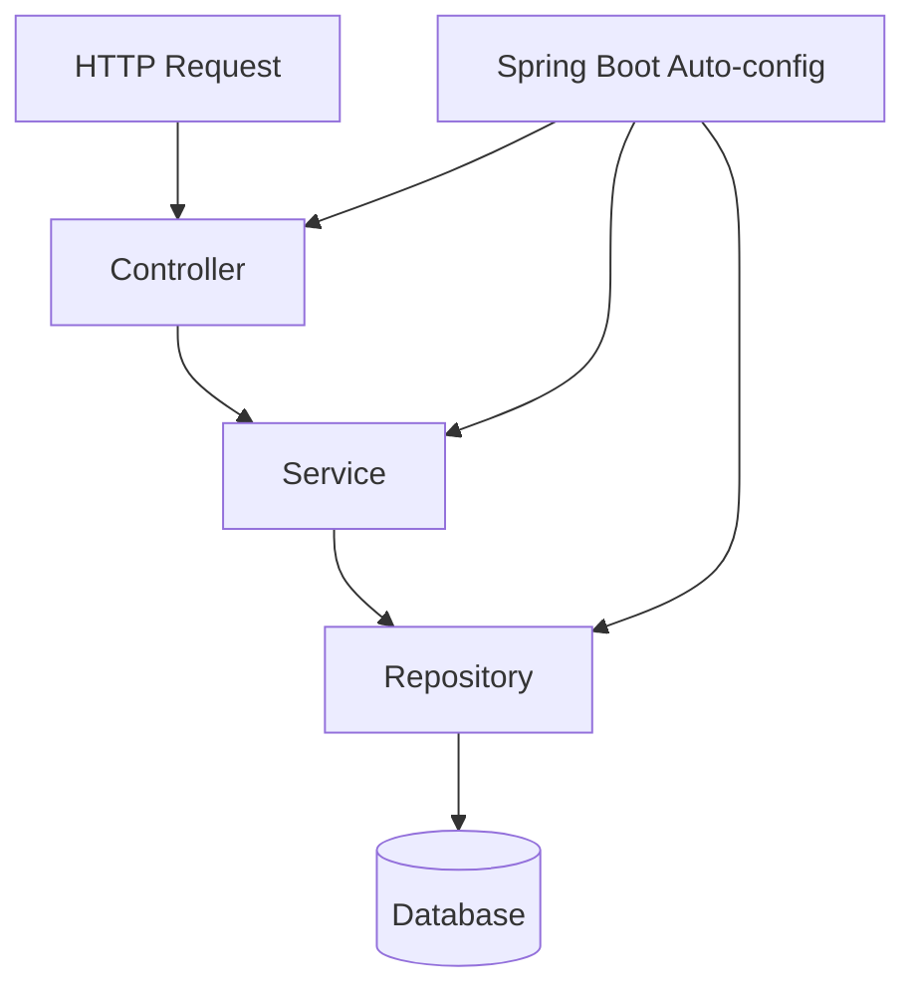

# 🌱 Spring & Spring Boot Overview

> The framework that lets you build production Java apps without wiring everything by hand.

## 🧠 What & Why

**Spring** is a framework for building Java applications. Its core job is to manage your objects (called *beans*) and connect them together for you, so you write less "plumbing" code and focus on business logic. Over the years Spring grew into a huge ecosystem covering web APIs, databases, security, messaging, and more.

The problem: plain Java apps need a lot of boilerplate — creating objects, passing dependencies around, configuring a web server, parsing JSON, opening database connections. Doing this manually is repetitive and error-prone.

**Spring Boot** sits on top of Spring and removes most of that setup. It uses **auto-configuration** to guess sensible defaults based on the libraries on your classpath, ships **starters** (curated dependency bundles), and embeds a web server so you can run your app with a single `main` method. The result: you go from empty folder to running REST API in minutes.

For interviews, remember the one-liner: *Spring gives you Dependency Injection and a huge ecosystem; Spring Boot makes Spring easy to start with opinionated defaults.*

## 🔑 Key Concepts

- **Spring Framework** — Core container that manages beans and wires dependencies (the IoC container).
- **Spring Boot** — A layer that auto-configures Spring so you can run apps with minimal setup.
- **Auto-configuration** — Boot inspects your classpath and configures beans automatically (e.g. sees H2 → configures a DataSource).
- **Starter** — A dependency bundle like `spring-boot-starter-web` that pulls in everything you need for a feature.
- **Embedded server** — Tomcat (or Jetty/Netty) ships inside your JAR, so `java -jar app.jar` just runs.
- **`@SpringBootApplication`** — One annotation that bootstraps the whole app.

## 💻 Example

```java
// The single entry point that starts the whole application.
@SpringBootApplication // = @Configuration + @EnableAutoConfiguration + @ComponentScan
public class PrepPilotApplication {
    public static void main(String[] args) {
        // Boots the Spring container and starts the embedded web server.
        SpringApplication.run(PrepPilotApplication.class, args);
    }
}

// A minimal REST endpoint. No servlet config, no XML — just annotations.
@RestController
class HelloController {

    @GetMapping("/hello") // Handles HTTP GET /hello
    public String hello() {
        return "Hello from Spring Boot!";
    }
}
```

## 📦 Typical Project Structure

A conventional Spring Boot project looks like this:

```
src/main/java/com/example/app/
  Application.java        // @SpringBootApplication entry point
  controller/             // REST controllers (web layer)
  service/                // business logic
  repository/             // data access (Spring Data JPA)
  model/                  // entities / DTOs
src/main/resources/
  application.yml         // configuration
  static/ , templates/    // web assets (if any)
src/test/java/            // tests
```

## 🧩 How the Pieces Fit



## ⚠️ Common Pitfalls

- Putting your `@SpringBootApplication` class in a deep package — component scanning only covers the class's package and below, so beans in sibling packages are missed.
- Confusing Spring and Spring Boot as competitors; Boot *uses* Spring, it doesn't replace it.
- Adding random dependencies instead of the matching starter, leading to version conflicts.
- Expecting auto-configuration to do the impossible — it only configures what it can detect on the classpath.

## ❓ FAQs

### What is the difference between Spring and Spring Boot?

Spring is the underlying framework that provides the IoC container, dependency injection, and modules for web, data, and security. Spring Boot is a convenience layer on top that adds auto-configuration, starter dependencies, and an embedded server so you can start a fully working application with almost no manual setup.

### What does @SpringBootApplication actually do?

It is a meta-annotation that combines three things: `@Configuration` (marks the class as a source of bean definitions), `@EnableAutoConfiguration` (turns on Boot's auto-configuration), and `@ComponentScan` (scans the current package and sub-packages for components). Together they bootstrap the entire application context.

### What is a Spring Boot starter?

A starter is a curated set of dependencies bundled under one name, such as `spring-boot-starter-web`. Instead of hunting for individual libraries and compatible versions, you add one starter and get everything needed for that capability, with versions managed for you.

### How does the embedded server work?

Spring Boot packages a web server (Tomcat by default) directly inside your application JAR. When you run `java -jar app.jar`, Boot starts that server programmatically, so you don't need to install or deploy to an external server container.

## What's Next

Now that you have the big picture, dig into how Spring wires objects together in **spring-ioc-di**, then explore **spring-beans**, the **spring-annotations** reference, and **spring-rest** to start building APIs.
