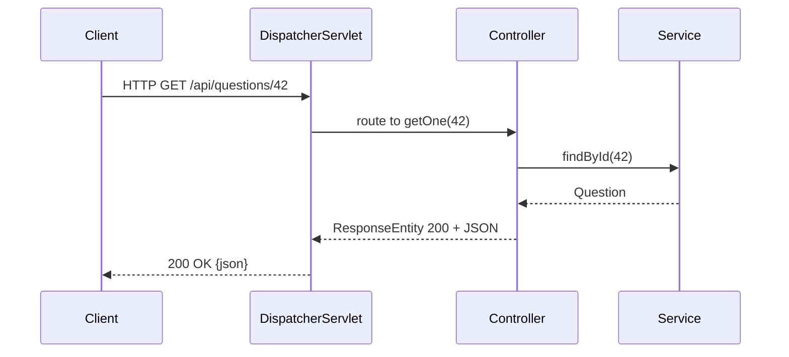

# 🌐 Building REST APIs with Spring

> Turn Java methods into HTTP endpoints that speak JSON.

## 🧠 What & Why

A **REST API** exposes your application's functionality over HTTP using resources (nouns like `/questions`) and HTTP methods (verbs like GET, POST, PUT, DELETE). Spring makes building one remarkably simple: annotate a class, map methods to URLs, and Spring handles JSON serialization, routing, and status codes.

The star of the show is **`@RestController`**. It combines `@Controller` and `@ResponseBody`, meaning every method's return value is automatically converted to the response body — usually JSON via the Jackson library. You focus on returning objects; Spring handles the wire format.

You map requests with `@GetMapping`, `@PostMapping`, and friends, extract data from the URL and body with `@PathVariable`, `@RequestParam`, and `@RequestBody`, and control the exact HTTP response with `ResponseEntity`. Add `@Valid` and you get automatic input validation for free.

## 🔑 Key Concepts

- **`@RestController`** — Marks a class whose methods return response bodies (JSON).
- **`@RequestMapping` / `@GetMapping` etc.** — Map HTTP methods and paths to Java methods.
- **`@PathVariable`** — Extracts a value from the URL path (`/questions/{id}`).
- **`@RequestParam`** — Extracts a query parameter (`?difficulty=easy`).
- **`@RequestBody`** — Deserializes the JSON request body into an object.
- **`ResponseEntity`** — Gives full control over status code, headers, and body.
- **`@Valid`** — Triggers bean validation on incoming data.

## 💻 Example

```java
@RestController
@RequestMapping("/api/questions") // Base path for every method below.
public class QuestionController {

    private final QuestionService service;

    public QuestionController(QuestionService service) {
        this.service = service;
    }

    // GET /api/questions?difficulty=easy
    @GetMapping
    public List<Question> list(@RequestParam(required = false) String difficulty) {
        return service.find(difficulty);
    }

    // GET /api/questions/42
    @GetMapping("/{id}")
    public ResponseEntity<Question> getOne(@PathVariable Long id) {
        return service.findById(id)
                .map(ResponseEntity::ok)              // 200 with body
                .orElse(ResponseEntity.notFound().build()); // 404 if absent
    }

    // POST /api/questions  with a JSON body, validated by @Valid.
    @PostMapping
    public ResponseEntity<Question> create(@Valid @RequestBody Question q) {
        Question saved = service.save(q);
        return ResponseEntity.status(HttpStatus.CREATED).body(saved); // 201
    }
}
```

## 📊 Common HTTP Status Codes

| Code | Meaning | When to return |
|------|---------|----------------|
| 200 OK | Success | GET/PUT that succeeded |
| 201 Created | Resource created | Successful POST |
| 204 No Content | Success, no body | Successful DELETE |
| 400 Bad Request | Invalid input | Validation failure |
| 404 Not Found | Resource missing | Unknown id |
| 500 Server Error | Unhandled exception | Bug on the server |

## 🧭 Request Flow



## ⚠️ Common Pitfalls

- Forgetting `@RequestBody`, so Spring tries to bind the JSON to query params and your object comes back empty.
- Returning `null` for a missing resource (produces a confusing 200 with empty body) instead of a proper 404 via `ResponseEntity`.
- Skipping `@Valid`, so invalid data reaches your service layer and blows up deeper in the stack.
- Using the wrong HTTP verb — e.g. mutating state on a GET, which breaks caching and REST semantics.

## ❓ FAQs

### What is the difference between @PathVariable and @RequestParam?

`@PathVariable` extracts a value embedded in the URL path itself, such as `42` in `/questions/42`, and is used to identify a specific resource. `@RequestParam` extracts a query-string parameter after the `?`, such as `difficulty` in `/questions?difficulty=easy`, and is typically used for filtering, sorting, or optional inputs.

### When should you use ResponseEntity instead of returning the object directly?

Return the object directly when the default 200 status and simple body are fine. Use `ResponseEntity` when you need to control the status code (201 Created, 404 Not Found), set custom headers, or conditionally return different responses — for example returning 200 with a body or 404 when a lookup fails.

### How does Spring convert my object to JSON?

Spring uses the Jackson library by default. Because `@RestController` implies `@ResponseBody`, Spring passes your returned object to an `HttpMessageConverter`, which serializes it to JSON based on the request's `Accept` header. The reverse happens for `@RequestBody`, deserializing incoming JSON into your Java object.

### How does @Valid validation work?

When you annotate a `@RequestBody` parameter with `@Valid`, Spring runs Bean Validation (Jakarta Validation) against the object's constraints like `@NotNull` or `@Size`. If any constraint fails, Spring throws a `MethodArgumentNotValidException`, which by default produces a 400 Bad Request. You typically handle it globally to return a clean error payload.

### What is content negotiation?

Content negotiation is how Spring decides the response format based on the client's `Accept` header. If the client asks for `application/json`, Spring serializes to JSON; if it asks for XML and the converter is available, it produces XML. It lets the same endpoint serve multiple formats from a single Java method.
