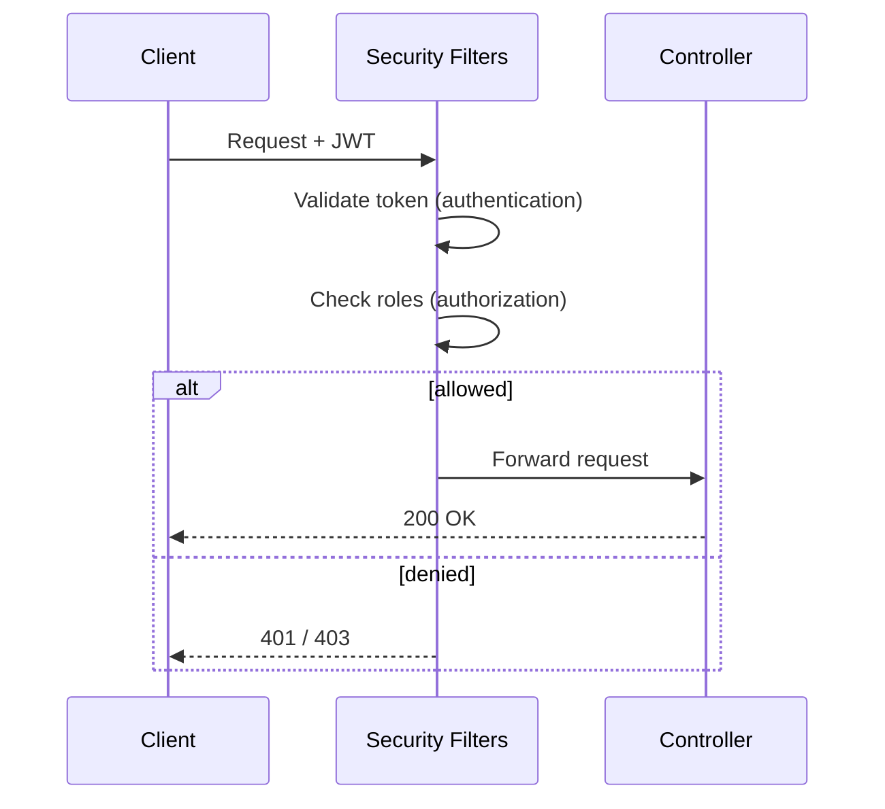

# 🔐 Spring Security

> Control who can get in (authentication) and what they can do (authorization).

## 🧠 What & Why

**Spring Security** protects your application. It answers two questions: *who are you?* (**authentication**) and *are you allowed to do this?* (**authorization**). It handles login, password checks, session/token management, and access rules so you don't build security primitives yourself.

At its heart is the **security filter chain** — a series of servlet filters every request passes through before reaching your controllers. Each filter does one job: extract credentials, validate a token, check authority, handle CORS, and so on. You configure this chain with a **`SecurityFilterChain`** bean.

Passwords must never be stored in plain text. Spring provides **`BCryptPasswordEncoder`** to hash them with a salt, so even if the database leaks, the raw passwords aren't exposed.

For APIs you'll often go **stateless** using **JWT** (JSON Web Tokens): the client logs in once, receives a signed token, and sends it on every request instead of relying on a server-side session. You'll also configure **CORS** so browsers from allowed origins can call your API.

## 🔑 Key Concepts

- **Authentication** — Verifying identity (who you are).
- **Authorization** — Verifying permissions (what you may do).
- **Security filter chain** — Ordered filters processing each request.
- **`SecurityFilterChain`** — The bean where you declare rules.
- **BCrypt** — A slow, salted hashing algorithm for passwords.
- **Stateless vs session** — Token per request vs server-stored session.
- **JWT** — A signed token carrying identity/claims.
- **CORS** — Rules for which browser origins may call your API.

## 💻 Example

```java
@Configuration
@EnableWebSecurity
public class SecurityConfig {

    // The filter chain: declares what's public and what needs auth.
    @Bean
    public SecurityFilterChain filterChain(HttpSecurity http) throws Exception {
        http
            .csrf(csrf -> csrf.disable())                 // Off for stateless token APIs.
            .cors(Customizer.withDefaults())              // Enable CORS config.
            .authorizeHttpRequests(auth -> auth
                .requestMatchers("/api/public/**").permitAll() // Open endpoints.
                .requestMatchers("/api/admin/**").hasRole("ADMIN") // Role-restricted.
                .anyRequest().authenticated()             // Everything else needs login.
            )
            .sessionManagement(s -> s
                .sessionCreationPolicy(SessionCreationPolicy.STATELESS)); // No server session.
        return http.build();
    }

    // Hash passwords with BCrypt — never store plain text.
    @Bean
    public PasswordEncoder passwordEncoder() {
        return new BCryptPasswordEncoder();
    }
}
```

## 📊 Authentication vs Authorization

| Aspect | Authentication | Authorization |
|--------|----------------|---------------|
| Question | Who are you? | What can you do? |
| Happens | First | After authentication |
| Example | Verify username + password | Check `ROLE_ADMIN` |
| Failure code | 401 Unauthorized | 403 Forbidden |

## 🧭 Request Through the Filter Chain



## ⚠️ Common Pitfalls

- Storing passwords in plain text or with fast hashes (MD5/SHA-1) instead of BCrypt/Argon2.
- Disabling CSRF protection on a session-based browser app (it's only safe to disable for stateless token APIs).
- Overly broad CORS (`*` with credentials), exposing your API to any origin.
- Putting sensitive data or secrets inside a JWT payload — it's signed, not encrypted, so anyone can read it.

## ❓ FAQs

### What is the difference between authentication and authorization?

Authentication verifies *identity* — confirming you are who you claim to be, typically via credentials or a token. Authorization happens afterward and verifies *permissions* — whether the authenticated user is allowed to perform a specific action or access a resource. A failed authentication returns 401; a failed authorization returns 403.

### What is the security filter chain?

It's an ordered series of servlet filters that every HTTP request passes through before reaching your controllers. Each filter handles one concern — extracting credentials, validating tokens, enforcing authorization rules, handling CORS, and so on. You configure it declaratively by defining a `SecurityFilterChain` bean.

### Why use BCrypt for passwords?

BCrypt is a deliberately slow, salted hashing algorithm. The salt ensures identical passwords produce different hashes, and the slowness makes brute-force attacks expensive. Because it's one-way, you never store or recover the original password — you only compare hashes at login, so a database leak doesn't reveal plain-text passwords.

### What is the difference between stateless and session-based authentication?

Session-based authentication stores user state on the server and gives the browser a session cookie; the server looks up the session on each request. Stateless authentication (typically JWT) keeps no server-side session — the client sends a self-contained signed token each time, which the server validates. Stateless scales better across servers but requires careful token expiry and revocation handling.

### Is a JWT secure to store sensitive data in?

No. A standard JWT is signed, not encrypted, so its payload is only Base64-encoded and anyone holding the token can read it. Never place secrets or sensitive personal data in the claims. Use it to carry identity and non-sensitive claims, keep it short-lived, and always transmit it over HTTPS.
