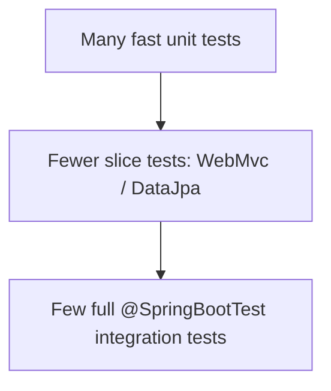

# 🧪 Testing Spring Applications

> Prove your code works — fast unit checks and realistic integration tests.

## 🧠 What & Why

Tests give you confidence that your code behaves correctly and keeps working as you change it. In Spring, tests fall into two broad camps. **Unit tests** check a single class in isolation, usually with its dependencies replaced by mocks — they're fast and don't start Spring. **Integration tests** load part or all of the Spring context and verify components work together.

Spring Boot provides **test slices** — annotations that boot only the layer you're testing. `@WebMvcTest` loads just the web layer (controllers) so you can test endpoints with **`MockMvc`**. `@DataJpaTest` loads just the persistence layer with an in-memory database to test repositories. `@SpringBootTest` boots the *whole* application for full end-to-end integration tests.

For unit tests, **Mockito** creates fake dependencies you fully control. Inside Spring tests, **`@MockBean`** replaces a real bean in the context with a mock. For tests needing a real database or broker, **Testcontainers** spins up throwaway Docker containers so tests run against the real thing.

Choosing the right level matters: many fast unit tests, fewer focused slice tests, and a small number of full integration tests — the classic testing pyramid.

## 🔑 Key Concepts

- **Unit test** — Tests one class in isolation with mocked dependencies; no Spring context.
- **Integration test** — Loads Spring context to test components together.
- **`@SpringBootTest`** — Boots the full application context.
- **`@WebMvcTest`** — Loads only the web/controller layer.
- **`@DataJpaTest`** — Loads only the JPA/repository layer with an in-memory DB.
- **`MockMvc`** — Simulates HTTP requests to controllers without a real server.
- **`@MockBean`** — Replaces a bean in the context with a Mockito mock.
- **Testcontainers** — Real dependencies in disposable Docker containers.

## 💻 Example

```java
// Fast unit test — no Spring, just Mockito.
class QuestionServiceTest {

    @Test
    void returnsQuestionsFromRepository() {
        QuestionRepository repo = Mockito.mock(QuestionRepository.class);
        Mockito.when(repo.findAll()).thenReturn(List.of(new Question("Two Sum")));

        QuestionService service = new QuestionService(repo);

        assertEquals(1, service.listQuestions().size());
    }
}

// Web-slice test — loads only the controller, mocks the service.
@WebMvcTest(QuestionController.class)
class QuestionControllerTest {

    @Autowired
    private MockMvc mockMvc; // Simulates HTTP without a running server.

    @MockBean
    private QuestionService service; // Replaces the real bean with a mock.

    @Test
    void getReturns200() throws Exception {
        Mockito.when(service.find(null)).thenReturn(List.of());

        mockMvc.perform(MockMvcRequestBuilders.get("/api/questions"))
               .andExpect(MockMvcResultMatchers.status().isOk());
    }
}
```

## 📊 Choosing the Right Test Type

| Annotation | Loads | Use for | Speed |
|------------|-------|---------|-------|
| (none) + Mockito | Nothing | Pure logic in one class | Fastest |
| `@WebMvcTest` | Web layer only | Controller / endpoint behavior | Fast |
| `@DataJpaTest` | JPA layer only | Repositories and queries | Fast |
| `@SpringBootTest` | Whole context | Full end-to-end flows | Slower |

## 🧭 The Testing Pyramid



## ⚠️ Common Pitfalls

- Using `@SpringBootTest` for everything, making the suite slow when a slice test would do.
- Writing "unit" tests that secretly hit a real database — they're actually integration tests and are brittle/slow.
- Forgetting `@MockBean` and letting a real dependency (e.g. an external API client) run during a web-slice test.
- Relying on test execution order or shared mutable state, causing flaky, order-dependent failures.

## ❓ FAQs

### What is the difference between a unit test and an integration test?

A unit test verifies a single class in isolation, replacing its dependencies with mocks, and does not start the Spring context — so it's very fast. An integration test loads some or all of the Spring context and checks that multiple components work correctly together, trading speed for realism.

### What is the difference between @SpringBootTest and @WebMvcTest?

`@SpringBootTest` boots the entire application context, wiring every bean, which suits full end-to-end integration tests. `@WebMvcTest` is a slice that loads only the web layer (controllers, filters, JSON serialization) and nothing else, so controller tests run much faster; you supply mocked collaborators with `@MockBean`.

### What does @MockBean do?

`@MockBean` creates a Mockito mock and places it into the Spring test context, replacing any real bean of that type. This lets you control a dependency's behavior during an integration or slice test — for example making a service return canned data — without invoking its real implementation.

### What is MockMvc?

`MockMvc` lets you send simulated HTTP requests to your controllers and assert on the responses without starting an actual web server. It exercises the full Spring MVC request handling — routing, argument binding, serialization, and exception handling — making it ideal for fast, realistic controller tests.

### When would you use Testcontainers?

Use Testcontainers when a test needs a real external dependency, such as an actual PostgreSQL database or Kafka broker, rather than an in-memory substitute. It launches the dependency in a disposable Docker container for the test run and tears it down afterward, giving you high-fidelity integration tests that closely match production behavior.
