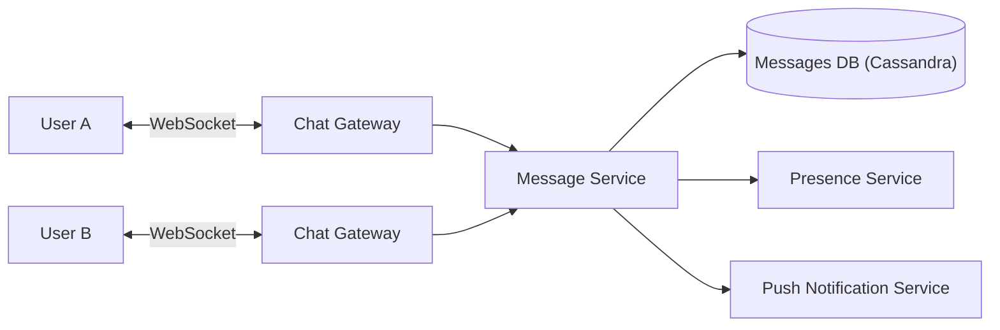

# 💬 Design a Chat System (WhatsApp)

> Real-time 1:1 and group messaging with delivery/read receipts, presence, and offline support.

---

## 🎯 The Problem

Apps like **WhatsApp** and **Messenger** deliver messages the instant they're sent, show when contacts are online, mark messages delivered and read, and still work when the recipient is offline. The central challenge is **real-time, bidirectional delivery** — plain HTTP can't push, so we need a different connection model.

---

## 📝 Requirements

**Functional**
- Send and receive messages in real time (1:1 and group).
- Delivery receipts (sent/delivered/read) and online/last-seen status.
- Store messages so offline users receive them on reconnect.

**Non-functional**
- Low latency delivery, high availability.
- Messages within a conversation must stay **in order**.
- Durable — messages must not be lost.

---

## 🏗️ High-Level Architecture



Each client holds a persistent **WebSocket** connection to a **gateway**. The **Presence Service** tracks which gateway each user is connected to, so the Message Service knows where to route a message. If the recipient is offline, the message is stored and a **push notification** is sent; the client fetches it on reconnect.

---

## 🔌 Why WebSockets?

Normal HTTP is **request/response** — the server can only reply when the client asks. But chat needs the *server* to push a message the moment it arrives.

A **WebSocket** is a long-lived, **bidirectional** TCP connection. Once open, either side can send data at any time with almost no overhead — perfect for instant delivery. (Alternatives like long-polling exist but are less efficient.)

---

## 🗄️ Data Model

**messages** (Cassandra — partitioned by conversation, ordered by time)

| Column | Type | Notes |
| --- | --- | --- |
| `chat_id` | UUID | Partition key |
| `message_id` | TIMEUUID | Clustering key — orders messages by time |
| `sender_id` | BIGINT | |
| `content` | TEXT | |
| `status` | ENUM | SENT / DELIVERED / READ |

**Why Cassandra?** Chat has a massive write volume and a simple access pattern ("get recent messages for this chat, in order"). Cassandra is write-optimized and naturally stores messages sorted within a partition.

---

## ⚖️ Deep Dives & Trade-offs

**Message ordering** — use a per-chat sequence number or a time-ordered ID (TIMEUUID). Clients sort by it so messages always appear in the right order.

**Group messages** — the message is fanned out to every member's active connection (or queued if they're offline). Large groups are like a mini fan-out problem.

**Delivery & read receipts** — these are just tiny status-update messages flowing back through the same pipeline, updating the original message's `status`.

**Scaling connections** — millions of open WebSockets require many gateway servers. The presence service (often backed by Redis) maps `userId → gateway` so routing stays fast.

---

## 🧭 Scope, invariants & sizing

This design covers authenticated 1:1 and group text messaging, multi-device sync, receipts, presence, and offline recovery. Voice/video calls, end-to-end-encryption key ceremonies, full-text search, and media processing are separate deep dives.

**Core invariants**

- A client-generated `messageId` identifies one logical send, even across retries.
- The server assigns a monotonically increasing sequence within a conversation; order is guaranteed **inside that conversation**, not globally.
- A message acknowledged as `STORED` is durable and can be recovered after reconnect.
- Delivery/read receipts are monotonic: `STORED → DELIVERED → READ`; late events cannot move state backward.
- Presence is ephemeral and approximate; message history is durable and authoritative.

Example assumptions: 10 million daily active users sending 40 messages/day gives 400 million messages/day, ≈ 4,600/sec average and perhaps 10× at peak. At 1 KB average envelope size, raw message data is ≈ 400 GB/day before replication, indexes, attachments, and retention. If 2 million users are simultaneously connected and one gateway safely holds 40,000 sockets, plan at least 50 gateways plus failover headroom.

---

## 📜 Client protocol & APIs

Use HTTPS for history and WebSocket for live commands/events:

```json
{"type":"SEND_MESSAGE","requestId":"req-7","conversationId":"c-42",
 "messageId":"01J...CLIENT","clientSentAt":"2026-08-08T10:00:00Z",
 "content":{"type":"TEXT","text":"Are we still meeting at 4?"}}
```

```json
{"type":"MESSAGE_STORED","requestId":"req-7","messageId":"01J...CLIENT",
 "conversationId":"c-42","sequence":9183,"serverReceivedAt":"2026-08-08T10:00:00.084Z"}
```

| Contract | Purpose |
| --- | --- |
| `POST /v1/conversations` | Create a direct/group conversation idempotently |
| `GET /v1/conversations/{id}/messages?afterSequence=9180&limit=100` | Gap recovery and pagination |
| `POST /v1/conversations/{id}/receipts` | Batched delivered/read watermark |
| `WS /v1/connect` | Live sends, receipts, membership events, presence hints |

Every command includes a schema version, bounded payload, stable ID, and authenticated device/session. The server authorizes current membership on every send and history read; knowing a conversation ID is never sufficient authorization.

---

## 🗃️ Data model and partition design

| Table/store | Key | Important fields |
| --- | --- | --- |
| `conversations` | `conversation_id` | type, created_by, membership_version |
| `memberships` | `(conversation_id, user_id)` | role, joined_sequence, left_sequence |
| `messages` | `((conversation_id, bucket), sequence)` | message_id, sender/device, ciphertext/content_ref, created_at |
| `message_dedup` | `(sender_id, message_id)` | conversation, sequence, result, expires_at |
| `device_cursor` | `(user_id, device_id, conversation_id)` | delivered/read sequence |
| Presence cache | `user_id → {gateway, device, lease_expiry}` | ephemeral routing only |

Bucket very large conversations by sequence/time so one Cassandra partition does not grow forever. The clustering key keeps range reads ordered. Attachments go directly to object storage through short-lived upload grants; messages contain immutable object references and metadata.

---

## 🔄 End-to-end message flow

1. The client authenticates the WebSocket, negotiates a protocol version, and starts heartbeats.
2. The gateway validates frame size/type and forwards `SEND_MESSAGE` using `conversationId` as the routing key.
3. The conversation owner/partition validates membership, claims `(senderId, messageId)`, assigns the next sequence, and durably stores the message plus an outbox event.
4. Only then does the sender receive `MESSAGE_STORED`.
5. A fan-out consumer finds active recipient devices from presence and routes to their gateways. Offline devices remain recoverable from storage and may receive a generic push notification.
6. Recipient devices acknowledge the highest contiguous delivered/read sequence. The service stores watermarks and fans compact receipt events back to participants.
7. On reconnect the device supplies its last contiguous sequence; the history API fills the gap before live delivery resumes.

**Group fan-out:** small groups fan out on write to device inboxes. Very large groups retain one conversation log and let recipients pull by cursor; otherwise one message creates millions of synchronous writes.

---

## 🧯 Ordering, duplicates & failures

Partition the event log by `conversationId`, so one ordered consumer path assigns/publishes sequence for a conversation. Cross-partition timestamps do not create reliable order. On leader failover, fence old leaders with an epoch and reject stale writes.

| Scenario | Safe behavior |
| --- | --- |
| Client retries after lost ACK | Dedup returns the original sequence/result |
| Gateway dies | Client reconnects elsewhere and resumes after its cursor |
| Recipient backpressure | Bound per-socket buffers; disconnect slow clients and require history catch-up |
| Presence mapping is stale | Route fails harmlessly; durable inbox/history remains source of truth |
| Fan-out consumer repeats | Device/message dedup suppresses duplicate display |
| Out-of-order receipt | Store `max(existing, incoming)` watermark |
| Push provider down | Message remains durable; reconnect fetch still works |

Delivery semantics are at least once internally. Exactly-once user experience comes from stable IDs, monotonic state, and idempotent consumers—not from assuming networks deliver once.

---

## 🔐 Security, privacy & abuse

- Use `wss://`, validate browser Origin where applicable, authenticate the upgrade, rotate short-lived sessions, and recheck authorization after membership changes.
- Apply per-user/device/conversation rate and size limits; reject decompression bombs and malformed frames before allocation.
- Do not log message bodies, access tokens, attachment URLs, or encryption keys. Encrypt transport and storage; use a KMS/HSM for server-side keys.
- For end-to-end encryption, servers store ciphertext and envelope metadata; key distribution, device verification, backups, and abuse reporting require a separate threat model.
- Treat presence/last-seen as privacy-controlled data with short TTLs and block-list enforcement.

---

## 📈 Observability, SLOs & rollout

Measure active sockets, connect/auth failures, heartbeat expiry, send-to-store and store-to-deliver p50/p95/p99, sequence gaps, duplicate rate, fan-out lag, reconnect catch-up duration, slow-consumer disconnects, push failures, and per-partition hot spots. Trace using IDs and sequence numbers, never content.

Start with one region and a single conversation owner shard, test reconnect and gateway termination, then add replicated storage and regional gateways. For multi-region writes, assign each conversation a home region or introduce a consensus owner; do not claim per-chat order while allowing independent writers.

### 60-second interview summary

“Clients maintain authenticated WebSockets to stateless gateways. Commands route by conversation to one ordering owner, which deduplicates a client message ID, assigns a per-chat sequence, stores durably, and publishes via an outbox. Presence only optimizes live routing; reconnect always repairs from durable history. Stable IDs, watermarks, bounded socket buffers, and per-chat partitioning provide ordering and retry safety.”

### Further reading

- [RFC 6455: The WebSocket Protocol](https://www.rfc-editor.org/rfc/rfc6455.html)
- [Apache Kafka ordering by topic partition](https://kafka.apache.org/documentation/)
- [Apache Cassandra logical data modeling](https://cassandra.apache.org/doc/4.0/cassandra/data_modeling/data_modeling_logical.html)

---

## ❓ FAQs

### Why use WebSockets instead of regular HTTP requests?
HTTP is one-directional (client asks, server answers), so the server can't push a new message on its own. A WebSocket stays open and lets the server deliver messages instantly in both directions.

### How does an offline user eventually get their messages?
Messages are persisted in the database. When the user reconnects, the client requests everything after its last-received message ID, and a push notification alerts them in the meantime.

### How do you know which server a recipient is connected to?
The presence service maintains a mapping of `userId → gateway server`. The message service looks it up to route the message to the correct gateway holding that user's WebSocket.

### How do you guarantee messages arrive in order?
Each message gets a per-conversation sequence number or time-based ID. Clients display messages sorted by that value, so ordering is consistent even if packets arrive out of order.
